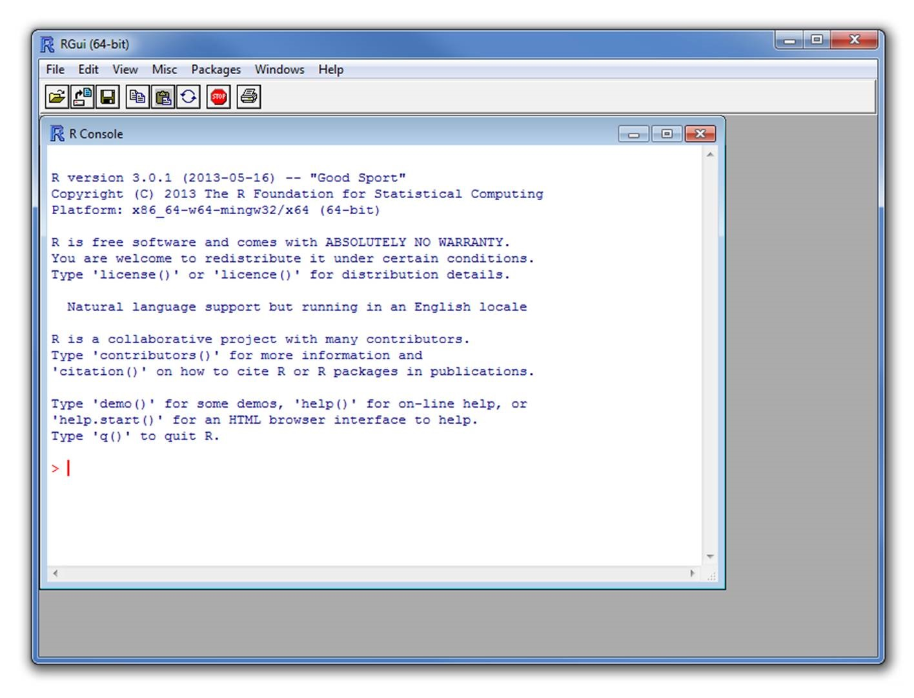
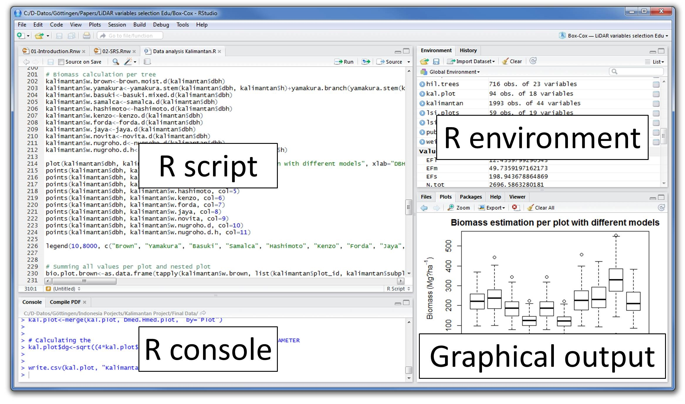

# Programsko okruzenje




# Osnovne matematicke operacije #

R je moguce koristiti kao bilo koji kalculator koristeci osnovne komande:
Sabiranje


```r
2+2 
```

```
## [1] 4
```

```r
1+2+3+4+5 
```

```
## [1] 15
```


Oduzimanje


```r
10-1 
```

```
## [1] 9
```

```r
5-6 
```

```
## [1] -1
```


Mnozenje


```r
2*2
```

```
## [1] 4
```

```r
1*2*3
```

```
## [1] 6
```


Deljenje


```r
4/2
```

```
## [1] 2
```

```r
10/2/4
```

```
## [1] 1.25
```


Koriscenje zagrada:


```r
10/2+2
```

```
## [1] 7
```

```r
10/(2+2)
```

```
## [1] 2.5
```

```r
(10/2)+2
```

```
## [1] 7
```


Stepenovanje i korenovanje


```r
2^2
```

```
## [1] 4
```

```r
3^4
```

```
## [1] 81
```

```r
1^0
```

```
## [1] 1
```

```r
sqrt(4)
```

```
## [1] 2
```


> <h3>Zadatak 1</h3>
> + Pronadji operator koji za rezultat operacije deljenja daje celobrojni deo rezultat (npr 111 `operator` 100 = 1).
> + Pronadji operator koji za rezultat operacije deljenja daje decimalni deo (npr 111 `operator` 100 = 0.11).


# Pozivanje funkcija u R-u

Logaritmi:


```r
log(0)
```

```
## [1] -Inf
```

```r
log(1)
```

```
## [1] 0
```


kao i logaritmi sa proizvoljnom osnovom (bazom):


```r
log10(1)
```

```
## [1] 0
```

```r
log10(10)
```

```
## [1] 1
```

```r
log2(1)
```

```
## [1] 0
```

```r
log2(2)
```

```
## [1] 1
```

```r
logb(1,5) # Dva argumenta
```

```
## [1] 0
```

```r
logb(5,base=5) # Dva argumenta od kojih je jedan imenovan
```

```
## [1] 1
```


Prirodni eksponent:


```r
exp(0)
```

```
## [1] 1
```

```r
exp(1)
```

```
## [1] 2.718282
```


Kao i mnoge druge matematicke operacije:
Apsolutna vrednost


```r
abs(-10)
```

```
## [1] 10
```


Faktorial:


```r
factorial(10)
```

```
## [1] 3628800
```


# Dodavanje komentara

Dodavanje komentara je veoma vazan deo dokumentovanja koda.


Svaki deo teksta koji je pracen sa (`#`) postaje komentar i `ne` izvrsava se od strane R-a.


```r
2+2 # This is a comment. The code before the `#` is still evaluated by R.
```

```
## [1] 4
```


Neki programski jezici omogucavaju tzv. multi-line komentare. R ne podrzava tu opciju. U R-u svaki komentar je zaseban
R-studio podrzava `proglasavanje` vise linija koda komentarom pozivom jedne komande `ctrl+shift+c`.


# Promenljive ili objekti


R omogucuje da se svakoj vrednosti doda ime, kako bi se ona pozivanjem tog imena kasnije mogla upotrebiti. Dodeljivanjem imena nekoj vrednosti (moguce je dodati ime i nekoj funkciji ili skupu nekih vrednosti) na taj nacin kreiramo `promenljive`. 
Na primer, umesto da odmah vidimo rezultat operacije `2+2`, mi mozemo sklaistiti taj rezultat pod nekim imenom i kasnije ga pogledati:


```r
a <- 2+2
```

Ukoliko hocemo da vidimo rezultat koji se `krije` iza tog imena, mi cemo samo ukucati to ime i pristisnuti `enter`:


```r
a
```

```
## [1] 4
```

Kao sto ste mogli da vidite, operator za dodeljivanje imenta je `<-` i rezultatu operacije na desnoj strani dodeli ime koje je na levoj strani operatora.
Isti rezultat se dobija i sa znakom `=` (ali se zbog litljivosti koda i sireg koriscenja znaka jednakost on izbegava):


```r
a = 2+2
a
```

```
## [1] 4
```

Moguce je koristiti operator i u `suprotnom` smeru, ali to nije uobicajeno:


```r
2+2 -> a
a
```

```
## [1] 4
```


Iz svega navedenog proizilazi da tako rezultat operacije koji je sacuvan pod nekim imenom mozemo pozivati u okviru drugih operacija:
Tako na primer, ako zelimo da rezultau prethodne operacije dodamo broj 4, pisacemo komandu:


```r
a + 4
```

```
## [1] 8
```

Moguce je da isto ime iskoristimo i za skladistenje druge vrednosti. U tom slucaju gubimo prethodno sacuvan rezultat pod tim imenom.


```r
a <- 2+2
a <- 3
a
```

```
## [1] 3
```

Mozemo napraviti `kopiju` promenljive ali pod drugim imenom:


```r
b <- a
b
```

```
## [1] 3
```

Ako zelimo da uklonimo promeljivu `a`, pozvacemo komandu `rm` (skracemo od `remove`):


```r
rm(a)
```

Ako zelimo da vidimo kakve smo sve promenljive napravili. Pozvacemo komandu `ls`.


```r
ls()
```

```
## [1] "b"
```

Ova funkcija ce vam izlistati sve promenljive koje ste kreirali tokom R sesije. Jedno pokretanje R-a je jedna sesija. Sto vise promenljvih to je teze da znate sa cim baratate u tokom sesije. Memorija racuara se takode opterecuje vise sa vecim brojem promenljivih.
Ukoliko zeimo da uklonimo sve promenljive to mozemo uraditi pozivom komande `rm(list = ls())`
Takode, mozemo pozvati komandu:


```r
b <- NULL
```

Ova komanda `ne brise` probmenljivu `b`, vec je samo ostavlja `praznom`.
Treba imati na umu da je `NULL` razlicito `NA`!
You can see this in the difference between the following two vectors:

Postoji i drugi nacin dodeljivanja imena, odnosno kreiranja promenljivih, a to je pozivom komande `assign`:


```r
assign("x",3)
x
```

```
## [1] 3
```

To nije uobicajeno u pocetku, ali kasnije moze biti korisno.
## Pravila nazivanja promenljivih ##

U R-u postoje jednostavna pravila koja se moraju postovati prilikom nazivanja promenljivih:


```r
# +Imena promeljivih u R-u su `case sensitive`, sto znaci da `a` nije isto sto i `A`.
# +Imena promeljivih u R-u moraju pocinjati sa slovima.
# +Imena promeljivih u R-u mogu sadrzati slova, znake i brojeve, kao na primer (`.`) ili (`_`).
# +Pozeljno je izbegavati dugacka imena.
```


# Help

R omogucava brz i jednostavan poziv `help`-a za svaku funkciju. Help je veoma jednostavan i pregledan. Help se moze pozvati na jedan od sledecih nacina:


```r
help(lm)
```

ili


```r
?lm
```

Za odredeni operator mora se moraju se koristiti navodnici:


```r
?`+`
```


# Uvod u strukture podataka u R-u

R vam omogucava da kreirate promenljve od komlikovanijih struktura podataka, ne samo od jedne vrednosti. Na primer, vi mozete kreirati promenljviu koja sadrzi vektor, niz (array), matricu ili listu. Od vrste strukture podataka zavisi kako ce ona biti prikazana i koje operacije su nad njom moguce. 

### Vektori, nizovi i matrice
Vektor i niz se skladiste na isti nacin, samo se uz niz vezuje i broj dimenzija, pa tako se on moze posmatrati kao visedimenzionalni vektor. Na primer, komandom `c` se kreira vektor, a komandom `array` se kreira niz.


```r
v <- c(1,2,3,4,5,6,7,8,9,10,11,12)
v
```

```
##  [1]  1  2  3  4  5  6  7  8  9 10 11 12
```

```r
a <- array(v, dim=c(3,4))
a
```

```
##      [,1] [,2] [,3] [,4]
## [1,]    1    4    7   10
## [2,]    2    5    8   11
## [3,]    3    6    9   12
```


> <h3>Zadatak 2</h3>
> + Pronadjite funkciju koja kreira `2x6` matricu od vrednosti koje se nalaze u promenljvoj `v.
> + Kreirati vektor koji ce sadrzati imena studenata u ucionici.

**Za vektore nizove i matrice je zajednicko da oni mogu skladistiti samo jednu vrstu podataka (najcesce numericke).**


### Liste

Lista je struktura podataka koja moze skladistiti razlicite vrste podataka


```r
e <- list(student="Milutin Pejovic", `broj indeksa` = 1018, `godina upisa` = 2012)
```


> <h3>Zadatak 3</h3>
> + Kreirati listu u kojoj ce prvi element sadrzati sva imena studenata, drugi element sve brojeve indeksa i treci element sve godine upisa.

### Data-frames

`Dataframe` je tabelarna struktura podataka u kojoj svaka kolona moze da sadrzi razliciti tip podataka. Ona u stvari predstavlja listu gde je svaki element liste u stvari vektor sa istom duzimom. `dataframe` je najslicniji `excel` tabeli. 


```r
studenti <- data.frame(ime = c("Milutin", "Petar"), Prezime = c("Pejovic", "Bursac"), `Broj indeksa` = c(1018, 1023), `Godina upisa` = c(2002, 2013))
studenti
```

```
##       ime Prezime Broj.indeksa Godina.upisa
## 1 Milutin Pejovic         1018         2002
## 2   Petar  Bursac         1023         2013
```


# R paketi

### R paketi prosiruju mogucnosti osnovne instalacije R-a.

  
R paketi su softverske jedinice koje su kreirane za resavanje odredenih problema. Tako na primer imamo pakete koji su namenjeni ucitavanju razlicitih formata podataka ili paketi koji su namenjeni ispisivanju dobijenih rezultata u razlicite vrste fajlova.


Instalacija paketa se vrsi pozivom komande:


```r
install.packages("ime paketa")
```


Ucitavanje paketa se vrsi komandom `


```r
library()
```

Opis paketa se moze pogledati pozivom funkcije


```r
packageDescription("name-of-package")
```


Postoji ogroman broj paketa koji se skladiste na centralnom repozorijumu R-a koji se zove [CRAN/packages](https://cran.r-project.org/web/packages/index.html).


