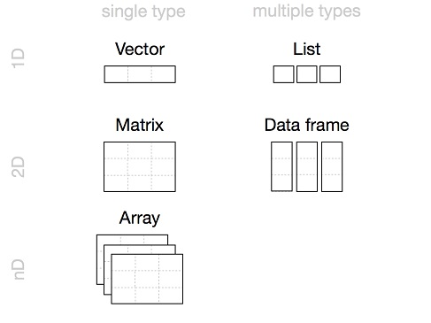
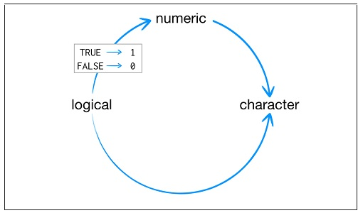
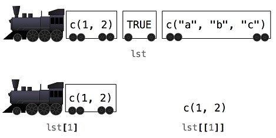
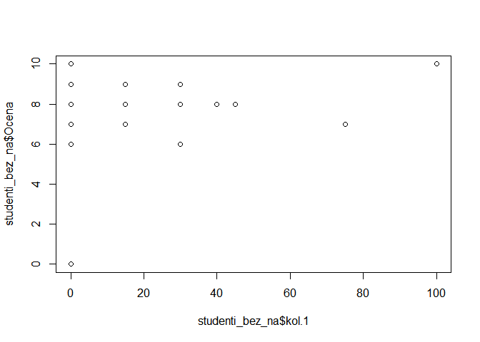
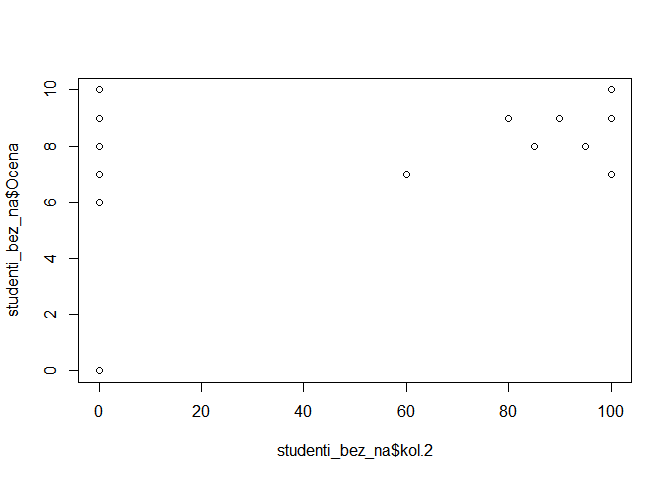

# Strukture podataka

Podsetićemo se na početku osnovnih struktura podataka u R-u





# Osnovni tipovi i klase podataka u R-u


## Atomic vectors


```r
v1 <- c(1, 2, 3, 4, 5, 6)

v2 <- 1:6

is.vector(v1)
```

```
## [1] TRUE
```

### Tipovi podatka

R razlikuje šest osnovnih tipova podatka, a to su *doubles, integers, characters, logicals, complex, and raw*. Tip podatka je obično poznat autoru koda, međutim ukoliko ima potrebe da se sazna kojeg je tipa određeni podatak skladišten u nekom vektoru, to moguće saznati pozivom komandom `typeof`: 

#### Double


```r
typeof(v1)
```

```
## [1] "double"
```


#### Integer


```r
v3 <- c(1L, 2L, 3L, 4L, 5L, 6L)

typeof(v3)
```

```
## [1] "integer"
```


#### Characters


```r
v4 <- c("Milutin", "Vojkan", "Petar")

typeof(v4)
```

```
## [1] "character"
```

```r
prof_name <- paste("Milutin", "Pejovic", sep = " ")

prof_name
```

```
## [1] "Milutin Pejovic"
```

```r
v5 <- paste(c("Milutin", "Vojkan", "Petar"), "GRF", sep = "_")

typeof(v5)
```

```
## [1] "character"
```


#### Logicals


```r
v6 <-c(TRUE, FALSE, TRUE)

typeof(v6)
```

```
## [1] "logical"
```

```r
v7 <-c(T, F, T)
v7
```

```
## [1]  TRUE FALSE  TRUE
```

```r
typeof(v7)
```

```
## [1] "logical"
```


#### Nedostajuće vrednosti (`NA`)

Nodostajuće ili nepoznate vrednosti u R-u se predstavljaju sa `NA`. Treba imati na umu da nedostajuća vrednost nije nula vrednost, odnosno da bilo koja operacija sa nedostajućom vrednosti rezultira takođe u nedostajuću vrednost.


```r
1 > 5
```

```
## [1] FALSE
```

```r
NA > 5
```

```
## [1] NA
```

```r
10 * NA
```

```
## [1] NA
```


Izuzeci su samo sledeće operacije:


```r
NA ^ 0
```

```
## [1] 1
```

```r
NA | TRUE # operator | znači "ili"
```

```
## [1] TRUE
```

```r
NA & FALSE
```

```
## [1] FALSE
```


#### Provera tipa podataka

Provera tipa podataka se može sprovesti pozivanjem neke od funkcija iz familije `is.*()`, kao na primer `is.logical()`, `is.integer()`, `is.double()`, ili `is.character()`. Postoje i funkcije kao što su `is.vector()`, `is.atomic()`, ili `is.numeric()` ali oni ne služe toj svrsi. 


```r
is.numeric(v1)
```

```
## [1] TRUE
```

```r
is.integer(v1)
```

```
## [1] FALSE
```

```r
is.logical(v1)
```

```
## [1] FALSE
```


#### Prinudna konverzija imeđu tipova podataka

Kao što je poznato, vektor, matrica ili array su strukture podataka koje mogu sadržati samo jedan tip podataka. Stim u vezi, ukoliko se u nekom vektoru nađu dva tipa podataka, R će prema integrisanim pravilima (`character → double → integer → logical`) prinudno transformisati tip podataka.  




```
##  chr [1:2] "a" "1"
```


## Atributi

### `Names` (nazivi)


```r
names(v1) <-c("jedan", "dva", "tri", "cetiri", "pet", "sest")

v1+1 # Imena ne prepoznaju vrednost na koju se odnose
```

```
##  jedan    dva    tri cetiri    pet   sest 
##      2      3      4      5      6      7
```

```r
names(v1) <- NULL # Uklanjanje atributa
```


### `Dim` (dimenzije)

Vektor se moze transformisati u dvo-dimenzionalnu strukturu podataka - matricu, dodavanjem odgovarajućih dimenzija pomoću komande `dim`:


```r
dim(v1) <- c(2, 3)

v1
```

```
##      [,1] [,2] [,3]
## [1,]    1    3    5
## [2,]    2    4    6
```


Na isti način, vektor se može transformisati u `array`:


```r
v1 <- 1:6
dim(v1) <- c(1, 2, 3)
v1
```

```
## , , 1
## 
##      [,1] [,2]
## [1,]    1    2
## 
## , , 2
## 
##      [,1] [,2]
## [1,]    3    4
## 
## , , 3
## 
##      [,1] [,2]
## [1,]    5    6
```


### Klase podataka

Jedan od najvažnijih atributa koji se vezuje za osnovne strukture podataka u R-u je `klasa`, čime se definiše jedan od objektno orijentisanih pristupa definisanja strukture podataka poznat pod imenom `S3` klase. R podržava više sistema za objeknto orijentisano struktuiranje podataka kao što su `S3`, `S4` i `R6`. `S3` je osnovni sistem i podržan je u okviru osnovne istalacije R-a.  
Dodavanjem atributa `class` R objekat postja `S3` objekat i od toga zavisi kako će se neke osnovne funkcije (`generic functions`) ophoditi prema tom objektu. Drugim rečima, rezultat neke operacije zavisi od klase podataka. 

U okviru ovog poglavlja, razmotrićemo tri osnovne klase vekorskih podataka:

#### `factors`

Faktor je vektor koji može sadržati samo određeni broj predefinisanih vrednosti i služi za skladištenje kategoričkih promenljivih. Faktorski vektor u sebi sadrži celobrojne vrednosti kojima je dodeljen naziv, odnosno nivo (`level`). Tako na primer:


```r
v7 <- factor(c("a", "b", "b", "a"))

v7
```

```
## [1] a b b a
## Levels: a b
```

```r
typeof(v7)
```

```
## [1] "integer"
```

```r
attributes(v7)
```

```
## $levels
## [1] "a" "b"
## 
## $class
## [1] "factor"
```

Faktorski vektor je pogodan za grupisanje podataka, što nam može omogućiti analizu podataka prema grupi kojoj pripadaju.  


#### `Dates` (Datum) vektori

`Dates` ili datumski vektori vektori u sebi sadrže podatak o vremenu na dnevnoj rezoluciji i kreirani su na osnovu `double` vrednosti. Oni predstavljanju broj dana počev od `1970-01-01` 


```r
v8 <- Sys.Date()

typeof(v8)
```

```
## [1] "double"
```

```r
attributes(v8)
```

```
## $class
## [1] "Date"
```

```r
as.numeric(v8)
```

```
## [1] 18570
```

```r
v9 <- as.Date("1983-03-30")
v9
```

```
## [1] "1983-03-30"
```

```r
as.numeric(v9)
```

```
## [1] 4836
```


#### `Date-time` (datum-vreme) vektori

R podržava dva načina u okviru `S3` klasa za skladištenje informacija o datumu-vremenu POSIXct, and POSIXlt. POSIX je skraćenica od Portable Operating System Interface što je skraćenica za familiju standarda za razmenu informacija o vremenu. `ct` je skraćenica od `calendar`, a `lt` od  `local time`. POSIXct vektor je kreiran na osnovu `double` vektora i predstavlja broj sekundi od `1970-01-01`.   


```r
v10 <- as.POSIXct("2020-11-04 10:00", tz = "UTC")

typeof(v10)
```

```
## [1] "double"
```

```r
attributes(v10)
```

```
## $class
## [1] "POSIXct" "POSIXt" 
## 
## $tzone
## [1] "UTC"
```


# Podešavanje radnog direktorijuma 

Ukoliko postoji potreba da se neka skripta veže za određeni set podataka koji se nalazi u određenom folderu, često je potrebno definisati radni direktorijum. Time se praktično definiše `default` putanja koju će koristiti sve funkcije koje za argument koriste putanju do određenog foldera, ukoliko se ne podesi drugačije. Podešavanje radnog direktorijuma se vrši pozivom komande `setwd()`


```r
#?setwd()

#setwd(dir = "C:/R_projects/Nauka_R/Slides")
```


Ukoliko postoji potreba da se proveri koja je aktuelna putanja, odnosno koji je aktuelni radni direktorijum, to se može učiniti pozivom komande `getwd()`.


```r
#getwd()
```


Izlistavanje fajlova koji se nalaze u nekom direktorijumu se vrši pozivom komande `ls()`

> <h3>Zadatak 1</h3>
> + Podesiti radni direktorijum.
> + Izlistati sve fajlove koji se nalaze u radnom direktorijumu.

Podešavanje radnog direktorijuma je korisno koristiti ako prilikom rada koristimo konstantno jedinstven direktorijum sa skriptama, podacima i drugim potrebnim fajlovima. Tada u radu i korišćenju funkcija možemo koristiti relativne putanje ka pod-fodlerima ako je potrebno, inače se podrazumeva data putanja kao apsolutna.


# Učitavanje podataka u R-u

Za učitavanje podataka u radno okruženje koriste se funkcije, koje rade na principu zadavanja putanje ka podacima, kao i formata podataka, koji ne mora biti eksplicitno naveden. Neke od osnovnih funkcija su:


```r
studenti <- read.table(file = "C:/R_projects/Nauka_R/Slides/data/Students_IG1.txt", sep = ",", header = TRUE)

studenti <- read.csv(file = "C:/R_projects/Nauka_R/Slides/data/Students_IG1.txt", header = TRUE, stringsAsFactors = FALSE)
```


## `readxl` paket

Učitavanje excel tabela je moguće učiniti putem paketa "readxl":


```r
install.packages("readxl")
library(readxl)

studenti <- readxl::read_xlsx(path = "C:/R_projects/Nauka_R/Slides/data/Students_IG1.xlsx", sheet = "Students")
```


## Pregled podataka


```r
str(studenti) # Obratite pažnju da su imena studenata skladištena kao faktorske kolone u okviru data.frame?
```

```
## 'data.frame':	35 obs. of  14 variables:
##  $ ID       : int  1 2 3 4 5 6 7 8 9 10 ...
##  $ Prezime  : chr  "Antonijev" "Arvaji" "Babic" "Beljin" ...
##  $ Ime      : chr  "Boris" "Luka" "Stefan" "Miloš" ...
##  $ br.ind   : int  1035 1020 1051 1019 1041 1038 1031 1018 1027 1015 ...
##  $ god.upisa: int  16 17 16 17 16 17 17 17 17 17 ...
##  $ kol.1    : int  NA NA 0 0 0 0 40 NA 0 0 ...
##  $ kol.2    : int  NA NA NA NA NA 60 85 NA NA NA ...
##  $ kol.1.1  : int  NA NA NA NA NA 55 100 NA NA NA ...
##  $ kol.2.2  : int  NA NA NA NA NA NA NA NA NA NA ...
##  $ Januar   : int  NA NA NA NA NA NA NA NA NA NA ...
##  $ Februar  : int  40 NA NA 10 100 NA NA 8 NA 82 ...
##  $ Jun      : int  51 NA 100 100 NA NA NA 70 100 NA ...
##  $ Ocena    : int  7 NA 7 8 7 7 8 6 6 8 ...
##  $ Praksa   : int  9 NA 8 8 8 NA 9 8 NA 7 ...
```

Ukoliko želimo da se određene kolone ne transformišu u faktorske prilikom učitavanja potrebno opciju `stringsAsFactors` podesititi da bude `FALSE`.


```r
class(studenti)
```

```
## [1] "data.frame"
```

```r
head(studenti, 5)
```

```
##   ID         Prezime    Ime br.ind god.upisa kol.1 kol.2 kol.1.1 kol.2.2 Januar
## 1  1       Antonijev  Boris   1035        16    NA    NA      NA      NA     NA
## 2  2          Arvaji   Luka   1020        17    NA    NA      NA      NA     NA
## 3  3           Babic Stefan   1051        16     0    NA      NA      NA     NA
## 4  4          Beljin  Miloš   1019        17     0    NA      NA      NA     NA
## 5  5 Božic Krajišnik Stefan   1041        16     0    NA      NA      NA     NA
##   Februar Jun Ocena Praksa
## 1      40  51     7      9
## 2      NA  NA    NA     NA
## 3      NA 100     7      8
## 4      10 100     8      8
## 5     100  NA     7      8
```

```r
tail(studenti, 5)
```

```
##    ID    Prezime     Ime br.ind god.upisa kol.1 kol.2 kol.1.1 kol.2.2 Januar
## 31 31 Stojanovic   Marta   1048        16     0    NA      NA      NA     20
## 32 32 Stojanovic   Mitar   1058        17     0    NA      NA      NA     NA
## 33 33      Tomic   Filip   1029        17     0    NA      NA      NA     65
## 34 34  Cvetkovic Božidar   1006        17     0    NA      NA      NA     NA
## 35 35  Cvetkovic Nemanja   1039        17    15   100      60      NA     NA
##    Februar Jun Ocena Praksa
## 31      51  NA     6      7
## 32      10 100     9     10
## 33      NA  NA     6      8
## 34      40  70     6      8
## 35      NA  NA     7      8
```

```r
dim(studenti)
```

```
## [1] 35 14
```


## Selektovanje podataka

U okviru R-a postoji poseban sistem notacije kojim je moguće pristupiti vrednostima objekta. Kako bi pristupili podatku ili setu podataka (red-u i/ili kolona-ma), koristi se sledeće notacija sa [] zagradama:


```r
# studenti[ , ]
```

U okviru zagrada pišu se dva indeksa odvojena zarezom, pri predstavlja broj **reda** i drugi predstavlja broj **kolone**. Indeksi mogu biti napisani na veći broj načina, i to:
 
- Pozitivne celobrojne vrednosti
- Negativne celobrojne vrednosti
- Nula
- Razmak
- Logičke vrednosti
- Nazivi   

#### Pozitivne celobrojne vrednosti


```r
studenti[1, ]
```

```
##   ID   Prezime   Ime br.ind god.upisa kol.1 kol.2 kol.1.1 kol.2.2 Januar
## 1  1 Antonijev Boris   1035        16    NA    NA      NA      NA     NA
##   Februar Jun Ocena Praksa
## 1      40  51     7      9
```

```r
studenti[, 2]
```

```
##  [1] "Antonijev"       "Arvaji"          "Babic"           "Beljin"         
##  [5] "Božic Krajišnik" "Brkic"           "Vasovic"         "Vucic"          
##  [9] "Garibovic"       "Gordic"          "Grujovic"        "Dimitrijevic"   
## [13] "Jovicic"         "Kocic"           "Kocic"           "Lazic"          
## [17] "Lazic"           "Milijaševic"     "Milic"           "Milic"          
## [21] "Milosavljevic"   "Mladenovic"      "Nikolic"         "Paunic"         
## [25] "Popovic"         "Radovancev"      "Smiljanic"       "Srejic"         
## [29] "Stanojevic"      "Stanojkovic"     "Stojanovic"      "Stojanovic"     
## [33] "Tomic"           "Cvetkovic"       "Cvetkovic"
```

```r
studenti[1, 2]
```

```
## [1] "Antonijev"
```

Na ovaj način izvršena je selekcija prvog reda i druge kolone. Pored zadavanja jedne vrednosti, možemo izvršiti selekciju podataka skupom indeksa.


```r
studenti[1, c(2,3)]
```

```
##     Prezime   Ime
## 1 Antonijev Boris
```

```r
studenti[1, c(2:5)]
```

```
##     Prezime   Ime br.ind god.upisa
## 1 Antonijev Boris   1035        16
```

Rezultat upita je samo prikaz - kopija vrednosti. Rezultat možemo dodeliti novoj promenljivoj:


```r
Boris <- studenti[1, c(1:14)]
Boris
```

```
##   ID   Prezime   Ime br.ind god.upisa kol.1 kol.2 kol.1.1 kol.2.2 Januar
## 1  1 Antonijev Boris   1035        16    NA    NA      NA      NA     NA
##   Februar Jun Ocena Praksa
## 1      40  51     7      9
```

Isti sistem notacije se koristi i kod drugih tipova podataka, npr. kod vektora:


```r
vec <- c(6, 1, 3, 6, 10, 5)
vec[1:3]
```

```
## [1] 6 1 3
```

Bitno je zapamtiti da indeksiranje u R-u **uvek počinje od 1**, dok za razliku od nekih drugih programskih jezika počinje od 0.      
   
#### Negativne celobrojne vrednosti
Negativne vrednosti daju suprotni rezultat u odnosu na pozitivne celobrojne vrednosti. Rezultat je sve osim elemenata navedenih indeksom:


```r
studenti[-c(2:35), 2:5]
```

```
##     Prezime   Ime br.ind god.upisa
## 1 Antonijev Boris   1035        16
```

Kombincija pozitivnih i negativnih indeksa je moguća, dok nije moguće postaviti pozitivnu i negativnu vrednost u okviru istog inndeksa:


```r
# studenti[-c(-1,1), 2]
# Error in x[i] : only 0's may be mixed with negative subscripts

studenti[1:5, -1]
```

```
##           Prezime    Ime br.ind god.upisa kol.1 kol.2 kol.1.1 kol.2.2 Januar
## 1       Antonijev  Boris   1035        16    NA    NA      NA      NA     NA
## 2          Arvaji   Luka   1020        17    NA    NA      NA      NA     NA
## 3           Babic Stefan   1051        16     0    NA      NA      NA     NA
## 4          Beljin  Miloš   1019        17     0    NA      NA      NA     NA
## 5 Božic Krajišnik Stefan   1041        16     0    NA      NA      NA     NA
##   Februar Jun Ocena Praksa
## 1      40  51     7      9
## 2      NA  NA    NA     NA
## 3      NA 100     7      8
## 4      10 100     8      8
## 5     100  NA     7      8
```


#### Nula
Kao što je rečeno indeksiranje elemenata počinje od 1, dok indeks 0 nije greška, već je rezultat objekat bez elemenata:


```r
studenti[0, 0]
```

```
## data frame with 0 columns and 0 rows
```


#### Razmak
Korišćenem razmaka - praznog indeksa, dobija se rezultat koji podrazumeva sve elemente datog reda ili kolone:


```r
studenti[1, ]
```

```
##   ID   Prezime   Ime br.ind god.upisa kol.1 kol.2 kol.1.1 kol.2.2 Januar
## 1  1 Antonijev Boris   1035        16    NA    NA      NA      NA     NA
##   Februar Jun Ocena Praksa
## 1      40  51     7      9
```


#### Logičke vrednosti          
Vrednost indeksa može biti i logička vrednost i tom slučaju rezultat je red i/ili kolona koja odgovara vrednosti TRUE:


```r
studenti[1, c(FALSE, TRUE, TRUE, TRUE, FALSE, FALSE, FALSE, FALSE, FALSE, FALSE, FALSE, FALSE, FALSE, FALSE)]
```

```
##     Prezime   Ime br.ind
## 1 Antonijev Boris   1035
```

Vektor logičkih vrednosti moguće je kreirati primenom logičkih upita. Odnosno kreiranjem logičkog upita dobija se vektor sa vrednostima TRUE i FALSE koji se mogu koristiti za određivanje pozicije vrednosti koju želimo izmeniti:
  


```r
generacija_2017 <- studenti$god.upisa == 2017
generacija_2017 # vektor logičkih vrednosti
```

```
##  [1] FALSE FALSE FALSE FALSE FALSE FALSE FALSE FALSE FALSE FALSE FALSE FALSE
## [13] FALSE FALSE FALSE FALSE FALSE FALSE FALSE FALSE FALSE FALSE FALSE FALSE
## [25] FALSE FALSE FALSE FALSE FALSE FALSE FALSE FALSE FALSE FALSE FALSE
```

```r
studenti[generacija_2017, ]
```

```
##  [1] ID        Prezime   Ime       br.ind    god.upisa kol.1     kol.2    
##  [8] kol.1.1   kol.2.2   Januar    Februar   Jun       Ocena     Praksa   
## <0 rows> (or 0-length row.names)
```


Logički operatori su veoma efikasan način selekcije i u okviru R-a definisani su na sledeći način:


#### Bulovi operatori

#' Bulovi operatori nam omogućuju da kombinujemo logičke izraze. Međutim, tu treba imati na umu da `NA` vrednosti mogu uticati na rezultat izraza. Bilo koji izraz sa `NA`vrednošću nam kao rezultat vraća `NA` vrednost.


Na primer, ako želimo pogledati  koji studenti su imali 100 bodova junskom roku i kranju ocenu 9, nećemo dobiti željeni rezultat, upravo zbog prisustva `NA` vrednosti


```r
studenti[studenti$Jun == 100 & studenti$Ocena == 9, ]
```

```
##      ID    Prezime    Ime br.ind god.upisa kol.1 kol.2 kol.1.1 kol.2.2 Januar
## NA   NA       <NA>   <NA>     NA        NA    NA    NA      NA      NA     NA
## NA.1 NA       <NA>   <NA>     NA        NA    NA    NA      NA      NA     NA
## 15   15      Kocic Stefan   1035        17     0    NA      NA      NA     NA
## NA.2 NA       <NA>   <NA>     NA        NA    NA    NA      NA      NA     NA
## NA.3 NA       <NA>   <NA>     NA        NA    NA    NA      NA      NA     NA
## NA.4 NA       <NA>   <NA>     NA        NA    NA    NA      NA      NA     NA
## NA.5 NA       <NA>   <NA>     NA        NA    NA    NA      NA      NA     NA
## NA.6 NA       <NA>   <NA>     NA        NA    NA    NA      NA      NA     NA
## 32   32 Stojanovic  Mitar   1058        17     0    NA      NA      NA     NA
##      Februar Jun Ocena Praksa
## NA        NA  NA    NA     NA
## NA.1      NA  NA    NA     NA
## 15        24 100     9      8
## NA.2      NA  NA    NA     NA
## NA.3      NA  NA    NA     NA
## NA.4      NA  NA    NA     NA
## NA.5      NA  NA    NA     NA
## NA.6      NA  NA    NA     NA
## 32        10 100     9     10
```

```r
studenti[!is.na(studenti$Jun) & !is.na(studenti$Ocena) & studenti$Jun == 100 & studenti$Ocena == 9, ]
```

```
##    ID    Prezime    Ime br.ind god.upisa kol.1 kol.2 kol.1.1 kol.2.2 Januar
## 15 15      Kocic Stefan   1035        17     0    NA      NA      NA     NA
## 32 32 Stojanovic  Mitar   1058        17     0    NA      NA      NA     NA
##    Februar Jun Ocena Praksa
## 15      24 100     9      8
## 32      10 100     9     10
```


 
   
#### Nazivi 

Selekcija podataka - elementa je moguća i putem naziva kolona i/ili redova ako su dostupni:


```r
names(studenti) 
```

```
##  [1] "ID"        "Prezime"   "Ime"       "br.ind"    "god.upisa" "kol.1"    
##  [7] "kol.2"     "kol.1.1"   "kol.2.2"   "Januar"    "Februar"   "Jun"      
## [13] "Ocena"     "Praksa"
```

```r
studenti[, "Prezime"]
```

```
##  [1] "Antonijev"       "Arvaji"          "Babic"           "Beljin"         
##  [5] "Božic Krajišnik" "Brkic"           "Vasovic"         "Vucic"          
##  [9] "Garibovic"       "Gordic"          "Grujovic"        "Dimitrijevic"   
## [13] "Jovicic"         "Kocic"           "Kocic"           "Lazic"          
## [17] "Lazic"           "Milijaševic"     "Milic"           "Milic"          
## [21] "Milosavljevic"   "Mladenovic"      "Nikolic"         "Paunic"         
## [25] "Popovic"         "Radovancev"      "Smiljanic"       "Srejic"         
## [29] "Stanojevic"      "Stanojkovic"     "Stojanovic"      "Stojanovic"     
## [33] "Tomic"           "Cvetkovic"       "Cvetkovic"
```

```r
studenti[1:5, c("Prezime", "Ime", "br.ind", "god.upisa")]
```

```
##           Prezime    Ime br.ind god.upisa
## 1       Antonijev  Boris   1035        16
## 2          Arvaji   Luka   1020        17
## 3           Babic Stefan   1051        16
## 4          Beljin  Miloš   1019        17
## 5 Božic Krajišnik Stefan   1041        16
```

Kao i kombinacija navedenog:


```r
studenti[1:5, c(names(studenti[, c(2:5)]))]
```

```
##           Prezime    Ime br.ind god.upisa
## 1       Antonijev  Boris   1035        16
## 2          Arvaji   Luka   1020        17
## 3           Babic Stefan   1051        16
## 4          Beljin  Miloš   1019        17
## 5 Božic Krajišnik Stefan   1041        16
```


### Selektovanje podataka putem $ sintakse
Putem prethodnih primera pokazan je osnovni način selekcije elementa iz skupa podataka. Način selekcije podataka koji se najčešče koristi predstavlja upotrebu $ sintakse.      
Potrebno je napisati naziv objekta - data frame-a a zatim napisati naziv kolone odvojen znakom "$":


```r
studenti$Prezime
```

```
##  [1] "Antonijev"       "Arvaji"          "Babic"           "Beljin"         
##  [5] "Božic Krajišnik" "Brkic"           "Vasovic"         "Vucic"          
##  [9] "Garibovic"       "Gordic"          "Grujovic"        "Dimitrijevic"   
## [13] "Jovicic"         "Kocic"           "Kocic"           "Lazic"          
## [17] "Lazic"           "Milijaševic"     "Milic"           "Milic"          
## [21] "Milosavljevic"   "Mladenovic"      "Nikolic"         "Paunic"         
## [25] "Popovic"         "Radovancev"      "Smiljanic"       "Srejic"         
## [29] "Stanojevic"      "Stanojkovic"     "Stojanovic"      "Stojanovic"     
## [33] "Tomic"           "Cvetkovic"       "Cvetkovic"
```

*Tips: Nakon napisanog znaka "$" moguće je pritisnuti taster TAB na tastaturi kako bi dobili listu naziva kolona.*      
Kako bi izvršili upit po redu, potrebno je napisati [] zagrade i navesti indeks reda.


```r
studenti$Prezime[1]
```

```
## [1] "Antonijev"
```

```r
studenti$Prezime[1:5]
```

```
## [1] "Antonijev"       "Arvaji"          "Babic"           "Beljin"         
## [5] "Božic Krajišnik"
```


### Selektovanje podataka u okviru `list` - e

Selektovanje podataka u okviru liste vrši se korišćenjem operatora `[]` i `[[]]` ili prema nazivu elementa liste. 
Na primer, kreiraćemo listu studenata sa dva elementa, oni koji su položili praksu i onih koji nisu položili praksu.


```r
praksa_list <- list(polozili = studenti[!is.na(studenti$Praksa), ], nisu_polozili = studenti[is.na(studenti$Praksa), ])
```


Ukoliko želimo selektovati prvi član liste primenom operatora `[]`, za rezultat ćemo takođe dobiti listu!


```r
praksa_list[1]
```

```
## $polozili
##    ID         Prezime        Ime br.ind god.upisa kol.1 kol.2 kol.1.1 kol.2.2
## 1   1       Antonijev      Boris   1035        16    NA    NA      NA      NA
## 3   3           Babic     Stefan   1051        16     0    NA      NA      NA
## 4   4          Beljin      Miloš   1019        17     0    NA      NA      NA
## 5   5 Božic Krajišnik     Stefan   1041        16     0    NA      NA      NA
## 7   7         Vasovic Aleksandar   1031        17    40    85     100      NA
## 8   8           Vucic      Boban   1018        17    NA    NA      NA      NA
## 10 10          Gordic     Nataša   1015        17     0    NA      NA      NA
## 11 11        Grujovic   Katarina   1042        15    NA    NA      NA      NA
## 12 12    Dimitrijevic      Jovan   1040        17    45    95      10      NA
## 13 13         Jovicic  Andrijana   1012        17    30    NA      NA      NA
## 14 14           Kocic     Danilo   1024        17     0    90     100      NA
## 15 15           Kocic     Stefan   1035        17     0    NA      NA      NA
## 16 16           Lazic      Darko   1009        17     0    NA       5      NA
## 17 17           Lazic      Dušan   1026        17    30    80      90      NA
## 18 18     Milijaševic     Vojkan   1021        17     0   100     100      NA
## 19 19           Milic    Nemanja   1014        17    15   100      90      NA
## 20 20           Milic       Saša   1023        17   100    NA      NA     100
## 21 21   Milosavljevic    Nemanja   1003        17    30    NA      NA      NA
## 22 22      Mladenovic     Nikola   1053        16     0    NA      NA      NA
## 23 23         Nikolic      Ratko   1016        17    15    NA      NA      NA
## 24 24          Paunic     Stefan   1049        17     0    NA      NA      NA
## 25 25         Popovic      Filip   1044        16    NA    NA      NA      NA
## 26 26      Radovancev      Miloš   1007        17    15   100      70      NA
## 28 28          Srejic Aleksandar   1037        16    NA    NA      NA      NA
## 29 29      Stanojevic Aleksandar   1033        17     0    80      80      NA
## 30 30     Stanojkovic      Ðorde   1004        17    75    60      NA      NA
## 31 31      Stojanovic      Marta   1048        16     0    NA      NA      NA
## 32 32      Stojanovic      Mitar   1058        17     0    NA      NA      NA
## 33 33           Tomic      Filip   1029        17     0    NA      NA      NA
## 34 34       Cvetkovic    Božidar   1006        17     0    NA      NA      NA
## 35 35       Cvetkovic    Nemanja   1039        17    15   100      60      NA
##    Januar Februar Jun Ocena Praksa
## 1      NA      40  51     7      9
## 3      NA      NA 100     7      8
## 4      NA      10 100     8      8
## 5      NA     100  NA     7      8
## 7      NA      NA  NA     8      9
## 8      NA       8  70     6      8
## 10     NA      82  NA     8      7
## 11     NA      NA  90     8      8
## 12     NA      80  NA     8      8
## 13     NA      92  NA     8      8
## 14     NA      NA  NA     9      9
## 15     NA      24 100     9      8
## 16     NA      NA  NA     7      8
## 17     NA      NA  NA     9      9
## 18     NA      NA  NA    10     10
## 19     NA      NA  NA     9      9
## 20     NA      NA  NA    10     10
## 21     30     100  NA     6      8
## 22     NA      NA  80     6      8
## 23     60      82  NA     8      9
## 24     55      NA  NA     7      8
## 25     NA      NA  80     7      8
## 26     NA      NA  NA     9      8
## 28     NA      NA  65     6      8
## 29     NA      NA  NA     9      9
## 30     NA      NA  NA     7      9
## 31     20      51  NA     6      7
## 32     NA      10 100     9     10
## 33     65      NA  NA     6      8
## 34     NA      40  70     6      8
## 35     NA      NA  NA     7      8
```

```r
class(praksa_list[1])
```

```
## [1] "list"
```





Međutim, ukoliko želimo selektovati prvi član liste primenom operatora `[[]]`, za rezultat ćemo takođe dobiti `data.frame`!


```r
praksa_list[[1]]
```

```
##    ID         Prezime        Ime br.ind god.upisa kol.1 kol.2 kol.1.1 kol.2.2
## 1   1       Antonijev      Boris   1035        16    NA    NA      NA      NA
## 3   3           Babic     Stefan   1051        16     0    NA      NA      NA
## 4   4          Beljin      Miloš   1019        17     0    NA      NA      NA
## 5   5 Božic Krajišnik     Stefan   1041        16     0    NA      NA      NA
## 7   7         Vasovic Aleksandar   1031        17    40    85     100      NA
## 8   8           Vucic      Boban   1018        17    NA    NA      NA      NA
## 10 10          Gordic     Nataša   1015        17     0    NA      NA      NA
## 11 11        Grujovic   Katarina   1042        15    NA    NA      NA      NA
## 12 12    Dimitrijevic      Jovan   1040        17    45    95      10      NA
## 13 13         Jovicic  Andrijana   1012        17    30    NA      NA      NA
## 14 14           Kocic     Danilo   1024        17     0    90     100      NA
## 15 15           Kocic     Stefan   1035        17     0    NA      NA      NA
## 16 16           Lazic      Darko   1009        17     0    NA       5      NA
## 17 17           Lazic      Dušan   1026        17    30    80      90      NA
## 18 18     Milijaševic     Vojkan   1021        17     0   100     100      NA
## 19 19           Milic    Nemanja   1014        17    15   100      90      NA
## 20 20           Milic       Saša   1023        17   100    NA      NA     100
## 21 21   Milosavljevic    Nemanja   1003        17    30    NA      NA      NA
## 22 22      Mladenovic     Nikola   1053        16     0    NA      NA      NA
## 23 23         Nikolic      Ratko   1016        17    15    NA      NA      NA
## 24 24          Paunic     Stefan   1049        17     0    NA      NA      NA
## 25 25         Popovic      Filip   1044        16    NA    NA      NA      NA
## 26 26      Radovancev      Miloš   1007        17    15   100      70      NA
## 28 28          Srejic Aleksandar   1037        16    NA    NA      NA      NA
## 29 29      Stanojevic Aleksandar   1033        17     0    80      80      NA
## 30 30     Stanojkovic      Ðorde   1004        17    75    60      NA      NA
## 31 31      Stojanovic      Marta   1048        16     0    NA      NA      NA
## 32 32      Stojanovic      Mitar   1058        17     0    NA      NA      NA
## 33 33           Tomic      Filip   1029        17     0    NA      NA      NA
## 34 34       Cvetkovic    Božidar   1006        17     0    NA      NA      NA
## 35 35       Cvetkovic    Nemanja   1039        17    15   100      60      NA
##    Januar Februar Jun Ocena Praksa
## 1      NA      40  51     7      9
## 3      NA      NA 100     7      8
## 4      NA      10 100     8      8
## 5      NA     100  NA     7      8
## 7      NA      NA  NA     8      9
## 8      NA       8  70     6      8
## 10     NA      82  NA     8      7
## 11     NA      NA  90     8      8
## 12     NA      80  NA     8      8
## 13     NA      92  NA     8      8
## 14     NA      NA  NA     9      9
## 15     NA      24 100     9      8
## 16     NA      NA  NA     7      8
## 17     NA      NA  NA     9      9
## 18     NA      NA  NA    10     10
## 19     NA      NA  NA     9      9
## 20     NA      NA  NA    10     10
## 21     30     100  NA     6      8
## 22     NA      NA  80     6      8
## 23     60      82  NA     8      9
## 24     55      NA  NA     7      8
## 25     NA      NA  80     7      8
## 26     NA      NA  NA     9      8
## 28     NA      NA  65     6      8
## 29     NA      NA  NA     9      9
## 30     NA      NA  NA     7      9
## 31     20      51  NA     6      7
## 32     NA      10 100     9     10
## 33     65      NA  NA     6      8
## 34     NA      40  70     6      8
## 35     NA      NA  NA     7      8
```

```r
class(praksa_list[[1]])
```

```
## [1] "data.frame"
```


Element liste moguće je selektovati i naznačavanjem imena liste u okviru operatora `[]`:


```r
praksa_list["polozili"]
```

```
## $polozili
##    ID         Prezime        Ime br.ind god.upisa kol.1 kol.2 kol.1.1 kol.2.2
## 1   1       Antonijev      Boris   1035        16    NA    NA      NA      NA
## 3   3           Babic     Stefan   1051        16     0    NA      NA      NA
## 4   4          Beljin      Miloš   1019        17     0    NA      NA      NA
## 5   5 Božic Krajišnik     Stefan   1041        16     0    NA      NA      NA
## 7   7         Vasovic Aleksandar   1031        17    40    85     100      NA
## 8   8           Vucic      Boban   1018        17    NA    NA      NA      NA
## 10 10          Gordic     Nataša   1015        17     0    NA      NA      NA
## 11 11        Grujovic   Katarina   1042        15    NA    NA      NA      NA
## 12 12    Dimitrijevic      Jovan   1040        17    45    95      10      NA
## 13 13         Jovicic  Andrijana   1012        17    30    NA      NA      NA
## 14 14           Kocic     Danilo   1024        17     0    90     100      NA
## 15 15           Kocic     Stefan   1035        17     0    NA      NA      NA
## 16 16           Lazic      Darko   1009        17     0    NA       5      NA
## 17 17           Lazic      Dušan   1026        17    30    80      90      NA
## 18 18     Milijaševic     Vojkan   1021        17     0   100     100      NA
## 19 19           Milic    Nemanja   1014        17    15   100      90      NA
## 20 20           Milic       Saša   1023        17   100    NA      NA     100
## 21 21   Milosavljevic    Nemanja   1003        17    30    NA      NA      NA
## 22 22      Mladenovic     Nikola   1053        16     0    NA      NA      NA
## 23 23         Nikolic      Ratko   1016        17    15    NA      NA      NA
## 24 24          Paunic     Stefan   1049        17     0    NA      NA      NA
## 25 25         Popovic      Filip   1044        16    NA    NA      NA      NA
## 26 26      Radovancev      Miloš   1007        17    15   100      70      NA
## 28 28          Srejic Aleksandar   1037        16    NA    NA      NA      NA
## 29 29      Stanojevic Aleksandar   1033        17     0    80      80      NA
## 30 30     Stanojkovic      Ðorde   1004        17    75    60      NA      NA
## 31 31      Stojanovic      Marta   1048        16     0    NA      NA      NA
## 32 32      Stojanovic      Mitar   1058        17     0    NA      NA      NA
## 33 33           Tomic      Filip   1029        17     0    NA      NA      NA
## 34 34       Cvetkovic    Božidar   1006        17     0    NA      NA      NA
## 35 35       Cvetkovic    Nemanja   1039        17    15   100      60      NA
##    Januar Februar Jun Ocena Praksa
## 1      NA      40  51     7      9
## 3      NA      NA 100     7      8
## 4      NA      10 100     8      8
## 5      NA     100  NA     7      8
## 7      NA      NA  NA     8      9
## 8      NA       8  70     6      8
## 10     NA      82  NA     8      7
## 11     NA      NA  90     8      8
## 12     NA      80  NA     8      8
## 13     NA      92  NA     8      8
## 14     NA      NA  NA     9      9
## 15     NA      24 100     9      8
## 16     NA      NA  NA     7      8
## 17     NA      NA  NA     9      9
## 18     NA      NA  NA    10     10
## 19     NA      NA  NA     9      9
## 20     NA      NA  NA    10     10
## 21     30     100  NA     6      8
## 22     NA      NA  80     6      8
## 23     60      82  NA     8      9
## 24     55      NA  NA     7      8
## 25     NA      NA  80     7      8
## 26     NA      NA  NA     9      8
## 28     NA      NA  65     6      8
## 29     NA      NA  NA     9      9
## 30     NA      NA  NA     7      9
## 31     20      51  NA     6      7
## 32     NA      10 100     9     10
## 33     65      NA  NA     6      8
## 34     NA      40  70     6      8
## 35     NA      NA  NA     7      8
```

```r
praksa_list[["polozili"]]
```

```
##    ID         Prezime        Ime br.ind god.upisa kol.1 kol.2 kol.1.1 kol.2.2
## 1   1       Antonijev      Boris   1035        16    NA    NA      NA      NA
## 3   3           Babic     Stefan   1051        16     0    NA      NA      NA
## 4   4          Beljin      Miloš   1019        17     0    NA      NA      NA
## 5   5 Božic Krajišnik     Stefan   1041        16     0    NA      NA      NA
## 7   7         Vasovic Aleksandar   1031        17    40    85     100      NA
## 8   8           Vucic      Boban   1018        17    NA    NA      NA      NA
## 10 10          Gordic     Nataša   1015        17     0    NA      NA      NA
## 11 11        Grujovic   Katarina   1042        15    NA    NA      NA      NA
## 12 12    Dimitrijevic      Jovan   1040        17    45    95      10      NA
## 13 13         Jovicic  Andrijana   1012        17    30    NA      NA      NA
## 14 14           Kocic     Danilo   1024        17     0    90     100      NA
## 15 15           Kocic     Stefan   1035        17     0    NA      NA      NA
## 16 16           Lazic      Darko   1009        17     0    NA       5      NA
## 17 17           Lazic      Dušan   1026        17    30    80      90      NA
## 18 18     Milijaševic     Vojkan   1021        17     0   100     100      NA
## 19 19           Milic    Nemanja   1014        17    15   100      90      NA
## 20 20           Milic       Saša   1023        17   100    NA      NA     100
## 21 21   Milosavljevic    Nemanja   1003        17    30    NA      NA      NA
## 22 22      Mladenovic     Nikola   1053        16     0    NA      NA      NA
## 23 23         Nikolic      Ratko   1016        17    15    NA      NA      NA
## 24 24          Paunic     Stefan   1049        17     0    NA      NA      NA
## 25 25         Popovic      Filip   1044        16    NA    NA      NA      NA
## 26 26      Radovancev      Miloš   1007        17    15   100      70      NA
## 28 28          Srejic Aleksandar   1037        16    NA    NA      NA      NA
## 29 29      Stanojevic Aleksandar   1033        17     0    80      80      NA
## 30 30     Stanojkovic      Ðorde   1004        17    75    60      NA      NA
## 31 31      Stojanovic      Marta   1048        16     0    NA      NA      NA
## 32 32      Stojanovic      Mitar   1058        17     0    NA      NA      NA
## 33 33           Tomic      Filip   1029        17     0    NA      NA      NA
## 34 34       Cvetkovic    Božidar   1006        17     0    NA      NA      NA
## 35 35       Cvetkovic    Nemanja   1039        17    15   100      60      NA
##    Januar Februar Jun Ocena Praksa
## 1      NA      40  51     7      9
## 3      NA      NA 100     7      8
## 4      NA      10 100     8      8
## 5      NA     100  NA     7      8
## 7      NA      NA  NA     8      9
## 8      NA       8  70     6      8
## 10     NA      82  NA     8      7
## 11     NA      NA  90     8      8
## 12     NA      80  NA     8      8
## 13     NA      92  NA     8      8
## 14     NA      NA  NA     9      9
## 15     NA      24 100     9      8
## 16     NA      NA  NA     7      8
## 17     NA      NA  NA     9      9
## 18     NA      NA  NA    10     10
## 19     NA      NA  NA     9      9
## 20     NA      NA  NA    10     10
## 21     30     100  NA     6      8
## 22     NA      NA  80     6      8
## 23     60      82  NA     8      9
## 24     55      NA  NA     7      8
## 25     NA      NA  80     7      8
## 26     NA      NA  NA     9      8
## 28     NA      NA  65     6      8
## 29     NA      NA  NA     9      9
## 30     NA      NA  NA     7      9
## 31     20      51  NA     6      7
## 32     NA      10 100     9     10
## 33     65      NA  NA     6      8
## 34     NA      40  70     6      8
## 35     NA      NA  NA     7      8
```


```r
praksa_list[1]
```

```
## $polozili
##    ID         Prezime        Ime br.ind god.upisa kol.1 kol.2 kol.1.1 kol.2.2
## 1   1       Antonijev      Boris   1035        16    NA    NA      NA      NA
## 3   3           Babic     Stefan   1051        16     0    NA      NA      NA
## 4   4          Beljin      Miloš   1019        17     0    NA      NA      NA
## 5   5 Božic Krajišnik     Stefan   1041        16     0    NA      NA      NA
## 7   7         Vasovic Aleksandar   1031        17    40    85     100      NA
## 8   8           Vucic      Boban   1018        17    NA    NA      NA      NA
## 10 10          Gordic     Nataša   1015        17     0    NA      NA      NA
## 11 11        Grujovic   Katarina   1042        15    NA    NA      NA      NA
## 12 12    Dimitrijevic      Jovan   1040        17    45    95      10      NA
## 13 13         Jovicic  Andrijana   1012        17    30    NA      NA      NA
## 14 14           Kocic     Danilo   1024        17     0    90     100      NA
## 15 15           Kocic     Stefan   1035        17     0    NA      NA      NA
## 16 16           Lazic      Darko   1009        17     0    NA       5      NA
## 17 17           Lazic      Dušan   1026        17    30    80      90      NA
## 18 18     Milijaševic     Vojkan   1021        17     0   100     100      NA
## 19 19           Milic    Nemanja   1014        17    15   100      90      NA
## 20 20           Milic       Saša   1023        17   100    NA      NA     100
## 21 21   Milosavljevic    Nemanja   1003        17    30    NA      NA      NA
## 22 22      Mladenovic     Nikola   1053        16     0    NA      NA      NA
## 23 23         Nikolic      Ratko   1016        17    15    NA      NA      NA
## 24 24          Paunic     Stefan   1049        17     0    NA      NA      NA
## 25 25         Popovic      Filip   1044        16    NA    NA      NA      NA
## 26 26      Radovancev      Miloš   1007        17    15   100      70      NA
## 28 28          Srejic Aleksandar   1037        16    NA    NA      NA      NA
## 29 29      Stanojevic Aleksandar   1033        17     0    80      80      NA
## 30 30     Stanojkovic      Ðorde   1004        17    75    60      NA      NA
## 31 31      Stojanovic      Marta   1048        16     0    NA      NA      NA
## 32 32      Stojanovic      Mitar   1058        17     0    NA      NA      NA
## 33 33           Tomic      Filip   1029        17     0    NA      NA      NA
## 34 34       Cvetkovic    Božidar   1006        17     0    NA      NA      NA
## 35 35       Cvetkovic    Nemanja   1039        17    15   100      60      NA
##    Januar Februar Jun Ocena Praksa
## 1      NA      40  51     7      9
## 3      NA      NA 100     7      8
## 4      NA      10 100     8      8
## 5      NA     100  NA     7      8
## 7      NA      NA  NA     8      9
## 8      NA       8  70     6      8
## 10     NA      82  NA     8      7
## 11     NA      NA  90     8      8
## 12     NA      80  NA     8      8
## 13     NA      92  NA     8      8
## 14     NA      NA  NA     9      9
## 15     NA      24 100     9      8
## 16     NA      NA  NA     7      8
## 17     NA      NA  NA     9      9
## 18     NA      NA  NA    10     10
## 19     NA      NA  NA     9      9
## 20     NA      NA  NA    10     10
## 21     30     100  NA     6      8
## 22     NA      NA  80     6      8
## 23     60      82  NA     8      9
## 24     55      NA  NA     7      8
## 25     NA      NA  80     7      8
## 26     NA      NA  NA     9      8
## 28     NA      NA  65     6      8
## 29     NA      NA  NA     9      9
## 30     NA      NA  NA     7      9
## 31     20      51  NA     6      7
## 32     NA      10 100     9     10
## 33     65      NA  NA     6      8
## 34     NA      40  70     6      8
## 35     NA      NA  NA     7      8
```

```r
class(praksa_list[1])
```

```
## [1] "list"
```


> <h3>Zadatak</h3>
> + Kreirati listu tako što da studenti upisani iste godine čine jedan član liste. Za te potrebe koristiti komandu `list(prvi data.frame, drugi data.frame, treci data.frame)`


## Modifikovanje podataka


### Promena vrednosti

Modifikacija vrednosti podataka odnosi se na promenu vrednosti nekog podatka. Da bi neku vrednost bilo moguce promeniti, potrebno je prvo specificirati tačnu poziciju vrednosti koju želimo promeniti. Na primer, ako želimo da upišemo kao godinu upisa broj 2017 umesto 17, i 2016 umesto 16, to cemo uraditi na sledeci nacin:


```r
studenti[studenti$god.upisa == 17, "god.upisa"] <- 2017

studenti[studenti$god.upisa == 16, "god.upisa"] <- 2016

studenti$god.upisa
```

```
##  [1] 2016 2017 2016 2017 2016 2017 2017 2017 2017 2017   15 2017 2017 2017 2017
## [16] 2017 2017 2017 2017 2017 2017 2016 2017 2017 2016 2017 2016 2016 2017 2017
## [31] 2016 2017 2017 2017 2017
```

Ukoliko žeilimo da svim studentima koji su upisali fakultet 2017 godine dodelimo ocenu 5 iz IG1, to možemo uraditi na sledeći način:


```r
studenti[studenti$god.upisa == 2017, "Ocena"] <- 5
studenti <- read.csv(file = "C:/R_projects/Nauka_R/Slides/data/Students_IG1.txt", header = TRUE, stringsAsFactors = FALSE)
```


> <h3>Zadatak</h3>
> + Izmeniti rezultate krajnje ocene i prakse za svoje ime tako sto cete dodeliti ocenu 10.

#### Modifikovanje tipa podataka


```r
str(studenti)
```

```
## 'data.frame':	35 obs. of  14 variables:
##  $ ID       : int  1 2 3 4 5 6 7 8 9 10 ...
##  $ Prezime  : chr  "Antonijev" "Arvaji" "Babic" "Beljin" ...
##  $ Ime      : chr  "Boris" "Luka" "Stefan" "Miloš" ...
##  $ br.ind   : int  1035 1020 1051 1019 1041 1038 1031 1018 1027 1015 ...
##  $ god.upisa: int  16 17 16 17 16 17 17 17 17 17 ...
##  $ kol.1    : int  NA NA 0 0 0 0 40 NA 0 0 ...
##  $ kol.2    : int  NA NA NA NA NA 60 85 NA NA NA ...
##  $ kol.1.1  : int  NA NA NA NA NA 55 100 NA NA NA ...
##  $ kol.2.2  : int  NA NA NA NA NA NA NA NA NA NA ...
##  $ Januar   : int  NA NA NA NA NA NA NA NA NA NA ...
##  $ Februar  : int  40 NA NA 10 100 NA NA 8 NA 82 ...
##  $ Jun      : int  51 NA 100 100 NA NA NA 70 100 NA ...
##  $ Ocena    : int  7 NA 7 8 7 7 8 6 6 8 ...
##  $ Praksa   : int  9 NA 8 8 8 NA 9 8 NA 7 ...
```

```r
unique(studenti$god.upisa)
```

```
## [1] 16 17 15
```

```r
studenti$god.upisa <- factor(studenti$god.upisa, labels = c("2015", "2016", "2017"))
```

#### Modifikovanje redosleda podataka

Ukoliko želimo da poređamo vrste u `data.frame`-u prema vrednostima u nekoj koloni, to možemo učiniti na sledeći način:


```r
studenti[order(studenti$Ocena, studenti$Praksa),] 
```

```
##    ID         Prezime        Ime br.ind god.upisa kol.1 kol.2 kol.1.1 kol.2.2
## 31 31      Stojanovic      Marta   1048      2016     0    NA      NA      NA
## 8   8           Vucic      Boban   1018      2017    NA    NA      NA      NA
## 21 21   Milosavljevic    Nemanja   1003      2017    30    NA      NA      NA
## 22 22      Mladenovic     Nikola   1053      2016     0    NA      NA      NA
## 28 28          Srejic Aleksandar   1037      2016    NA    NA      NA      NA
## 33 33           Tomic      Filip   1029      2017     0    NA      NA      NA
## 34 34       Cvetkovic    Božidar   1006      2017     0    NA      NA      NA
## 9   9       Garibovic      Tarik   1027      2017     0    NA      NA      NA
## 3   3           Babic     Stefan   1051      2016     0    NA      NA      NA
## 5   5 Božic Krajišnik     Stefan   1041      2016     0    NA      NA      NA
## 16 16           Lazic      Darko   1009      2017     0    NA       5      NA
## 24 24          Paunic     Stefan   1049      2017     0    NA      NA      NA
## 25 25         Popovic      Filip   1044      2016    NA    NA      NA      NA
## 35 35       Cvetkovic    Nemanja   1039      2017    15   100      60      NA
## 1   1       Antonijev      Boris   1035      2016    NA    NA      NA      NA
## 30 30     Stanojkovic      Ðorde   1004      2017    75    60      NA      NA
## 6   6           Brkic Aleksandar   1038      2017     0    60      55      NA
## 10 10          Gordic     Nataša   1015      2017     0    NA      NA      NA
## 4   4          Beljin      Miloš   1019      2017     0    NA      NA      NA
## 11 11        Grujovic   Katarina   1042      2015    NA    NA      NA      NA
## 12 12    Dimitrijevic      Jovan   1040      2017    45    95      10      NA
## 13 13         Jovicic  Andrijana   1012      2017    30    NA      NA      NA
## 7   7         Vasovic Aleksandar   1031      2017    40    85     100      NA
## 23 23         Nikolic      Ratko   1016      2017    15    NA      NA      NA
## 15 15           Kocic     Stefan   1035      2017     0    NA      NA      NA
## 26 26      Radovancev      Miloš   1007      2017    15   100      70      NA
## 14 14           Kocic     Danilo   1024      2017     0    90     100      NA
## 17 17           Lazic      Dušan   1026      2017    30    80      90      NA
## 19 19           Milic    Nemanja   1014      2017    15   100      90      NA
## 29 29      Stanojevic Aleksandar   1033      2017     0    80      80      NA
## 32 32      Stojanovic      Mitar   1058      2017     0    NA      NA      NA
## 18 18     Milijaševic     Vojkan   1021      2017     0   100     100      NA
## 20 20           Milic       Saša   1023      2017   100    NA      NA     100
## 2   2          Arvaji       Luka   1020      2017    NA    NA      NA      NA
## 27 27       Smiljanic      Vojin   1016      2016    NA    NA      NA      NA
##    Januar Februar Jun Ocena Praksa
## 31     20      51  NA     6      7
## 8      NA       8  70     6      8
## 21     30     100  NA     6      8
## 22     NA      NA  80     6      8
## 28     NA      NA  65     6      8
## 33     65      NA  NA     6      8
## 34     NA      40  70     6      8
## 9      NA      NA 100     6     NA
## 3      NA      NA 100     7      8
## 5      NA     100  NA     7      8
## 16     NA      NA  NA     7      8
## 24     55      NA  NA     7      8
## 25     NA      NA  80     7      8
## 35     NA      NA  NA     7      8
## 1      NA      40  51     7      9
## 30     NA      NA  NA     7      9
## 6      NA      NA  NA     7     NA
## 10     NA      82  NA     8      7
## 4      NA      10 100     8      8
## 11     NA      NA  90     8      8
## 12     NA      80  NA     8      8
## 13     NA      92  NA     8      8
## 7      NA      NA  NA     8      9
## 23     60      82  NA     8      9
## 15     NA      24 100     9      8
## 26     NA      NA  NA     9      8
## 14     NA      NA  NA     9      9
## 17     NA      NA  NA     9      9
## 19     NA      NA  NA     9      9
## 29     NA      NA  NA     9      9
## 32     NA      10 100     9     10
## 18     NA      NA  NA    10     10
## 20     NA      NA  NA    10     10
## 2      NA      NA  NA    NA     NA
## 27     NA      NA  NA    NA     NA
```


#### Kombinovanje podataka

Kombinovanjem podataka se odnosi na mogućnost spajanja dve tabele. Za te potrebe učitaćemo rezultate (konačne ocene) studenata postignute na predmetima IG1, Praksa i IG2. 


```r
ig1 <- readxl::read_xlsx(path = "C:/R_projects/Nauka_R/Slides/data/Students_IG1.xlsx", sheet = "Students")
head(ig1)
```

```
## # A tibble: 6 x 14
##      ID Prezime Ime   br.ind god.upisa kol.1 kol.2 kol.1.1 kol.2.2 Januar
##   <dbl> <chr>   <chr>  <dbl>     <dbl> <dbl> <dbl>   <dbl>   <dbl>  <dbl>
## 1     1 Antoni~ Boris   1035        16    NA    NA      NA      NA     NA
## 2     2 Arvaji  Luka    1020        17    NA    NA      NA      NA     NA
## 3     3 Babic   Stef~   1051        16     0    NA      NA      NA     NA
## 4     4 Beljin  Miloš   1019        17     0    NA      NA      NA     NA
## 5     5 Božic ~ Stef~   1041        16     0    NA      NA      NA     NA
## 6     6 Brkic   Alek~   1038        17     0    60      55      NA     NA
## # ... with 4 more variables: Februar <dbl>, Jun <dbl>, Ocena <dbl>,
## #   Praksa <dbl>
```

```r
ig1 <- ig1[, c("Prezime", "Ime", "Ocena", "Praksa")] # Selektovali smo samo kolone koje nas zanimaju.
names(ig1) <- c("prezime", "ime", "ocena_ig1", "ocena_praksa")

ig2 <- readxl::read_xlsx(path = "C:/R_projects/Nauka_R/Slides/data/Students_IG2.xlsx", sheet = "Students")
head(ig1)
```

```
## # A tibble: 6 x 4
##   prezime         ime        ocena_ig1 ocena_praksa
##   <chr>           <chr>          <dbl>        <dbl>
## 1 Antonijev       Boris              7            9
## 2 Arvaji          Luka              NA           NA
## 3 Babic           Stefan             7            8
## 4 Beljin          Miloš              8            8
## 5 Božic Krajišnik Stefan             7            8
## 6 Brkic           Aleksandar         7           NA
```

```r
ig2 <- ig2[, c("Prezime", "Ime", "Ocena")] # Selektovali smo samo kolone koje nas zanimaju.
names(ig2) <- c("prezime", "ime", "ocena_ig2")
```

Komanda `cbind` spaja dve tabele tako što drugu "nalepi" na prvu. Kao rezultat se dobija tabela sa ponovljenih kolonama koje su zajedničke. Uslov za korišćenje komande `cbind` je da dve tabele imaju isti broj vrsta. 


```r
ig <- cbind(ig1, ig2)
ig
```

```
##            prezime        ime ocena_ig1 ocena_praksa        prezime        ime
## 1        Antonijev      Boris         7            9      Antonijev      Boris
## 2           Arvaji       Luka        NA           NA         Arvaji       Luka
## 3            Babic     Stefan         7            8          Babic     Stefan
## 4           Beljin      Miloš         8            8         Beljin      Miloš
## 5  Božic Krajišnik     Stefan         7            8 BožicKrajišnik     Stefan
## 6            Brkic Aleksandar         7           NA          Brkic Aleksandar
## 7          Vasovic Aleksandar         8            9        Vasovic Aleksandar
## 8            Vucic      Boban         6            8          Vucic      Boban
## 9        Garibovic      Tarik         6           NA      Garibovic      Tarik
## 10          Gordic     Nataša         8            7         Gordic     Nataša
## 11        Grujovic   Katarina         8            8       Grujovic   Katarina
## 12    Dimitrijevic      Jovan         8            8   Dimitrijevic      Jovan
## 13         Jovicic  Andrijana         8            8        Jovicic  Andrijana
## 14           Kocic     Danilo         9            9          Kocic     Danilo
## 15           Kocic     Stefan         9            8          Kocic     Stefan
## 16           Lazic      Darko         7            8          Lazic      Darko
## 17           Lazic      Dušan         9            9          Lazic      Dušan
## 18     Milijaševic     Vojkan        10           10    Milijaševic     Vojkan
## 19           Milic    Nemanja         9            9          Milic    Nemanja
## 20           Milic       Saša        10           10          Milic       Saša
## 21   Milosavljevic    Nemanja         6            8  Milosavljevic    Nemanja
## 22      Mladenovic     Nikola         6            8     Mladenovic     Nikola
## 23         Nikolic      Ratko         8            9        Nikolic      Ratko
## 24          Paunic     Stefan         7            8         Paunic     Stefan
## 25         Popovic      Filip         7            8        Popovic      Filip
## 26      Radovancev      Miloš         9            8     Radovancev      Miloš
## 27       Smiljanic      Vojin        NA           NA      Smiljanic      Vojin
## 28          Srejic Aleksandar         6            8         Srejic Aleksandar
## 29      Stanojevic Aleksandar         9            9     Stanojevic Aleksandar
## 30     Stanojkovic      Ðorde         7            9    Stanojkovic      Ðorde
## 31      Stojanovic      Marta         6            7     Stojanovic      Marta
## 32      Stojanovic      Mitar         9           10     Stojanovic      Mitar
## 33           Tomic      Filip         6            8          Tomic      Filip
## 34       Cvetkovic    Božidar         6            8      Cvetkovic    Božidar
## 35       Cvetkovic    Nemanja         7            8      Cvetkovic    Nemanja
##    ocena_ig2
## 1         NA
## 2         NA
## 3         NA
## 4         NA
## 5         NA
## 6         NA
## 7          6
## 8          6
## 9         NA
## 10        NA
## 11        NA
## 12        NA
## 13        NA
## 14         8
## 15        NA
## 16         8
## 17         8
## 18         8
## 19         9
## 20        10
## 21         9
## 22        NA
## 23         8
## 24         6
## 25        NA
## 26         8
## 27        NA
## 28        NA
## 29         7
## 30        NA
## 31        NA
## 32         8
## 33        NA
## 34        NA
## 35        NA
```

Analogno komandi `cbind`, postoji komanda `rbind` koja spaja dve tabele tako što ih nadovezuje jednu ispod druge. Uslov za korišćenje komande `rbind` je da dve tabele imaju isti broj kolona. 
Ukoliko postoje zajedničke kolone poželjno je da se one ne ponavljaju. U tu svrhu koristićemo komandu `merge`:


```r
ig <- merge(ig1, ig2, by = c("prezime", "ime"))

ig
```

```
##          prezime        ime ocena_ig1 ocena_praksa ocena_ig2
## 1      Antonijev      Boris         7            9        NA
## 2         Arvaji       Luka        NA           NA        NA
## 3          Babic     Stefan         7            8        NA
## 4         Beljin      Miloš         8            8        NA
## 5          Brkic Aleksandar         7           NA        NA
## 6      Cvetkovic    Božidar         6            8        NA
## 7      Cvetkovic    Nemanja         7            8        NA
## 8   Dimitrijevic      Jovan         8            8        NA
## 9      Garibovic      Tarik         6           NA        NA
## 10        Gordic     Nataša         8            7        NA
## 11      Grujovic   Katarina         8            8        NA
## 12       Jovicic  Andrijana         8            8        NA
## 13         Kocic     Danilo         9            9         8
## 14         Kocic     Stefan         9            8        NA
## 15         Lazic      Darko         7            8         8
## 16         Lazic      Dušan         9            9         8
## 17         Milic    Nemanja         9            9         9
## 18         Milic       Saša        10           10        10
## 19   Milijaševic     Vojkan        10           10         8
## 20 Milosavljevic    Nemanja         6            8         9
## 21    Mladenovic     Nikola         6            8        NA
## 22       Nikolic      Ratko         8            9         8
## 23        Paunic     Stefan         7            8         6
## 24       Popovic      Filip         7            8        NA
## 25    Radovancev      Miloš         9            8         8
## 26     Smiljanic      Vojin        NA           NA        NA
## 27        Srejic Aleksandar         6            8        NA
## 28    Stanojevic Aleksandar         9            9         7
## 29   Stanojkovic      Ðorde         7            9        NA
## 30    Stojanovic      Marta         6            7        NA
## 31    Stojanovic      Mitar         9           10         8
## 32         Tomic      Filip         6            8        NA
## 33       Vasovic Aleksandar         8            9         6
## 34         Vucic      Boban         6            8         6
```


## Sumiranje

Sumiranje podataka je moguće uraditi po vrednostima reodova i/ili kolona. Postoji veliki broj funkcija, kao i paketa koji koriste svoje funkcije za sumiranje po određenim pravilima. Neke od osnovnih funkcija base paketa su:

### Base funkcije


```r
summary(studenti)
```

```
##        ID         Prezime              Ime                br.ind     god.upisa
##  Min.   : 1.0   Length:35          Length:35          Min.   :1003   2015: 1  
##  1st Qu.: 9.5   Class :character   Class :character   1st Qu.:1016   2016: 8  
##  Median :18.0   Mode  :character   Mode  :character   Median :1027   2017:26  
##  Mean   :18.0                                         Mean   :1028            
##  3rd Qu.:26.5                                         3rd Qu.:1040            
##  Max.   :35.0                                         Max.   :1058            
##                                                                               
##      kol.1            kol.2           kol.1.1          kol.2.2        Januar  
##  Min.   :  0.00   Min.   : 60.00   Min.   :  5.00   Min.   :100   Min.   :20  
##  1st Qu.:  0.00   1st Qu.: 80.00   1st Qu.: 57.50   1st Qu.:100   1st Qu.:30  
##  Median :  0.00   Median : 90.00   Median : 80.00   Median :100   Median :55  
##  Mean   : 14.64   Mean   : 86.36   Mean   : 69.09   Mean   :100   Mean   :46  
##  3rd Qu.: 18.75   3rd Qu.:100.00   3rd Qu.: 95.00   3rd Qu.:100   3rd Qu.:60  
##  Max.   :100.00   Max.   :100.00   Max.   :100.00   Max.   :100   Max.   :65  
##  NA's   :7        NA's   :24       NA's   :24       NA's   :34    NA's   :30  
##     Februar            Jun             Ocena            Praksa      
##  Min.   :  8.00   Min.   : 51.00   Min.   : 6.000   Min.   : 7.000  
##  1st Qu.: 24.00   1st Qu.: 70.00   1st Qu.: 7.000   1st Qu.: 8.000  
##  Median : 51.00   Median : 85.00   Median : 7.000   Median : 8.000  
##  Mean   : 55.31   Mean   : 83.83   Mean   : 7.576   Mean   : 8.387  
##  3rd Qu.: 82.00   3rd Qu.:100.00   3rd Qu.: 9.000   3rd Qu.: 9.000  
##  Max.   :100.00   Max.   :100.00   Max.   :10.000   Max.   :10.000  
##  NA's   :22       NA's   :23       NA's   :2        NA's   :4
```

```r
mean(studenti$Ocena, na.rm = TRUE) # "na.rm" parametar se koristi kako bi se zanemarile NA vrednosti u podacima.
```

```
## [1] 7.575758
```

```r
min(studenti$kol.1, na.rm = TRUE)
```

```
## [1] 0
```

```r
max(studenti$kol.1, na.rm = TRUE)
```

```
## [1] 100
```

```r
median(studenti$Praksa, na.rm = T)
```

```
## [1] 8
```


### apply i lapply funkcije
apply i lapply funkcije kao ulaz koriste data.frame ili matricu i kao rezultat daju vektor, listu ili array. 


```r
## ?apply()
## ?lapply()
```

apply možemo koristiti kako bi izvršili sumiranje po svim redovima (drugi argument funkcije je 1) ili kolonama (drugi argument funkcije je 2). 


```r
studenti_bez_na <- studenti
studenti_bez_na[is.na(studenti_bez_na)] <- 0
apply(studenti_bez_na[, 6:14], 2, mean)
```

```
##     kol.1     kol.2   kol.1.1   kol.2.2    Januar   Februar       Jun     Ocena 
## 11.714286 27.142857 21.714286  2.857143  6.571429 20.542857 28.742857  7.142857 
##    Praksa 
##  7.428571
```

lapply koristimo kada želimo da izvršimo sumiranje po svakom članu liste ili npr. svakoj koloni data.frame-a. Razlika u odnosu na apply je što je ovde rezltat lista,


```r
lapply(studenti_bez_na[, 6:14], mean) 
```

```
## $kol.1
## [1] 11.71429
## 
## $kol.2
## [1] 27.14286
## 
## $kol.1.1
## [1] 21.71429
## 
## $kol.2.2
## [1] 2.857143
## 
## $Januar
## [1] 6.571429
## 
## $Februar
## [1] 20.54286
## 
## $Jun
## [1] 28.74286
## 
## $Ocena
## [1] 7.142857
## 
## $Praksa
## [1] 7.428571
```

### Funkcije colSums() i rowSums()


```r
colSums(studenti[, 6:14], na.rm = T) 
```

```
##   kol.1   kol.2 kol.1.1 kol.2.2  Januar Februar     Jun   Ocena  Praksa 
##     410     950     760     100     230     719    1006     250     260
```

```r
rowSums(studenti[, 6:7], na.rm = T) # Rezultat je zbir bodova na prvom i drugom kolokvijumu
```

```
##  [1]   0   0   0   0   0  60 125   0   0   0   0 140  30  90   0   0 110 100 115
## [20] 100  30   0  15   0   0 115   0   0  80 135   0   0   0   0 115
```

```r
colMeans(studenti[, 6:14], na.rm = T) # Uočavamo razilku između srednje vrednosti kolona dobijene funkcijom apply i colSums. Razlika je u tome da smo u prvom slučaju NA vrednosti zamenili sa 0 (pa je delilac veći) u odnosu na funkciju colSums gde smo naznačili da zanemarujemo NA vrednosti.
```

```
##      kol.1      kol.2    kol.1.1    kol.2.2     Januar    Februar        Jun 
##  14.642857  86.363636  69.090909 100.000000  46.000000  55.307692  83.833333 
##      Ocena     Praksa 
##   7.575758   8.387097
```

```r
rowMeans(studenti[, 6:7], na.rm = T)
```

```
##  [1]   NaN   NaN   0.0   0.0   0.0  30.0  62.5   NaN   0.0   0.0   NaN  70.0
## [13]  30.0  45.0   0.0   0.0  55.0  50.0  57.5 100.0  30.0   0.0  15.0   0.0
## [25]   NaN  57.5   NaN   NaN  40.0  67.5   0.0   0.0   0.0   0.0  57.5
```


### Funkcija by()
Koriscenjem funkcije by(), možemo na jednostavan način uraditi sumiranje po određenim faktorskim kolona.


```r
by(studenti, studenti[, 5], summary) # Sumarni rezultati po godini upisa
```

```
## studenti[, 5]: 2015
##        ID       Prezime              Ime                br.ind     god.upisa
##  Min.   :11   Length:1           Length:1           Min.   :1042   2015:1   
##  1st Qu.:11   Class :character   Class :character   1st Qu.:1042   2016:0   
##  Median :11   Mode  :character   Mode  :character   Median :1042   2017:0   
##  Mean   :11                                         Mean   :1042            
##  3rd Qu.:11                                         3rd Qu.:1042            
##  Max.   :11                                         Max.   :1042            
##                                                                             
##      kol.1         kol.2        kol.1.1       kol.2.2        Januar   
##  Min.   : NA   Min.   : NA   Min.   : NA   Min.   : NA   Min.   : NA  
##  1st Qu.: NA   1st Qu.: NA   1st Qu.: NA   1st Qu.: NA   1st Qu.: NA  
##  Median : NA   Median : NA   Median : NA   Median : NA   Median : NA  
##  Mean   :NaN   Mean   :NaN   Mean   :NaN   Mean   :NaN   Mean   :NaN  
##  3rd Qu.: NA   3rd Qu.: NA   3rd Qu.: NA   3rd Qu.: NA   3rd Qu.: NA  
##  Max.   : NA   Max.   : NA   Max.   : NA   Max.   : NA   Max.   : NA  
##  NA's   :1     NA's   :1     NA's   :1     NA's   :1     NA's   :1    
##     Februar         Jun         Ocena       Praksa 
##  Min.   : NA   Min.   :90   Min.   :8   Min.   :8  
##  1st Qu.: NA   1st Qu.:90   1st Qu.:8   1st Qu.:8  
##  Median : NA   Median :90   Median :8   Median :8  
##  Mean   :NaN   Mean   :90   Mean   :8   Mean   :8  
##  3rd Qu.: NA   3rd Qu.:90   3rd Qu.:8   3rd Qu.:8  
##  Max.   : NA   Max.   :90   Max.   :8   Max.   :8  
##  NA's   :1                                         
## ------------------------------------------------------------ 
## studenti[, 5]: 2016
##        ID          Prezime              Ime                br.ind     god.upisa
##  Min.   : 1.00   Length:8           Length:8           Min.   :1016   2015:0   
##  1st Qu.: 4.50   Class :character   Class :character   1st Qu.:1036   2016:8   
##  Median :23.50   Mode  :character   Mode  :character   Median :1042   2017:0   
##  Mean   :17.75                                         Mean   :1041            
##  3rd Qu.:27.25                                         3rd Qu.:1049            
##  Max.   :31.00                                         Max.   :1053            
##                                                                                
##      kol.1       kol.2        kol.1.1       kol.2.2        Januar  
##  Min.   :0   Min.   : NA   Min.   : NA   Min.   : NA   Min.   :20  
##  1st Qu.:0   1st Qu.: NA   1st Qu.: NA   1st Qu.: NA   1st Qu.:20  
##  Median :0   Median : NA   Median : NA   Median : NA   Median :20  
##  Mean   :0   Mean   :NaN   Mean   :NaN   Mean   :NaN   Mean   :20  
##  3rd Qu.:0   3rd Qu.: NA   3rd Qu.: NA   3rd Qu.: NA   3rd Qu.:20  
##  Max.   :0   Max.   : NA   Max.   : NA   Max.   : NA   Max.   :20  
##  NA's   :4   NA's   :8     NA's   :8     NA's   :8     NA's   :7   
##     Februar            Jun            Ocena           Praksa 
##  Min.   : 40.00   Min.   : 51.0   Min.   :6.000   Min.   :7  
##  1st Qu.: 45.50   1st Qu.: 65.0   1st Qu.:6.000   1st Qu.:8  
##  Median : 51.00   Median : 80.0   Median :7.000   Median :8  
##  Mean   : 63.67   Mean   : 75.2   Mean   :6.571   Mean   :8  
##  3rd Qu.: 75.50   3rd Qu.: 80.0   3rd Qu.:7.000   3rd Qu.:8  
##  Max.   :100.00   Max.   :100.0   Max.   :7.000   Max.   :9  
##  NA's   :5        NA's   :3       NA's   :1       NA's   :1  
## ------------------------------------------------------------ 
## studenti[, 5]: 2017
##        ID          Prezime              Ime                br.ind     god.upisa
##  Min.   : 2.00   Length:26          Length:26          Min.   :1003   2015: 0  
##  1st Qu.:10.50   Class :character   Class :character   1st Qu.:1014   2016: 0  
##  Median :17.50   Mode  :character   Mode  :character   Median :1022   2017:26  
##  Mean   :18.35                                         Mean   :1024            
##  3rd Qu.:25.50                                         3rd Qu.:1032            
##  Max.   :35.00                                         Max.   :1058            
##                                                                                
##      kol.1            kol.2           kol.1.1          kol.2.2   
##  Min.   :  0.00   Min.   : 60.00   Min.   :  5.00   Min.   :100  
##  1st Qu.:  0.00   1st Qu.: 80.00   1st Qu.: 57.50   1st Qu.:100  
##  Median :  0.00   Median : 90.00   Median : 80.00   Median :100  
##  Mean   : 17.08   Mean   : 86.36   Mean   : 69.09   Mean   :100  
##  3rd Qu.: 30.00   3rd Qu.:100.00   3rd Qu.: 95.00   3rd Qu.:100  
##  Max.   :100.00   Max.   :100.00   Max.   :100.00   Max.   :100  
##  NA's   :2        NA's   :15       NA's   :15       NA's   :25   
##      Januar         Februar           Jun            Ocena      
##  Min.   :30.00   Min.   :  8.0   Min.   : 70.0   Min.   : 6.00  
##  1st Qu.:48.75   1st Qu.: 13.5   1st Qu.: 77.5   1st Qu.: 7.00  
##  Median :57.50   Median : 60.0   Median :100.0   Median : 8.00  
##  Mean   :52.50   Mean   : 52.8   Mean   : 90.0   Mean   : 7.84  
##  3rd Qu.:61.25   3rd Qu.: 82.0   3rd Qu.:100.0   3rd Qu.: 9.00  
##  Max.   :65.00   Max.   :100.0   Max.   :100.0   Max.   :10.00  
##  NA's   :22      NA's   :16      NA's   :20      NA's   :1      
##      Praksa      
##  Min.   : 7.000  
##  1st Qu.: 8.000  
##  Median : 8.000  
##  Mean   : 8.522  
##  3rd Qu.: 9.000  
##  Max.   :10.000  
##  NA's   :3
```

### Kreiranje jednostavne funkcije
U cilju sumiranja podataka po određenom pravilu, možemo napisati jednostavnu funkciju:


```r
racunajSrednjuVrednost <- function(data_frame = data_frame, izbaciNA = TRUE){ # argumenti funkcije
  sr_vrednost  <- mean(data_frame$Ocena, na.rm = izbaciNA)
  return(sr_vrednost)
}

racunajSrednjuVrednost(data_frame = studenti, izbaciNA = TRUE) 
```

```
## [1] 7.575758
```


> <h3>Zadatak</h3>
> + Sumirati podatke i sračunati ukupan broj studenata koji su položili prvi kolokvijum.
> + Sumirati podatke i sračunati ukupan broj studenata koji su položili oba kolokvijuma.
> + Sumirati podatke i sračunati koliko su bodovi na prvom i drugom kolokvijumu u korelaciji sa krajnjom ocenom.

Rešenje: 

Zadatak 1:


```r
length(studenti_bez_na$kol.1[studenti_bez_na$kol.1 > 0])
```

```
## [1] 11
```

Zadatak 2:


```r
length(studenti_bez_na$kol.1[studenti_bez_na$kol.1 > 0 & studenti_bez_na$kol.2 > 0])
```

```
## [1] 7
```

Zadatak 3:


```r
cor(studenti_bez_na$kol.1, studenti_bez_na$Ocena)
```

```
## [1] 0.2730105
```

```r
plot(studenti_bez_na$kol.1, studenti_bez_na$Ocena)
```

<!-- -->

```r
cor(studenti_bez_na$kol.2, studenti_bez_na$Ocena)
```

```
## [1] 0.4086795
```

```r
plot(studenti_bez_na$kol.2, studenti_bez_na$Ocena)
```

<!-- -->


# Eksportovanje podataka u R-u

Osnovna funkcija za eksportovanje podataka u R-u je `write.table`. Međutim, češće se koriste tzv. `wrapper` funkcije koje pozivaju funkciju `write.table` ali sa predefinisanim `default` parametrima, kao na primer `write.csv`.


```r
write.csv(studenti, file = "studenti_export.csv", row.names = FALSE)
```


## `writexl` paket

Paket `writexl` je veoma jednostavan paket za kreiranje `excel` fajlova. Ima svega nekoliko veoma korisnih funkcija.


```r
install.packages("writexl")
library(writexl)
```

```r
writexl::write_xlsx(studenti, path = "studenti_excel.xlsx")
```


 
## Čuvanje i učitavanje R podataka

Podaci (objekti svih vrsta) kreirani u okviru R-a, mogu biti sačuvani kao `Rdata` (ukoliko je više objekata) ili `rda` (`rds`) (ukoliko je jedan objekat)


```r
save(studenti, file = "C:/R_projects/Nauka_R/Slides/studenti_export.rda")
```

  
      
