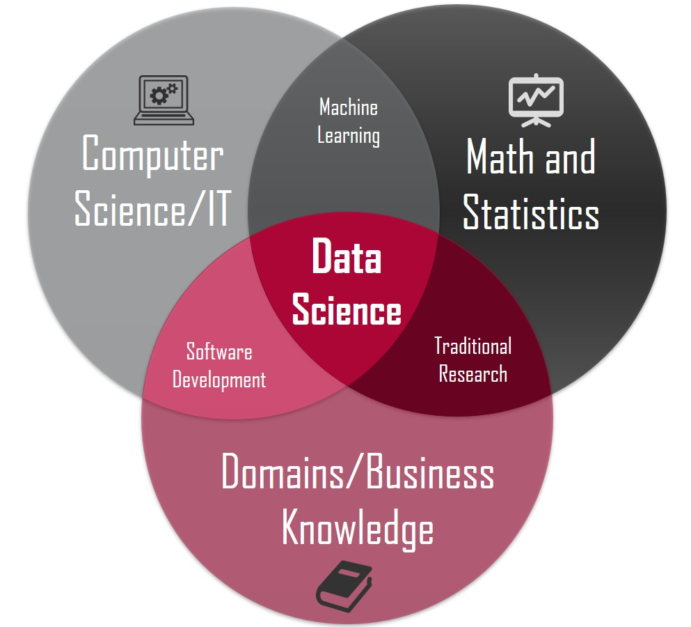
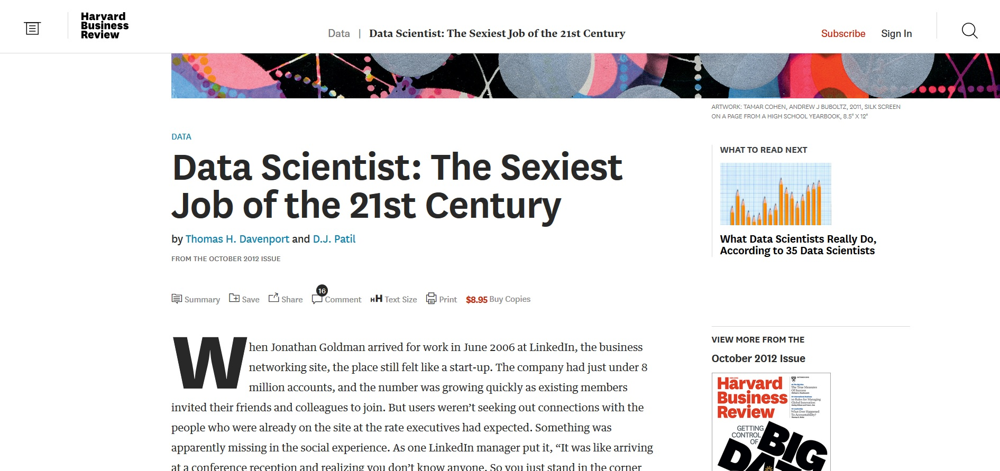
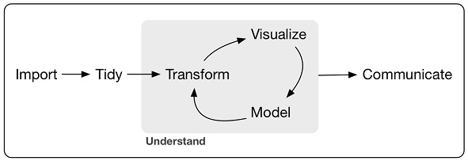
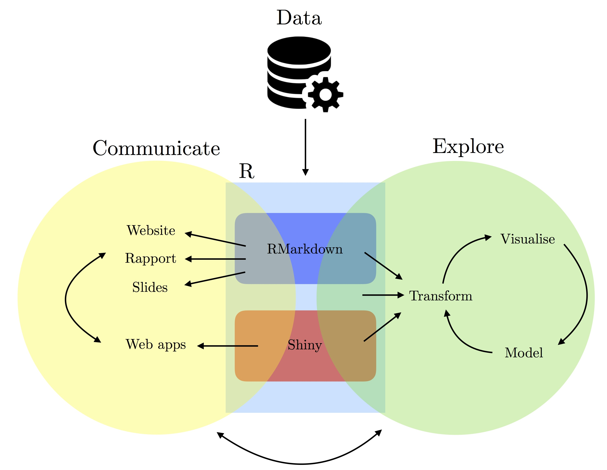

class: inverse, center, middle

# ***Dobrodošli na predmet </br> Nauka o podacima u R-u***


```{r setup, include=FALSE}
options(htmltools.dir.version = FALSE)
```

???

Dobro dosli na predavanja iz predmeta Nauka o podacima u R-u.

---
# Anketa

</br>

-	***Da li ste ranije čuli za termin "Nauka o podacima?***

--

-	***Ako jeste, gde?***

--

-	***Zašto ste birali ovaj predmet?***

---

class: inverse, center, middle

# Šta je Nauka o podacima?

???
https://www.welcometothejungle.co/en/articles/story-origin-data-science
---

class: inverse, center, middle

.center[***Nauka o podacima se bavi generičkim metodama analize podataka (vizuelizacije, transformacije podataka, statističke analize i modeliranja) kojima podaci postaju razumljiviji, a njihova informativnost veća, čime se neposredno i produbljuje znanje o pojavi koju oni opisuju.***]

???

Ona neizostavno podrazumeva primenu različitih metoda vizuelizacije, transformacije podataka, statističke analize i modeliranja u cilju iznalaženja informacija koje na prvi pogled nisu dostupne, a koje su od značaja za bolje razumevanje samih podataka.

---
# Nauka o podacima - definicije
</br>

- *"Data science is the field of study that combines domain expertise, programming skills, and knowledge of mathematics and statistics to extract meaningful insights from data."*

--

- *"Data science is a multi-disciplinary field that uses scientific methods, processes, algorithms and systems to extract knowledge and insights from structured and unstructured data."* 

--
- *"Data science is the same concept as data mining and big data: "use the most powerful hardware, the most powerful programming systems, and the most efficient algorithms to solve problems"*

--

- *"Data science is a "concept to unify statistics, data analysis, machine learning and their related methods" in order to "understand and analyze actual phenomena" with data."*

???
https://www.forbes.com/sites/gilpress/2013/05/28/a-very-short-history-of-data-science/#261dfb8555cf
---

# Nauka o podacima (Data Science)`

```{r echo = FALSE, out.width = '70%', fig.align='center'}

```

---

# Nauka o podacima (Data Science)

</br>

-	***Relativno nova disciplina***

-	***Ima za cilj ekstrakciju znanja/informacija iz podataka***

-	***Oslanja se na statistiku, kao i na nove pristupe analizi podataka***

-	***Proistekla je iz potrebe obrade velike količine podataka (senzori, automatizovani sistemi)***

- ***Multidisciplinarna oblast***

???
Analiza podataka je proces u kojem podaci postaju razumljiviji, a njihova informativnost veća, čime se neposredno i produbljuje znanje o pojavi koju oni opisuju. Ona neizostavno podrazumeva primenu različitih metoda vizuelizacije, transformacije podataka, statističke analize i modeliranja u cilju iznalaženja informacija koje na prvi pogled nisu dostupne, a koje su od značaja za bolje razumevanje samih podataka. Imajući u vidu da je razumevanje podataka saveznik i preduslov uspešnoj primeni svih metoda u cilju rešavanja nekog naučnog i praktičnog problema, analiza podataka bi trebala da rezultira i u identifikaciji  postojećih metoda neophodnih za neko istraživanje, kao i definisanju ciljeva i razvijanju novih pristupa neophodnih za rešavanje nekog naučnog i praktičnog problema. Programski jezik "R" nametnuo se u protekloj deceniji kao najpopularnije softversko okruženje za analizu podataka, naročito u akademskoj i naučnoj zajednici. Sa te strane, predmet je od izuzetne važnosti za sticanje veština naučne analize podataka.

---

# Data Scientist

```{r echo = FALSE, out.width = '70%', fig.align='center'}

```

--
</br>
</br>

.center[*An analytical data professional with a high degree of technical skill and knowledge, usually with expertise in programming languages such as R and Python. Data scientists help businesses collect, compile, interpret, format, model, make predictions about, and manipulate all kinds of data in all manner of ways. They’re experts at both construction and deconstruction. ***Even though the role of data scientist is relatively new, it’s in high demand and pays well.****]

---

# Povezane oblasti ... 

</br>

-	***Data mining***

-	***Statistics***

-	***Machine Learning***

- ***Big Data***

- ***Artificial Intelligence ili AI***


???
Istrazivanje podataka (eng. data mining) se bavi pronalazenjem zakonitosti u
podacima i ukljucuje primenu algoritama masinskog ucenja kao jedan od cestih
koraka

I Takode, istrazivanje podataka ukljucuje poslove poput preprocesiranja podataka,
eksplorativne analize, vizualizacije...

I Masinsko ucenje se bavi dizajnom algoritama koji generalizuju i stoga mogu da
vrse predvidanje, njihovim svojstvima i time kako ta svojstva zavise od elemanta
dizajna algoritma

Data mining is a process that data scientists employ to find usable models and insights in data sets. They use numerous techniques to accomplish this task such as regression, classification, cluster analysis, and outlier analysis.

---

# Spatial Data Science 

</br>

-	***Bavi se problemom prostornih podataka u "Data Science" (prostorna predikcija, klasterizacija, klasifikacija, prostorna zavisnost itd)***

-	***Predstavlja logičnu nadogradnju/proširenje oblasti uzimanjem prostorne lokacije u obzir***

-	***GIS i Earth Observation***

---
class: inverse, center, middle

***Spatial data science treats location, distance, and spatial interaction as core aspects of the data and employs specialized methods and software to store, retrieve, explore, analyze, visualize and learn from such data. In this sense, spatial data science relates to data science as spatial statistics to statistics, spatial databases to databases, and geocomputation to computation." (Luc Anselin, 2019, "Spatial Data Science" in The International Encyclopedia of Geography: People, the Earth, Environment, and Technology.***

.right[Luc Anselin, 2019]
.right["Spatial Data Science" in The International Encyclopedia of Geography: People, the Earth, Environment, and Technology.]

???
Spatial data science is a flavor of data science where spatial locations play a role, not only to hold records together (which IDs also could do), but also play an explicit role in the analysis, e.g. to compute and analyse distances, consider spatial autocorrelation, or compute spatial relationships between features with different geometry types, such as distances from points to linestrings. Quite often, temporal considerations play a role too when considering spatial properties.

---
# Nauka o podacima je proces..

</br>

***"Data science is the process by which data becomes understanding, knowledge and insight"***
</br>
.right[***Hadley Wickham***]
--
</br>

```{r echo = FALSE, out.width = '100%'}
#TODO ubaci Figure caption

```


---

class: inverse, center, middle

# Šta je R?

???
https://www.welcometothejungle.co/en/articles/story-origin-data-science

---

# R

</br>

-	***R nije program kao Word ili Excel ***

--

-	***R je programski jezik***

--

-	***Koristi se tako što se zadaju komande (koje naređuju računaru da ih interpretira)***


---

# Zašto R?

</br>

-	***"Free and Open Source" i dostupan na svim platformama***
-	***Ima najbolju zajednicu korisnika ([rstats on twitter](https://twitter.com/search?q=%23rstats), [rbloggers](https://www.r-bloggers.com/), [R Programming Language Meetup groups](https://www.meetup.com/topics/r-programming-language/)).***
-	***Kao posledica toga, rešenja mnogih problema se brzo pronalaze na web-u ([R studio](https://community.rstudio.com/), [StackOverflow](http://stackoverflow.com/), [R-help mailing list](https://stat.ethz.ch/mailman/listinfo/r-help))***
- ***Ogroman broj paketa za različite oblasti je besplatno dostupan ([Cran Task View](https://cran.r-project.org/web/views/))***
-	***Medju njima i fantastične alate za diseminaciju rezultata (kreiranje izveštaja u bilo kojem formatu [pandoc](https://pandoc.org/installing.html), web i blog stranica [blogdown](https://bookdown.org/yihui/blogdown/), knjiga [bookdown](https://bookdown.org/home/) i na kraju paketa [R packages](http://r-pkgs.had.co.nz/))***
-	***R studio je integralno okruženje sa fantastičnim mogućnostima***
- ***R je jezik akademske zajednice i kao takav predstavlja alat za implementaciju najnovijih rešenja***
- ***U okviru R-a se lako mogu koristiti drugi programski jezici***
- ***R ti dozvoljava da se fokusiraš na prblem koji rešavaš.***
- ***Više na [Advanced R](https://adv-r.hadley.nz/) by Hadley Wickham.***

---

# Nauka o podacima u R-u?

```{r echo = FALSE, out.width = '70%', fig.align="center" }
#TODO ubaci Figure caption

```

.center[Book: [An Introduction to Statistical Programming Methods with R](https://smac-group.github.io/ds/)]


---

# Cilj predmeta
</br>

-	***Upoznavanje sa Naukom o podacima***

-	***Upoznavanje sa R programskim jezikom***

-	***Ovladavanje savremenim metodama i alatima za rad sa podacima (manupulacija, oblikovanje, transformacija, vizualizacija, stastistčko modeliranje itd.)***

-	***Usvajanje dobre prakse (kolaborativni rada, reproduktivni izveštaji, itd.)***


???
Predmet nauka o podacima je nastao iz potrebe da se studenti pripreme za akademski pristup analizi problema i podataka. Pored toga, 

introduce tools and workflow for reproducible research (R/RStudio, Git/GitHub, etc.);
introduce principles of tidy data and tools for data wrangling;
exploit data structures to appropriately manage data, computer memory and computations;
data manipulation through controls, instructions, and tailored functions;
develop new software tools including functions, Shiny applications, and packages;
manage software development process including version control, documentation (with embedded code), and dissemination for other users.


---

# Sadržaj
</br>
-	**Uvod u "R" programski jezik (R studio, CRAN, R packages)**
- **Kreiranje reproduktivinih izveštaja (R markdown)**
- **Kolaborativan rad korišćenjem GitHub-a**
-	**Tipovi i strukture osnovnih podataka u "R"-u**
-	**Učitavanje/ispisivanje podataka (readr, rgdal)**
-	**Dodavanja, eliminacije, sortiranja, selekcije i ekstrakcije podataka**
-	**Funkcionalnosti u "R"-u**
-	**Oblikovanje i formatiranje podataka (tidyverse familija alata)**
-	**Vizuelizacija podataka (base plot, grid, lattice, ggplot)**
-	**Deskriptivna statistička analiza**
- **Prostorni podaci u "R"-u**
-	**Programiranje u "R"-u (pipes, functions...)**
-	**Osnove statističkog modeliranja**
-	**Kreiranje "R" paketa**


???
Predmet nauka o podacima je nastao iz potrebe da se studenti pripreme za akademski pristup analizi problema i podataka. Pored toga, 

---

# Šta vas čeka
</br>

-	***Interaktivan rad***

-	***Seminarski rad***

- ***Oktobar i Novembar posvećeni učenju***

- ***Decembar i Januar posvećeni praktičnom radu***

???
Predmet nauka o podacima je nastao iz potrebe da se studenti pripreme za akademski pristup analizi problema i podataka. Pored toga

---

# Literatura

.pull-left[

]
.pull-right[

]


# Literatura

.pull-left[

]
.pull-right[

]


---

# Literatura

.pull-left[

]
.pull-right[

]


