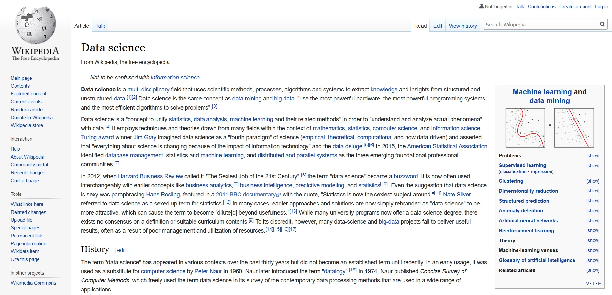

class: inverse, center, middle

# Šta je Nauka o podacima?

---
# Nauka o podacima (Data Science)

```{r echo = FALSE, out.width = '100%'}
# url
# knitr::include_graphics("http://bit.ly/arm-greens") 
# local

```


---
# Nauka o podacima (Data Science)


<br/>

-	Nauka o podacima je nova disciplina

-	Bavi se razvojem metodologije, pristupa i softvera za bolje razumevanje podataka

-	Oslanja se na statistiku, kao i na nove pristupe analizi podataka

-	Proistekla je iz potrebe obrade velike količine podataka (senzori, automatizovani sistemi)

---

class: inverse, center, middle

***Nauka o podacima obuhvata generičke procese analize podataka kojima podaci postaju razumljiviji, a njihova informativnost veća, čime se neposredno i produbljuje znanje o pojavi koju oni opisuju. Ona neizostavno podrazumeva primenu različitih metoda vizuelizacije, transformacije podataka, statističke analize i modeliranja u cilju iznalaženja informacija koje na prvi pogled nisu dostupne, a koje su od značaja za bolje razumevanje samih podataka.***


```{r setup, include=FALSE}
options(htmltools.dir.version = FALSE)
```

---
# Šta je Nauka o podacima?

<br/>

-	Podaci postaju razumljiviji

-	Bavi se razvojem metodologije, pristupa i softvera za bolje razumevanje podataka

-	Oslanja se na primenu različitih metoda vizuelizacije, transformacije podataka, statističke analize i modeliranja

-	Proistekla je iz potrebe obrade velike količine podataka (senzori, automatizovani sistemi)

---
class: center, middle

# xaringan

### /ʃaː.'riŋ.ɡan/

---
