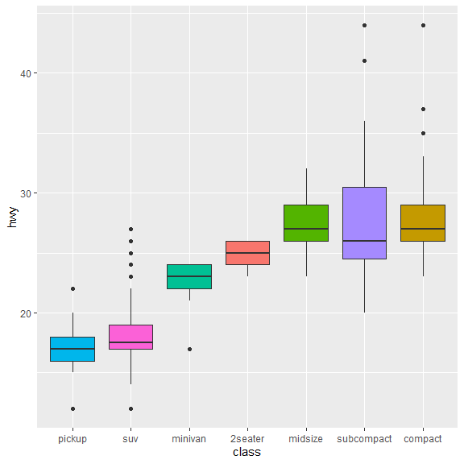
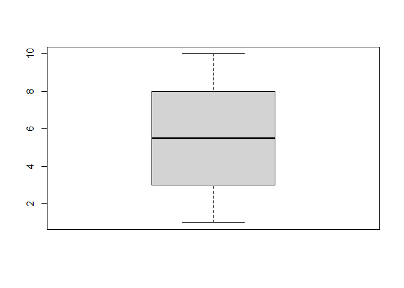
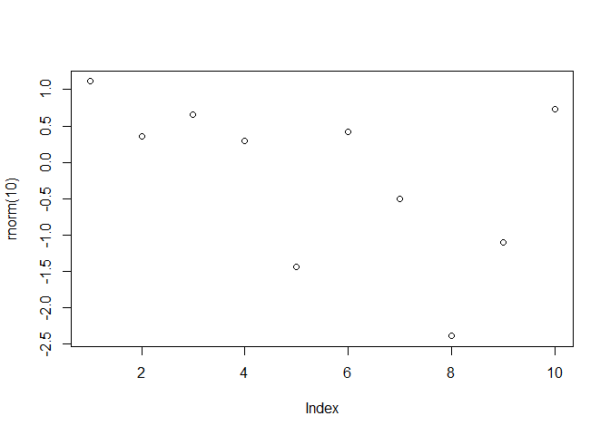
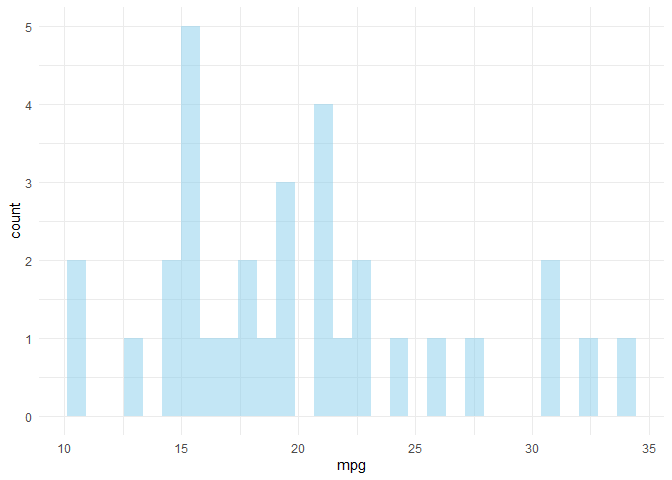

# Uvod

`Rmarkdown` je okruženje u okviru `R` programskog jezika koje nam omogućava da kreiramo dokumente koji objedinjuju R kod, rezultate koda i prateći tekst. U okviru `Rmarkdown`-a moguće je kreirati različite dokumente u različitim formatima, kao što su html, pdf, word, prezentaciju itd. 

`Rmarkdown` je prevashodno namenjen da:

1.  Da omogući lakšu komunikaciju između onoga ko radi na rešavanju nekog problema i onoga ko će da donese odluku na osnovu rezultata, omogućavajući onome ko donosi odluke da se fokusira na rezultate i tekst, a ne na kod. 

1.  Da omogući komunikaciju između ljudi (uključujući i budućeg tebe) tako što će kod biti praćen određenim tekstom koji će objašnjavati kako se došlo do određenih rezultata.
    
1.  Da omogući bolju dokumentaciju onoga što je urađeno.


U okviru ovog dokumenta dat je prikaz osnovnih alata, kao i par trikova u cilju izrade kvalitetnih i interaktivnih R Markdown izveštaja.


# Formatiranje teksta
***
U okviru R Markdown-a, formatiranje teksta je jednostavno i koriste se sledeći tagovi:

  - **Boldiran** tekst se piše pomoću ** **.
  - *Iskošen* teskt se piše pomoću * *.
  - [Linkovi](https://www.grf.bg.ac.rs/home) se dodaju pomoću [] i ().

  

```r
Kod je napisan na sledeći način:

  - **Boldiran** tekst se piše pomoću ** **.
  - *Iskošen* teskt se piše pomoću * *.
  - [Linkovi](https://www.grf.bg.ac.rs/home) se dodaju pomoću [] i ().
```


# Horizontalne linije 
***
Dodavanje horizontalne linije koja odvaja delove dokumenta je moguća putem tri zvezdice ***:


```r
***
```


# Auto numerisanje naslova 
***
Naslovi i podnaslovi nivoa 1, 2, 3 se postavljaju putem #, ## i ###. Auto numerisanje naslova i podnaslova je moguće korišćenjem sledećeg taga u zaglavlju dokumenta:


```r
---
title: "Naslov dokumenta"
output: 
  html_document:
    number_sections: TRUE
---

# Prvi naslov
## Prvi podnaslov
## Drugi podnaslov

# Drugi naslov
```


# Prazan red 
***
Dodavanje razmaka - prazan red između paragrafa kao i ostalog sadržaja je moguće korišćenjem taga `<br>`, putem `.rmd` koda: 

```r
Prva rečenica
<br><br><br><br>
Druga rečenica
```

dobijamo ovakav `html` rezultat:

***

Prva rečenica
<br><br><br><br>
Druga rečenica

***


# Centriranje slika 
***
Centriranje slika se postiže sledećim kodom:

```r
<center>

</center>
```

I kao rezultat: 
<center>


</center>


# Naziv slike 
***
Naziv slike pišemo u okviru taga unutar chunk-a, primer:

```r
{r, fig.align="center", fig.width=6, fig.height=6, fig.cap="Slika: Veoma važan naziv slike."}
```


```r
library(tidyverse)
mpg %>%
  ggplot( aes(x=reorder(class, hwy), y=hwy, fill=class)) + 
    geom_boxplot() +
    xlab("class") +
    theme(legend.position="none")
```

<div class="figure" style="text-align: center">

<p class="caption">Slika: Veoma važan naziv slike.</p>
</div>


# Formule
***
Formule se pišu korišćenjem LATEX formata:

$A = (\pi * \lambda \times r^{4}) / \alpha$

Latex sintaksa se piše unutar `$`

```r
$A = (\pi * \lambda \times r^{4}) / \alpha $
```


# 2 slike u 2 kolone
***
Plotovanje dve slike, jedna pored druge je moguće korišćenjem sledećeg koda, koji se piše u okviru header-a chunk-a:


```r
``{r out.width=c('50%', '50%'), fig.show='hold'}
boxplot(1:10)
plot(rnorm(10))
`
```




# Više kolona
***


<div class = "row">
<div class = "col-md-4">
<br><br>Since R Markdown use the [bootstrap framework](https://getbootstrap.com/docs/4.0/layout/grid/) under the hood. It is possible to benefit its powerful grid system. Basically, you can consider that your row is divided in 12 subunits of same width. You can then choose to use only a few of this subunits.
</div>
<div class = "col-md-4">
<br><br>Here, I use 3 subunits of size 4 (4x3=12). The last column is used for a plot. You can read more about the grid system [here](bootstrap grid system). I got this result showing the following code in my R Markdown document.
</div>
<div class = "col-md-4">
<!-- -->
</div>
</div>


Kod kojim se postiže ovaj rezultat:

```r
<div class = "row">
  
<div class = "col-md-4">
<br><br>Since R Markdown use the [bootstrap framework](https://getbootstrap.com/docs/4.0/layout/grid/) under the hood. It is possible to benefit its powerful grid system. Basically, you can consider that your row is divided in 12 subunits of same width. You can then choose to use only a few of this subunits.
</div>
  
<div class = "col-md-4">
<br><br>Here, I use 3 subunits of size 4 (4x3=12). The last column is used for a plot. You can read more about the grid system [here](bootstrap grid system). I got this result showing the following code in my R Markdown document.
</div>
  
<div class = "col-md-4">
``{r, message=FALSE, echo=FALSE}
ggplot( mtcars, aes(x=mpg)) + geom_histogram(fill="skyblue", alpha=0.5) + theme_minimal()
``
</div>
</div>
```


# Tabovi za podnaslove {#buttons .tabset .tabset-fade .tabset-pills}
***
Kreiranje tabova za podnaslove se može kreirati na sledeći način, nakon naslova u čijem nastavku je dat kod "{#buttons .tabset .tabset-fade .tabset-pills}":

## Prvi
Sadržaj prvog podnaslova #1

<br><br>

***

Kod za kreiranje ovakvog izgleda:

```r
# Korišćenje buttons-a ili tab-ova za podnaslove 
***
Organizovati podnaslove na sledeći način: 

## Prvi
Prvi podnaslov

## Drugi
Sadržaj drugog podnaslova #2

## Treći
Sadržaj trećeg podnaslova #3
```


Takođe je moguće stilizovati izgled dugmeta sledećim css kodom:

```r
.btn {
    border-width: 0 0px 0px 0px;
    font-weight: normal;
    text-transform: ;
}
.btn-default {
    color: #2ecc71;
    background-color: #ffffff;
    border-color: #ffffff;
}
```

## Drugi
Sadržaj drugog podnaslova #2

## Treći
Sadržaj trećeg podnaslova #3


## Naglašavanje dela teksta
***
Korišćenjem stilizacije putem **css** koda moguće je promeniti boju pozdaine kako bi tekst bio naglašen.

Kod:

```r
<style>
div.blue { background-color:#e6f0ff; border-radius: 5px; padding: 20px;}
</style>
<div class = "blue">

- Ovo je prva rečenica.
- Ovo je druga rečenica.

</div>
```

Dobijamo:
<br>
<style>
div.blue { background-color:#d97e77; border-radius: 5px; padding: 30px;}
</style>
<div class = "blue">

- Ovo je prva rečenica.
- Ovo je druga rečenica.

</div>


# Tabele - paket DT
***
Paket [DT library](https://rstudio.github.io/DT/) je jedna od najboljih opcija u cilju formatiranja i stilizacije tabela u HTML formatu. Moguće je:

- Prikazati samo željeni sadržaj
- Imati jasan uvid u podatke
- Moguća je pretraga po kolonama
- Dodavanje filtera
- Kao i drugih pojedinosti

Primer:


```r
library(DT)
datatable(mtcars, rownames = FALSE, filter="top", options = list(pageLength = 5, scrollX=T) )
```

<!--html_preserve--><div id="htmlwidget-19a0d5cd4ef673c97b7b" style="width:100%;height:auto;" class="datatables html-widget"></div>
<script type="application/json" data-for="htmlwidget-19a0d5cd4ef673c97b7b">{"x":{"filter":"top","filterHTML":"<tr>\n  <td data-type=\"number\" style=\"vertical-align: top;\">\n    <div class=\"form-group has-feedback\" style=\"margin-bottom: auto;\">\n      <input type=\"search\" placeholder=\"All\" class=\"form-control\" style=\"width: 100%;\"/>\n      <span class=\"glyphicon glyphicon-remove-circle form-control-feedback\"><\/span>\n    <\/div>\n    <div style=\"display: none; position: absolute; width: 200px;\">\n      <div data-min=\"10.4\" data-max=\"33.9\" data-scale=\"1\"><\/div>\n      <span style=\"float: left;\"><\/span>\n      <span style=\"float: right;\"><\/span>\n    <\/div>\n  <\/td>\n  <td data-type=\"number\" style=\"vertical-align: top;\">\n    <div class=\"form-group has-feedback\" style=\"margin-bottom: auto;\">\n      <input type=\"search\" placeholder=\"All\" class=\"form-control\" style=\"width: 100%;\"/>\n      <span class=\"glyphicon glyphicon-remove-circle form-control-feedback\"><\/span>\n    <\/div>\n    <div style=\"display: none; position: absolute; width: 200px;\">\n      <div data-min=\"4\" data-max=\"8\"><\/div>\n      <span style=\"float: left;\"><\/span>\n      <span style=\"float: right;\"><\/span>\n    <\/div>\n  <\/td>\n  <td data-type=\"number\" style=\"vertical-align: top;\">\n    <div class=\"form-group has-feedback\" style=\"margin-bottom: auto;\">\n      <input type=\"search\" placeholder=\"All\" class=\"form-control\" style=\"width: 100%;\"/>\n      <span class=\"glyphicon glyphicon-remove-circle form-control-feedback\"><\/span>\n    <\/div>\n    <div style=\"display: none; position: absolute; width: 200px;\">\n      <div data-min=\"71.1\" data-max=\"472\" data-scale=\"1\"><\/div>\n      <span style=\"float: left;\"><\/span>\n      <span style=\"float: right;\"><\/span>\n    <\/div>\n  <\/td>\n  <td data-type=\"number\" style=\"vertical-align: top;\">\n    <div class=\"form-group has-feedback\" style=\"margin-bottom: auto;\">\n      <input type=\"search\" placeholder=\"All\" class=\"form-control\" style=\"width: 100%;\"/>\n      <span class=\"glyphicon glyphicon-remove-circle form-control-feedback\"><\/span>\n    <\/div>\n    <div style=\"display: none; position: absolute; width: 200px;\">\n      <div data-min=\"52\" data-max=\"335\"><\/div>\n      <span style=\"float: left;\"><\/span>\n      <span style=\"float: right;\"><\/span>\n    <\/div>\n  <\/td>\n  <td data-type=\"number\" style=\"vertical-align: top;\">\n    <div class=\"form-group has-feedback\" style=\"margin-bottom: auto;\">\n      <input type=\"search\" placeholder=\"All\" class=\"form-control\" style=\"width: 100%;\"/>\n      <span class=\"glyphicon glyphicon-remove-circle form-control-feedback\"><\/span>\n    <\/div>\n    <div style=\"display: none; position: absolute; width: 200px;\">\n      <div data-min=\"2.76\" data-max=\"4.93\" data-scale=\"2\"><\/div>\n      <span style=\"float: left;\"><\/span>\n      <span style=\"float: right;\"><\/span>\n    <\/div>\n  <\/td>\n  <td data-type=\"number\" style=\"vertical-align: top;\">\n    <div class=\"form-group has-feedback\" style=\"margin-bottom: auto;\">\n      <input type=\"search\" placeholder=\"All\" class=\"form-control\" style=\"width: 100%;\"/>\n      <span class=\"glyphicon glyphicon-remove-circle form-control-feedback\"><\/span>\n    <\/div>\n    <div style=\"display: none; position: absolute; width: 200px;\">\n      <div data-min=\"1.513\" data-max=\"5.424\" data-scale=\"3\"><\/div>\n      <span style=\"float: left;\"><\/span>\n      <span style=\"float: right;\"><\/span>\n    <\/div>\n  <\/td>\n  <td data-type=\"number\" style=\"vertical-align: top;\">\n    <div class=\"form-group has-feedback\" style=\"margin-bottom: auto;\">\n      <input type=\"search\" placeholder=\"All\" class=\"form-control\" style=\"width: 100%;\"/>\n      <span class=\"glyphicon glyphicon-remove-circle form-control-feedback\"><\/span>\n    <\/div>\n    <div style=\"display: none; position: absolute; width: 200px;\">\n      <div data-min=\"14.5\" data-max=\"22.9\" data-scale=\"2\"><\/div>\n      <span style=\"float: left;\"><\/span>\n      <span style=\"float: right;\"><\/span>\n    <\/div>\n  <\/td>\n  <td data-type=\"number\" style=\"vertical-align: top;\">\n    <div class=\"form-group has-feedback\" style=\"margin-bottom: auto;\">\n      <input type=\"search\" placeholder=\"All\" class=\"form-control\" style=\"width: 100%;\"/>\n      <span class=\"glyphicon glyphicon-remove-circle form-control-feedback\"><\/span>\n    <\/div>\n    <div style=\"display: none; position: absolute; width: 200px;\">\n      <div data-min=\"0\" data-max=\"1\"><\/div>\n      <span style=\"float: left;\"><\/span>\n      <span style=\"float: right;\"><\/span>\n    <\/div>\n  <\/td>\n  <td data-type=\"number\" style=\"vertical-align: top;\">\n    <div class=\"form-group has-feedback\" style=\"margin-bottom: auto;\">\n      <input type=\"search\" placeholder=\"All\" class=\"form-control\" style=\"width: 100%;\"/>\n      <span class=\"glyphicon glyphicon-remove-circle form-control-feedback\"><\/span>\n    <\/div>\n    <div style=\"display: none; position: absolute; width: 200px;\">\n      <div data-min=\"0\" data-max=\"1\"><\/div>\n      <span style=\"float: left;\"><\/span>\n      <span style=\"float: right;\"><\/span>\n    <\/div>\n  <\/td>\n  <td data-type=\"number\" style=\"vertical-align: top;\">\n    <div class=\"form-group has-feedback\" style=\"margin-bottom: auto;\">\n      <input type=\"search\" placeholder=\"All\" class=\"form-control\" style=\"width: 100%;\"/>\n      <span class=\"glyphicon glyphicon-remove-circle form-control-feedback\"><\/span>\n    <\/div>\n    <div style=\"display: none; position: absolute; width: 200px;\">\n      <div data-min=\"3\" data-max=\"5\"><\/div>\n      <span style=\"float: left;\"><\/span>\n      <span style=\"float: right;\"><\/span>\n    <\/div>\n  <\/td>\n  <td data-type=\"number\" style=\"vertical-align: top;\">\n    <div class=\"form-group has-feedback\" style=\"margin-bottom: auto;\">\n      <input type=\"search\" placeholder=\"All\" class=\"form-control\" style=\"width: 100%;\"/>\n      <span class=\"glyphicon glyphicon-remove-circle form-control-feedback\"><\/span>\n    <\/div>\n    <div style=\"display: none; position: absolute; width: 200px;\">\n      <div data-min=\"1\" data-max=\"8\"><\/div>\n      <span style=\"float: left;\"><\/span>\n      <span style=\"float: right;\"><\/span>\n    <\/div>\n  <\/td>\n<\/tr>","data":[[21,21,22.8,21.4,18.7,18.1,14.3,24.4,22.8,19.2,17.8,16.4,17.3,15.2,10.4,10.4,14.7,32.4,30.4,33.9,21.5,15.5,15.2,13.3,19.2,27.3,26,30.4,15.8,19.7,15,21.4],[6,6,4,6,8,6,8,4,4,6,6,8,8,8,8,8,8,4,4,4,4,8,8,8,8,4,4,4,8,6,8,4],[160,160,108,258,360,225,360,146.7,140.8,167.6,167.6,275.8,275.8,275.8,472,460,440,78.7,75.7,71.1,120.1,318,304,350,400,79,120.3,95.1,351,145,301,121],[110,110,93,110,175,105,245,62,95,123,123,180,180,180,205,215,230,66,52,65,97,150,150,245,175,66,91,113,264,175,335,109],[3.9,3.9,3.85,3.08,3.15,2.76,3.21,3.69,3.92,3.92,3.92,3.07,3.07,3.07,2.93,3,3.23,4.08,4.93,4.22,3.7,2.76,3.15,3.73,3.08,4.08,4.43,3.77,4.22,3.62,3.54,4.11],[2.62,2.875,2.32,3.215,3.44,3.46,3.57,3.19,3.15,3.44,3.44,4.07,3.73,3.78,5.25,5.424,5.345,2.2,1.615,1.835,2.465,3.52,3.435,3.84,3.845,1.935,2.14,1.513,3.17,2.77,3.57,2.78],[16.46,17.02,18.61,19.44,17.02,20.22,15.84,20,22.9,18.3,18.9,17.4,17.6,18,17.98,17.82,17.42,19.47,18.52,19.9,20.01,16.87,17.3,15.41,17.05,18.9,16.7,16.9,14.5,15.5,14.6,18.6],[0,0,1,1,0,1,0,1,1,1,1,0,0,0,0,0,0,1,1,1,1,0,0,0,0,1,0,1,0,0,0,1],[1,1,1,0,0,0,0,0,0,0,0,0,0,0,0,0,0,1,1,1,0,0,0,0,0,1,1,1,1,1,1,1],[4,4,4,3,3,3,3,4,4,4,4,3,3,3,3,3,3,4,4,4,3,3,3,3,3,4,5,5,5,5,5,4],[4,4,1,1,2,1,4,2,2,4,4,3,3,3,4,4,4,1,2,1,1,2,2,4,2,1,2,2,4,6,8,2]],"container":"<table class=\"display\">\n  <thead>\n    <tr>\n      <th>mpg<\/th>\n      <th>cyl<\/th>\n      <th>disp<\/th>\n      <th>hp<\/th>\n      <th>drat<\/th>\n      <th>wt<\/th>\n      <th>qsec<\/th>\n      <th>vs<\/th>\n      <th>am<\/th>\n      <th>gear<\/th>\n      <th>carb<\/th>\n    <\/tr>\n  <\/thead>\n<\/table>","options":{"pageLength":5,"scrollX":true,"columnDefs":[{"className":"dt-right","targets":[0,1,2,3,4,5,6,7,8,9,10]}],"order":[],"autoWidth":false,"orderClasses":false,"orderCellsTop":true,"lengthMenu":[5,10,25,50,100]}},"evals":[],"jsHooks":[]}</script><!--/html_preserve-->


# Tabele - paket kableExtra
***
Druga opcija kod kreiranja tabela je korišćenje paketa [kableExtra](https://cran.r-project.org/web/packages/kableExtra/vignettes/awesome_table_in_html.html).
Ovaj paketa nudi mogućnosti stilizacije i kreiranja tabela u skladu sa funkcionalnostima tidyverse familije paketa.


```r
library(kableExtra)
dt <- mtcars[1:5, 1:6]
dt %>%
  kbl() %>%
  kable_styling() # automatsko dodavanje bootstrap teme
```

<table class="table" style="margin-left: auto; margin-right: auto;">
 <thead>
  <tr>
   <th style="text-align:left;">   </th>
   <th style="text-align:right;"> mpg </th>
   <th style="text-align:right;"> cyl </th>
   <th style="text-align:right;"> disp </th>
   <th style="text-align:right;"> hp </th>
   <th style="text-align:right;"> drat </th>
   <th style="text-align:right;"> wt </th>
  </tr>
 </thead>
<tbody>
  <tr>
   <td style="text-align:left;"> Mazda RX4 </td>
   <td style="text-align:right;"> 21.0 </td>
   <td style="text-align:right;"> 6 </td>
   <td style="text-align:right;"> 160 </td>
   <td style="text-align:right;"> 110 </td>
   <td style="text-align:right;"> 3.90 </td>
   <td style="text-align:right;"> 2.620 </td>
  </tr>
  <tr>
   <td style="text-align:left;"> Mazda RX4 Wag </td>
   <td style="text-align:right;"> 21.0 </td>
   <td style="text-align:right;"> 6 </td>
   <td style="text-align:right;"> 160 </td>
   <td style="text-align:right;"> 110 </td>
   <td style="text-align:right;"> 3.90 </td>
   <td style="text-align:right;"> 2.875 </td>
  </tr>
  <tr>
   <td style="text-align:left;"> Datsun 710 </td>
   <td style="text-align:right;"> 22.8 </td>
   <td style="text-align:right;"> 4 </td>
   <td style="text-align:right;"> 108 </td>
   <td style="text-align:right;"> 93 </td>
   <td style="text-align:right;"> 3.85 </td>
   <td style="text-align:right;"> 2.320 </td>
  </tr>
  <tr>
   <td style="text-align:left;"> Hornet 4 Drive </td>
   <td style="text-align:right;"> 21.4 </td>
   <td style="text-align:right;"> 6 </td>
   <td style="text-align:right;"> 258 </td>
   <td style="text-align:right;"> 110 </td>
   <td style="text-align:right;"> 3.08 </td>
   <td style="text-align:right;"> 3.215 </td>
  </tr>
  <tr>
   <td style="text-align:left;"> Hornet Sportabout </td>
   <td style="text-align:right;"> 18.7 </td>
   <td style="text-align:right;"> 8 </td>
   <td style="text-align:right;"> 360 </td>
   <td style="text-align:right;"> 175 </td>
   <td style="text-align:right;"> 3.15 </td>
   <td style="text-align:right;"> 3.440 </td>
  </tr>
</tbody>
</table>


```r
dt %>%
  kbl() %>%
  kable_paper("hover", full_width = F)
```

<table class=" lightable-paper lightable-hover" style='font-family: "Arial Narrow", arial, helvetica, sans-serif; width: auto !important; margin-left: auto; margin-right: auto;'>
 <thead>
  <tr>
   <th style="text-align:left;">   </th>
   <th style="text-align:right;"> mpg </th>
   <th style="text-align:right;"> cyl </th>
   <th style="text-align:right;"> disp </th>
   <th style="text-align:right;"> hp </th>
   <th style="text-align:right;"> drat </th>
   <th style="text-align:right;"> wt </th>
  </tr>
 </thead>
<tbody>
  <tr>
   <td style="text-align:left;"> Mazda RX4 </td>
   <td style="text-align:right;"> 21.0 </td>
   <td style="text-align:right;"> 6 </td>
   <td style="text-align:right;"> 160 </td>
   <td style="text-align:right;"> 110 </td>
   <td style="text-align:right;"> 3.90 </td>
   <td style="text-align:right;"> 2.620 </td>
  </tr>
  <tr>
   <td style="text-align:left;"> Mazda RX4 Wag </td>
   <td style="text-align:right;"> 21.0 </td>
   <td style="text-align:right;"> 6 </td>
   <td style="text-align:right;"> 160 </td>
   <td style="text-align:right;"> 110 </td>
   <td style="text-align:right;"> 3.90 </td>
   <td style="text-align:right;"> 2.875 </td>
  </tr>
  <tr>
   <td style="text-align:left;"> Datsun 710 </td>
   <td style="text-align:right;"> 22.8 </td>
   <td style="text-align:right;"> 4 </td>
   <td style="text-align:right;"> 108 </td>
   <td style="text-align:right;"> 93 </td>
   <td style="text-align:right;"> 3.85 </td>
   <td style="text-align:right;"> 2.320 </td>
  </tr>
  <tr>
   <td style="text-align:left;"> Hornet 4 Drive </td>
   <td style="text-align:right;"> 21.4 </td>
   <td style="text-align:right;"> 6 </td>
   <td style="text-align:right;"> 258 </td>
   <td style="text-align:right;"> 110 </td>
   <td style="text-align:right;"> 3.08 </td>
   <td style="text-align:right;"> 3.215 </td>
  </tr>
  <tr>
   <td style="text-align:left;"> Hornet Sportabout </td>
   <td style="text-align:right;"> 18.7 </td>
   <td style="text-align:right;"> 8 </td>
   <td style="text-align:right;"> 360 </td>
   <td style="text-align:right;"> 175 </td>
   <td style="text-align:right;"> 3.15 </td>
   <td style="text-align:right;"> 3.440 </td>
  </tr>
</tbody>
</table>


```r
dt %>%
  kbl(caption = "Recreating booktabs style table") %>%
  kable_classic(full_width = F, html_font = "Cambria")
```

<table class=" lightable-classic" style="font-family: Cambria; width: auto !important; margin-left: auto; margin-right: auto;">
<caption>Recreating booktabs style table</caption>
 <thead>
  <tr>
   <th style="text-align:left;">   </th>
   <th style="text-align:right;"> mpg </th>
   <th style="text-align:right;"> cyl </th>
   <th style="text-align:right;"> disp </th>
   <th style="text-align:right;"> hp </th>
   <th style="text-align:right;"> drat </th>
   <th style="text-align:right;"> wt </th>
  </tr>
 </thead>
<tbody>
  <tr>
   <td style="text-align:left;"> Mazda RX4 </td>
   <td style="text-align:right;"> 21.0 </td>
   <td style="text-align:right;"> 6 </td>
   <td style="text-align:right;"> 160 </td>
   <td style="text-align:right;"> 110 </td>
   <td style="text-align:right;"> 3.90 </td>
   <td style="text-align:right;"> 2.620 </td>
  </tr>
  <tr>
   <td style="text-align:left;"> Mazda RX4 Wag </td>
   <td style="text-align:right;"> 21.0 </td>
   <td style="text-align:right;"> 6 </td>
   <td style="text-align:right;"> 160 </td>
   <td style="text-align:right;"> 110 </td>
   <td style="text-align:right;"> 3.90 </td>
   <td style="text-align:right;"> 2.875 </td>
  </tr>
  <tr>
   <td style="text-align:left;"> Datsun 710 </td>
   <td style="text-align:right;"> 22.8 </td>
   <td style="text-align:right;"> 4 </td>
   <td style="text-align:right;"> 108 </td>
   <td style="text-align:right;"> 93 </td>
   <td style="text-align:right;"> 3.85 </td>
   <td style="text-align:right;"> 2.320 </td>
  </tr>
  <tr>
   <td style="text-align:left;"> Hornet 4 Drive </td>
   <td style="text-align:right;"> 21.4 </td>
   <td style="text-align:right;"> 6 </td>
   <td style="text-align:right;"> 258 </td>
   <td style="text-align:right;"> 110 </td>
   <td style="text-align:right;"> 3.08 </td>
   <td style="text-align:right;"> 3.215 </td>
  </tr>
  <tr>
   <td style="text-align:left;"> Hornet Sportabout </td>
   <td style="text-align:right;"> 18.7 </td>
   <td style="text-align:right;"> 8 </td>
   <td style="text-align:right;"> 360 </td>
   <td style="text-align:right;"> 175 </td>
   <td style="text-align:right;"> 3.15 </td>
   <td style="text-align:right;"> 3.440 </td>
  </tr>
</tbody>
</table>


```r
dt %>%
  kbl() %>%
  kable_minimal()
```

<table class=" lightable-minimal" style='font-family: "Trebuchet MS", verdana, sans-serif; margin-left: auto; margin-right: auto;'>
 <thead>
  <tr>
   <th style="text-align:left;">   </th>
   <th style="text-align:right;"> mpg </th>
   <th style="text-align:right;"> cyl </th>
   <th style="text-align:right;"> disp </th>
   <th style="text-align:right;"> hp </th>
   <th style="text-align:right;"> drat </th>
   <th style="text-align:right;"> wt </th>
  </tr>
 </thead>
<tbody>
  <tr>
   <td style="text-align:left;"> Mazda RX4 </td>
   <td style="text-align:right;"> 21.0 </td>
   <td style="text-align:right;"> 6 </td>
   <td style="text-align:right;"> 160 </td>
   <td style="text-align:right;"> 110 </td>
   <td style="text-align:right;"> 3.90 </td>
   <td style="text-align:right;"> 2.620 </td>
  </tr>
  <tr>
   <td style="text-align:left;"> Mazda RX4 Wag </td>
   <td style="text-align:right;"> 21.0 </td>
   <td style="text-align:right;"> 6 </td>
   <td style="text-align:right;"> 160 </td>
   <td style="text-align:right;"> 110 </td>
   <td style="text-align:right;"> 3.90 </td>
   <td style="text-align:right;"> 2.875 </td>
  </tr>
  <tr>
   <td style="text-align:left;"> Datsun 710 </td>
   <td style="text-align:right;"> 22.8 </td>
   <td style="text-align:right;"> 4 </td>
   <td style="text-align:right;"> 108 </td>
   <td style="text-align:right;"> 93 </td>
   <td style="text-align:right;"> 3.85 </td>
   <td style="text-align:right;"> 2.320 </td>
  </tr>
  <tr>
   <td style="text-align:left;"> Hornet 4 Drive </td>
   <td style="text-align:right;"> 21.4 </td>
   <td style="text-align:right;"> 6 </td>
   <td style="text-align:right;"> 258 </td>
   <td style="text-align:right;"> 110 </td>
   <td style="text-align:right;"> 3.08 </td>
   <td style="text-align:right;"> 3.215 </td>
  </tr>
  <tr>
   <td style="text-align:left;"> Hornet Sportabout </td>
   <td style="text-align:right;"> 18.7 </td>
   <td style="text-align:right;"> 8 </td>
   <td style="text-align:right;"> 360 </td>
   <td style="text-align:right;"> 175 </td>
   <td style="text-align:right;"> 3.15 </td>
   <td style="text-align:right;"> 3.440 </td>
  </tr>
</tbody>
</table>


```r
dt %>%
  kbl() %>%
  kable_material(c("striped", "hover"))
```

<table class=" lightable-material lightable-striped lightable-hover" style='font-family: "Source Sans Pro", helvetica, sans-serif; margin-left: auto; margin-right: auto;'>
 <thead>
  <tr>
   <th style="text-align:left;">   </th>
   <th style="text-align:right;"> mpg </th>
   <th style="text-align:right;"> cyl </th>
   <th style="text-align:right;"> disp </th>
   <th style="text-align:right;"> hp </th>
   <th style="text-align:right;"> drat </th>
   <th style="text-align:right;"> wt </th>
  </tr>
 </thead>
<tbody>
  <tr>
   <td style="text-align:left;"> Mazda RX4 </td>
   <td style="text-align:right;"> 21.0 </td>
   <td style="text-align:right;"> 6 </td>
   <td style="text-align:right;"> 160 </td>
   <td style="text-align:right;"> 110 </td>
   <td style="text-align:right;"> 3.90 </td>
   <td style="text-align:right;"> 2.620 </td>
  </tr>
  <tr>
   <td style="text-align:left;"> Mazda RX4 Wag </td>
   <td style="text-align:right;"> 21.0 </td>
   <td style="text-align:right;"> 6 </td>
   <td style="text-align:right;"> 160 </td>
   <td style="text-align:right;"> 110 </td>
   <td style="text-align:right;"> 3.90 </td>
   <td style="text-align:right;"> 2.875 </td>
  </tr>
  <tr>
   <td style="text-align:left;"> Datsun 710 </td>
   <td style="text-align:right;"> 22.8 </td>
   <td style="text-align:right;"> 4 </td>
   <td style="text-align:right;"> 108 </td>
   <td style="text-align:right;"> 93 </td>
   <td style="text-align:right;"> 3.85 </td>
   <td style="text-align:right;"> 2.320 </td>
  </tr>
  <tr>
   <td style="text-align:left;"> Hornet 4 Drive </td>
   <td style="text-align:right;"> 21.4 </td>
   <td style="text-align:right;"> 6 </td>
   <td style="text-align:right;"> 258 </td>
   <td style="text-align:right;"> 110 </td>
   <td style="text-align:right;"> 3.08 </td>
   <td style="text-align:right;"> 3.215 </td>
  </tr>
  <tr>
   <td style="text-align:left;"> Hornet Sportabout </td>
   <td style="text-align:right;"> 18.7 </td>
   <td style="text-align:right;"> 8 </td>
   <td style="text-align:right;"> 360 </td>
   <td style="text-align:right;"> 175 </td>
   <td style="text-align:right;"> 3.15 </td>
   <td style="text-align:right;"> 3.440 </td>
  </tr>
</tbody>
</table>


```r
kbl(dt) %>%
  kable_styling(bootstrap_options = "striped", full_width = F, position = "left")
```

<table class="table table-striped" style="width: auto !important; ">
 <thead>
  <tr>
   <th style="text-align:left;">   </th>
   <th style="text-align:right;"> mpg </th>
   <th style="text-align:right;"> cyl </th>
   <th style="text-align:right;"> disp </th>
   <th style="text-align:right;"> hp </th>
   <th style="text-align:right;"> drat </th>
   <th style="text-align:right;"> wt </th>
  </tr>
 </thead>
<tbody>
  <tr>
   <td style="text-align:left;"> Mazda RX4 </td>
   <td style="text-align:right;"> 21.0 </td>
   <td style="text-align:right;"> 6 </td>
   <td style="text-align:right;"> 160 </td>
   <td style="text-align:right;"> 110 </td>
   <td style="text-align:right;"> 3.90 </td>
   <td style="text-align:right;"> 2.620 </td>
  </tr>
  <tr>
   <td style="text-align:left;"> Mazda RX4 Wag </td>
   <td style="text-align:right;"> 21.0 </td>
   <td style="text-align:right;"> 6 </td>
   <td style="text-align:right;"> 160 </td>
   <td style="text-align:right;"> 110 </td>
   <td style="text-align:right;"> 3.90 </td>
   <td style="text-align:right;"> 2.875 </td>
  </tr>
  <tr>
   <td style="text-align:left;"> Datsun 710 </td>
   <td style="text-align:right;"> 22.8 </td>
   <td style="text-align:right;"> 4 </td>
   <td style="text-align:right;"> 108 </td>
   <td style="text-align:right;"> 93 </td>
   <td style="text-align:right;"> 3.85 </td>
   <td style="text-align:right;"> 2.320 </td>
  </tr>
  <tr>
   <td style="text-align:left;"> Hornet 4 Drive </td>
   <td style="text-align:right;"> 21.4 </td>
   <td style="text-align:right;"> 6 </td>
   <td style="text-align:right;"> 258 </td>
   <td style="text-align:right;"> 110 </td>
   <td style="text-align:right;"> 3.08 </td>
   <td style="text-align:right;"> 3.215 </td>
  </tr>
  <tr>
   <td style="text-align:left;"> Hornet Sportabout </td>
   <td style="text-align:right;"> 18.7 </td>
   <td style="text-align:right;"> 8 </td>
   <td style="text-align:right;"> 360 </td>
   <td style="text-align:right;"> 175 </td>
   <td style="text-align:right;"> 3.15 </td>
   <td style="text-align:right;"> 3.440 </td>
  </tr>
</tbody>
</table>


```r
mtcars[1:8, 1:8] %>%
  kbl() %>%
  kable_paper(full_width = T) %>%
  column_spec(2, color = spec_color(mtcars$mpg[1:8]),
              link = "https://haozhu233.github.io/kableExtra/") %>%
  column_spec(6, color = "white",
              background = spec_color(mtcars$drat[1:8], end = 0.7),
              popover = paste("am:", mtcars$am[1:8]))
```

<table class=" lightable-paper" style='font-family: "Arial Narrow", arial, helvetica, sans-serif; margin-left: auto; margin-right: auto;'>
 <thead>
  <tr>
   <th style="text-align:left;">   </th>
   <th style="text-align:right;"> mpg </th>
   <th style="text-align:right;"> cyl </th>
   <th style="text-align:right;"> disp </th>
   <th style="text-align:right;"> hp </th>
   <th style="text-align:right;"> drat </th>
   <th style="text-align:right;"> wt </th>
   <th style="text-align:right;"> qsec </th>
   <th style="text-align:right;"> vs </th>
  </tr>
 </thead>
<tbody>
  <tr>
   <td style="text-align:left;"> Mazda RX4 </td>
   <td style="text-align:right;color: rgba(52, 182, 121, 1) !important;">
<a href="https://haozhu233.github.io/kableExtra/" style="color: rgba(52, 182, 121, 1) !important;"> 21.0 </a>
</td>
   <td style="text-align:right;"> 6 </td>
   <td style="text-align:right;"> 160.0 </td>
   <td style="text-align:right;"> 110 </td>
   <td style="text-align:right;color: white !important;background-color: rgba(67, 191, 113, 1) !important;" data-toggle="popover" data-container="body" data-trigger="hover" data-placement="right" data-content="am: 1"> 3.90 </td>
   <td style="text-align:right;"> 2.620 </td>
   <td style="text-align:right;"> 16.46 </td>
   <td style="text-align:right;"> 0 </td>
  </tr>
  <tr>
   <td style="text-align:left;"> Mazda RX4 Wag </td>
   <td style="text-align:right;color: rgba(52, 182, 121, 1) !important;">
<a href="https://haozhu233.github.io/kableExtra/" style="color: rgba(52, 182, 121, 1) !important;"> 21.0 </a>
</td>
   <td style="text-align:right;"> 6 </td>
   <td style="text-align:right;"> 160.0 </td>
   <td style="text-align:right;"> 110 </td>
   <td style="text-align:right;color: white !important;background-color: rgba(67, 191, 113, 1) !important;" data-toggle="popover" data-container="body" data-trigger="hover" data-placement="right" data-content="am: 1"> 3.90 </td>
   <td style="text-align:right;"> 2.875 </td>
   <td style="text-align:right;"> 17.02 </td>
   <td style="text-align:right;"> 0 </td>
  </tr>
  <tr>
   <td style="text-align:left;"> Datsun 710 </td>
   <td style="text-align:right;color: rgba(149, 216, 64, 1) !important;">
<a href="https://haozhu233.github.io/kableExtra/" style="color: rgba(149, 216, 64, 1) !important;"> 22.8 </a>
</td>
   <td style="text-align:right;"> 4 </td>
   <td style="text-align:right;"> 108.0 </td>
   <td style="text-align:right;"> 93 </td>
   <td style="text-align:right;color: white !important;background-color: rgba(55, 184, 120, 1) !important;" data-toggle="popover" data-container="body" data-trigger="hover" data-placement="right" data-content="am: 1"> 3.85 </td>
   <td style="text-align:right;"> 2.320 </td>
   <td style="text-align:right;"> 18.61 </td>
   <td style="text-align:right;"> 1 </td>
  </tr>
  <tr>
   <td style="text-align:left;"> Hornet 4 Drive </td>
   <td style="text-align:right;color: rgba(68, 191, 112, 1) !important;">
<a href="https://haozhu233.github.io/kableExtra/" style="color: rgba(68, 191, 112, 1) !important;"> 21.4 </a>
</td>
   <td style="text-align:right;"> 6 </td>
   <td style="text-align:right;"> 258.0 </td>
   <td style="text-align:right;"> 110 </td>
   <td style="text-align:right;color: white !important;background-color: rgba(65, 67, 135, 1) !important;" data-toggle="popover" data-container="body" data-trigger="hover" data-placement="right" data-content="am: 0"> 3.08 </td>
   <td style="text-align:right;"> 3.215 </td>
   <td style="text-align:right;"> 19.44 </td>
   <td style="text-align:right;"> 1 </td>
  </tr>
  <tr>
   <td style="text-align:left;"> Hornet Sportabout </td>
   <td style="text-align:right;color: rgba(38, 129, 142, 1) !important;">
<a href="https://haozhu233.github.io/kableExtra/" style="color: rgba(38, 129, 142, 1) !important;"> 18.7 </a>
</td>
   <td style="text-align:right;"> 8 </td>
   <td style="text-align:right;"> 360.0 </td>
   <td style="text-align:right;"> 175 </td>
   <td style="text-align:right;color: white !important;background-color: rgba(60, 79, 138, 1) !important;" data-toggle="popover" data-container="body" data-trigger="hover" data-placement="right" data-content="am: 0"> 3.15 </td>
   <td style="text-align:right;"> 3.440 </td>
   <td style="text-align:right;"> 17.02 </td>
   <td style="text-align:right;"> 0 </td>
  </tr>
  <tr>
   <td style="text-align:left;"> Valiant </td>
   <td style="text-align:right;color: rgba(44, 114, 142, 1) !important;">
<a href="https://haozhu233.github.io/kableExtra/" style="color: rgba(44, 114, 142, 1) !important;"> 18.1 </a>
</td>
   <td style="text-align:right;"> 6 </td>
   <td style="text-align:right;"> 225.0 </td>
   <td style="text-align:right;"> 105 </td>
   <td style="text-align:right;color: white !important;background-color: rgba(68, 1, 84, 1) !important;" data-toggle="popover" data-container="body" data-trigger="hover" data-placement="right" data-content="am: 0"> 2.76 </td>
   <td style="text-align:right;"> 3.460 </td>
   <td style="text-align:right;"> 20.22 </td>
   <td style="text-align:right;"> 1 </td>
  </tr>
  <tr>
   <td style="text-align:left;"> Duster 360 </td>
   <td style="text-align:right;color: rgba(68, 1, 84, 1) !important;">
<a href="https://haozhu233.github.io/kableExtra/" style="color: rgba(68, 1, 84, 1) !important;"> 14.3 </a>
</td>
   <td style="text-align:right;"> 8 </td>
   <td style="text-align:right;"> 360.0 </td>
   <td style="text-align:right;"> 245 </td>
   <td style="text-align:right;color: white !important;background-color: rgba(55, 90, 140, 1) !important;" data-toggle="popover" data-container="body" data-trigger="hover" data-placement="right" data-content="am: 0"> 3.21 </td>
   <td style="text-align:right;"> 3.570 </td>
   <td style="text-align:right;"> 15.84 </td>
   <td style="text-align:right;"> 0 </td>
  </tr>
  <tr>
   <td style="text-align:left;"> Merc 240D </td>
   <td style="text-align:right;color: rgba(253, 231, 37, 1) !important;">
<a href="https://haozhu233.github.io/kableExtra/" style="color: rgba(253, 231, 37, 1) !important;"> 24.4 </a>
</td>
   <td style="text-align:right;"> 4 </td>
   <td style="text-align:right;"> 146.7 </td>
   <td style="text-align:right;"> 62 </td>
   <td style="text-align:right;color: white !important;background-color: rgba(31, 161, 135, 1) !important;" data-toggle="popover" data-container="body" data-trigger="hover" data-placement="right" data-content="am: 0"> 3.69 </td>
   <td style="text-align:right;"> 3.190 </td>
   <td style="text-align:right;"> 20.00 </td>
   <td style="text-align:right;"> 1 </td>
  </tr>
</tbody>
</table>


```r
kbl(dt) %>%
  kable_paper("striped", full_width = T) %>%
  column_spec(5:7, bold = T) %>%
  row_spec(3:5, bold = T, color = "white", background = "#D7261E")
```

<table class=" lightable-paper lightable-striped" style='font-family: "Arial Narrow", arial, helvetica, sans-serif; margin-left: auto; margin-right: auto;'>
 <thead>
  <tr>
   <th style="text-align:left;">   </th>
   <th style="text-align:right;"> mpg </th>
   <th style="text-align:right;"> cyl </th>
   <th style="text-align:right;"> disp </th>
   <th style="text-align:right;"> hp </th>
   <th style="text-align:right;"> drat </th>
   <th style="text-align:right;"> wt </th>
  </tr>
 </thead>
<tbody>
  <tr>
   <td style="text-align:left;"> Mazda RX4 </td>
   <td style="text-align:right;"> 21.0 </td>
   <td style="text-align:right;"> 6 </td>
   <td style="text-align:right;"> 160 </td>
   <td style="text-align:right;font-weight: bold;"> 110 </td>
   <td style="text-align:right;font-weight: bold;"> 3.90 </td>
   <td style="text-align:right;font-weight: bold;"> 2.620 </td>
  </tr>
  <tr>
   <td style="text-align:left;"> Mazda RX4 Wag </td>
   <td style="text-align:right;"> 21.0 </td>
   <td style="text-align:right;"> 6 </td>
   <td style="text-align:right;"> 160 </td>
   <td style="text-align:right;font-weight: bold;"> 110 </td>
   <td style="text-align:right;font-weight: bold;"> 3.90 </td>
   <td style="text-align:right;font-weight: bold;"> 2.875 </td>
  </tr>
  <tr>
   <td style="text-align:left;font-weight: bold;color: white !important;background-color: #D7261E !important;"> Datsun 710 </td>
   <td style="text-align:right;font-weight: bold;color: white !important;background-color: #D7261E !important;"> 22.8 </td>
   <td style="text-align:right;font-weight: bold;color: white !important;background-color: #D7261E !important;"> 4 </td>
   <td style="text-align:right;font-weight: bold;color: white !important;background-color: #D7261E !important;"> 108 </td>
   <td style="text-align:right;font-weight: bold;font-weight: bold;color: white !important;background-color: #D7261E !important;"> 93 </td>
   <td style="text-align:right;font-weight: bold;font-weight: bold;color: white !important;background-color: #D7261E !important;"> 3.85 </td>
   <td style="text-align:right;font-weight: bold;font-weight: bold;color: white !important;background-color: #D7261E !important;"> 2.320 </td>
  </tr>
  <tr>
   <td style="text-align:left;font-weight: bold;color: white !important;background-color: #D7261E !important;"> Hornet 4 Drive </td>
   <td style="text-align:right;font-weight: bold;color: white !important;background-color: #D7261E !important;"> 21.4 </td>
   <td style="text-align:right;font-weight: bold;color: white !important;background-color: #D7261E !important;"> 6 </td>
   <td style="text-align:right;font-weight: bold;color: white !important;background-color: #D7261E !important;"> 258 </td>
   <td style="text-align:right;font-weight: bold;font-weight: bold;color: white !important;background-color: #D7261E !important;"> 110 </td>
   <td style="text-align:right;font-weight: bold;font-weight: bold;color: white !important;background-color: #D7261E !important;"> 3.08 </td>
   <td style="text-align:right;font-weight: bold;font-weight: bold;color: white !important;background-color: #D7261E !important;"> 3.215 </td>
  </tr>
  <tr>
   <td style="text-align:left;font-weight: bold;color: white !important;background-color: #D7261E !important;"> Hornet Sportabout </td>
   <td style="text-align:right;font-weight: bold;color: white !important;background-color: #D7261E !important;"> 18.7 </td>
   <td style="text-align:right;font-weight: bold;color: white !important;background-color: #D7261E !important;"> 8 </td>
   <td style="text-align:right;font-weight: bold;color: white !important;background-color: #D7261E !important;"> 360 </td>
   <td style="text-align:right;font-weight: bold;font-weight: bold;color: white !important;background-color: #D7261E !important;"> 175 </td>
   <td style="text-align:right;font-weight: bold;font-weight: bold;color: white !important;background-color: #D7261E !important;"> 3.15 </td>
   <td style="text-align:right;font-weight: bold;font-weight: bold;color: white !important;background-color: #D7261E !important;"> 3.440 </td>
  </tr>
</tbody>
</table>


```r
kbl(mtcars[1:10, 1:6], caption = "Group Rows") %>%
  kable_paper("striped", full_width = F) %>%
  pack_rows("Group 1", 4, 7) %>%
  pack_rows("Group 2", 8, 10)
```

<table class=" lightable-paper lightable-striped" style='font-family: "Arial Narrow", arial, helvetica, sans-serif; width: auto !important; margin-left: auto; margin-right: auto;'>
<caption>Group Rows</caption>
 <thead>
  <tr>
   <th style="text-align:left;">   </th>
   <th style="text-align:right;"> mpg </th>
   <th style="text-align:right;"> cyl </th>
   <th style="text-align:right;"> disp </th>
   <th style="text-align:right;"> hp </th>
   <th style="text-align:right;"> drat </th>
   <th style="text-align:right;"> wt </th>
  </tr>
 </thead>
<tbody>
  <tr>
   <td style="text-align:left;"> Mazda RX4 </td>
   <td style="text-align:right;"> 21.0 </td>
   <td style="text-align:right;"> 6 </td>
   <td style="text-align:right;"> 160.0 </td>
   <td style="text-align:right;"> 110 </td>
   <td style="text-align:right;"> 3.90 </td>
   <td style="text-align:right;"> 2.620 </td>
  </tr>
  <tr>
   <td style="text-align:left;"> Mazda RX4 Wag </td>
   <td style="text-align:right;"> 21.0 </td>
   <td style="text-align:right;"> 6 </td>
   <td style="text-align:right;"> 160.0 </td>
   <td style="text-align:right;"> 110 </td>
   <td style="text-align:right;"> 3.90 </td>
   <td style="text-align:right;"> 2.875 </td>
  </tr>
  <tr>
   <td style="text-align:left;"> Datsun 710 </td>
   <td style="text-align:right;"> 22.8 </td>
   <td style="text-align:right;"> 4 </td>
   <td style="text-align:right;"> 108.0 </td>
   <td style="text-align:right;"> 93 </td>
   <td style="text-align:right;"> 3.85 </td>
   <td style="text-align:right;"> 2.320 </td>
  </tr>
  <tr grouplength="4"><td colspan="7" style="border-bottom: 1px solid;"><strong>Group 1</strong></td></tr>
<tr>
   <td style="text-align:left; padding-left:  2em;" indentlevel="1"> Hornet 4 Drive </td>
   <td style="text-align:right;"> 21.4 </td>
   <td style="text-align:right;"> 6 </td>
   <td style="text-align:right;"> 258.0 </td>
   <td style="text-align:right;"> 110 </td>
   <td style="text-align:right;"> 3.08 </td>
   <td style="text-align:right;"> 3.215 </td>
  </tr>
  <tr>
   <td style="text-align:left; padding-left:  2em;" indentlevel="1"> Hornet Sportabout </td>
   <td style="text-align:right;"> 18.7 </td>
   <td style="text-align:right;"> 8 </td>
   <td style="text-align:right;"> 360.0 </td>
   <td style="text-align:right;"> 175 </td>
   <td style="text-align:right;"> 3.15 </td>
   <td style="text-align:right;"> 3.440 </td>
  </tr>
  <tr>
   <td style="text-align:left; padding-left:  2em;" indentlevel="1"> Valiant </td>
   <td style="text-align:right;"> 18.1 </td>
   <td style="text-align:right;"> 6 </td>
   <td style="text-align:right;"> 225.0 </td>
   <td style="text-align:right;"> 105 </td>
   <td style="text-align:right;"> 2.76 </td>
   <td style="text-align:right;"> 3.460 </td>
  </tr>
  <tr>
   <td style="text-align:left; padding-left:  2em;" indentlevel="1"> Duster 360 </td>
   <td style="text-align:right;"> 14.3 </td>
   <td style="text-align:right;"> 8 </td>
   <td style="text-align:right;"> 360.0 </td>
   <td style="text-align:right;"> 245 </td>
   <td style="text-align:right;"> 3.21 </td>
   <td style="text-align:right;"> 3.570 </td>
  </tr>
  <tr grouplength="3"><td colspan="7" style="border-bottom: 1px solid;"><strong>Group 2</strong></td></tr>
<tr>
   <td style="text-align:left; padding-left:  2em;" indentlevel="1"> Merc 240D </td>
   <td style="text-align:right;"> 24.4 </td>
   <td style="text-align:right;"> 4 </td>
   <td style="text-align:right;"> 146.7 </td>
   <td style="text-align:right;"> 62 </td>
   <td style="text-align:right;"> 3.69 </td>
   <td style="text-align:right;"> 3.190 </td>
  </tr>
  <tr>
   <td style="text-align:left; padding-left:  2em;" indentlevel="1"> Merc 230 </td>
   <td style="text-align:right;"> 22.8 </td>
   <td style="text-align:right;"> 4 </td>
   <td style="text-align:right;"> 140.8 </td>
   <td style="text-align:right;"> 95 </td>
   <td style="text-align:right;"> 3.92 </td>
   <td style="text-align:right;"> 3.150 </td>
  </tr>
  <tr>
   <td style="text-align:left; padding-left:  2em;" indentlevel="1"> Merc 280 </td>
   <td style="text-align:right;"> 19.2 </td>
   <td style="text-align:right;"> 6 </td>
   <td style="text-align:right;"> 167.6 </td>
   <td style="text-align:right;"> 123 </td>
   <td style="text-align:right;"> 3.92 </td>
   <td style="text-align:right;"> 3.440 </td>
  </tr>
</tbody>
</table>


```r
collapse_rows_dt <- data.frame(C1 = c(rep("a", 10), rep("b", 5)),
                 C2 = c(rep("c", 7), rep("d", 3), rep("c", 2), rep("d", 3)),
                 C3 = 1:15,
                 C4 = sample(c(0,1), 15, replace = TRUE))

kbl(collapse_rows_dt, align = "c") %>%
  kable_paper(full_width = F) %>%
  column_spec(1, bold = T) %>%
  collapse_rows(columns = 1:2, valign = "top")
```

<table class=" lightable-paper" style='font-family: "Arial Narrow", arial, helvetica, sans-serif; width: auto !important; margin-left: auto; margin-right: auto;'>
 <thead>
  <tr>
   <th style="text-align:center;"> C1 </th>
   <th style="text-align:center;"> C2 </th>
   <th style="text-align:center;"> C3 </th>
   <th style="text-align:center;"> C4 </th>
  </tr>
 </thead>
<tbody>
  <tr>
   <td style="text-align:center;font-weight: bold;vertical-align: top !important;" rowspan="10"> a </td>
   <td style="text-align:center;vertical-align: top !important;" rowspan="7"> c </td>
   <td style="text-align:center;"> 1 </td>
   <td style="text-align:center;"> 1 </td>
  </tr>
  <tr>
   
   
   <td style="text-align:center;"> 2 </td>
   <td style="text-align:center;"> 0 </td>
  </tr>
  <tr>
   
   
   <td style="text-align:center;"> 3 </td>
   <td style="text-align:center;"> 1 </td>
  </tr>
  <tr>
   
   
   <td style="text-align:center;"> 4 </td>
   <td style="text-align:center;"> 1 </td>
  </tr>
  <tr>
   
   
   <td style="text-align:center;"> 5 </td>
   <td style="text-align:center;"> 0 </td>
  </tr>
  <tr>
   
   
   <td style="text-align:center;"> 6 </td>
   <td style="text-align:center;"> 0 </td>
  </tr>
  <tr>
   
   
   <td style="text-align:center;"> 7 </td>
   <td style="text-align:center;"> 1 </td>
  </tr>
  <tr>
   
   <td style="text-align:center;vertical-align: top !important;" rowspan="3"> d </td>
   <td style="text-align:center;"> 8 </td>
   <td style="text-align:center;"> 1 </td>
  </tr>
  <tr>
   
   
   <td style="text-align:center;"> 9 </td>
   <td style="text-align:center;"> 1 </td>
  </tr>
  <tr>
   
   
   <td style="text-align:center;"> 10 </td>
   <td style="text-align:center;"> 1 </td>
  </tr>
  <tr>
   <td style="text-align:center;font-weight: bold;vertical-align: top !important;" rowspan="5"> b </td>
   <td style="text-align:center;vertical-align: top !important;" rowspan="2"> c </td>
   <td style="text-align:center;"> 11 </td>
   <td style="text-align:center;"> 0 </td>
  </tr>
  <tr>
   
   
   <td style="text-align:center;"> 12 </td>
   <td style="text-align:center;"> 0 </td>
  </tr>
  <tr>
   
   <td style="text-align:center;vertical-align: top !important;" rowspan="3"> d </td>
   <td style="text-align:center;"> 13 </td>
   <td style="text-align:center;"> 1 </td>
  </tr>
  <tr>
   
   
   <td style="text-align:center;"> 14 </td>
   <td style="text-align:center;"> 0 </td>
  </tr>
  <tr>
   
   
   <td style="text-align:center;"> 15 </td>
   <td style="text-align:center;"> 1 </td>
  </tr>
</tbody>
</table>

