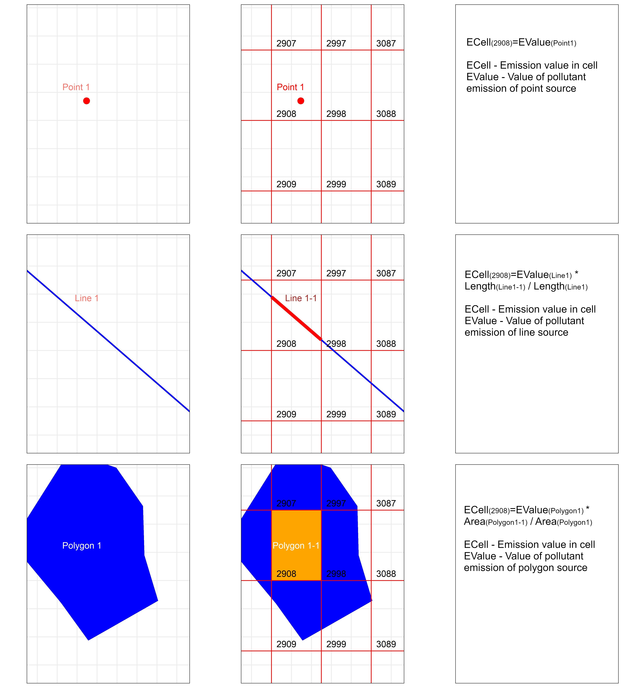

# Uvod
***

Prostorni podaci su namenjeni skladištenju, manipulaciji i analizi informacija o nekim prostornim fenomenima. Na primer, izmerena temperatura u jednoj tački može da predstavlja jedan prostorni podatak. Prostorni podatak je najčešće reprezentacija jednog prostornog fenomena u toj tački. U ovom slučaju to je temperatura, koja je prostorno-vremenski promenljiva. Prema tome, prostorni podaci opisuju prostorne fenomene i kao takvi, prilagođeni su prirodi i karakteristikama prostornih fenomena:

+ Prostorni fenomeni mogu biti diskretni i kontinualni,
+ Pod diskretnim prostornim fenomenima se smatraju fenomeni koji se mogu opisati primarnim geometrijskim primitivima,
+ Diskretni prostorni fenomeni se obicno opisuju vektorskim podacima (lokacija, kuca, reka…),
+ Kontinualni prostorni fenomeni su obicno podložni prostornim i vremenskim promenama i obično se opisuju rasterskim podacima.
+ Kad kažemo vektorski podaci, obično mislimo na tačku liniju i poligon.


# `sf` paket
***

Razvoj novih tehnologija i softvera otvorenog koda za rad sa prostornim podacima, kao i standarda u ovoj oblasti, zahteva jednostavniji i efikasniji pristup nad podacima. R paket sp je razvijen da proširi R funkcionalnosti klasama i metodama namenjenim prostornim podacima. Postoje opravdani razlozi za prelazak na „najsavremeniju“ sf klasu, koja omogućava interoperabilnost i efikasnije rukovanje prostornim podacima.
Paket sf je R paket za čitanje, čuvanje, rukovanje i manipulaiciju prostornim podacima u R okruženju, putem pristupa koji se naziva `simple feature`.  Simple feature je međunarodni standard za predstavljanje i kodiranje prostornih podataka, predstavljenih putem geometrije tipa tačka, linija i poligon (ISO, 2004). Najvažniji razlog za upotrebu ovog pristupa je bolja manipulacija geometrijom prostornih podataka i jednostavan način za čuvanje geometrije u podacima, tj. jednom redu `data.frame`-a , čime se u potpunosti mogu iskoristiti funkcionalnosti familije paketa `tidyverse`.

# Zadatak - Prostorizacija vrednosti emisije zagađenja na području Republike Srbije
***
<style>
div.blue { background-color:#fff7fa; border-radius: 5px; padding: 20px;}
</style>
<div class = "blue">

> <h3>Tekst zadatka</h3>
>
> Vrednosti emisije zagađenja po polutantima SO2, NOx, PM10, PM2.5, NMVOC i NH3 prostorizovati po izvorima zagađenja (tačkastih, linijskih i površinskih kategorija). Vrednosti sumirati po ćelijama grida za područje teritorije Republike Srbije.

+ Učitati u R okruženje izvore zagađivača sa vrednostima po svim polutantima. Podaci su u vektorskom obliku, u formatu `ESRI shapefile`.
+ Učitati u R okruženje jedinstveni grid za teritoriju Republike Srbije, prostorne rezolucije 0.05° x 0.05°.
+ Uraditi presek geometrijskih entiteta sa gridom.
+ Sumirati vrednosti polutanata po ćelijama grida.
+ Kreirati jedinstveni grid u kome ćelije grida imaju agregirane vrednosti po svim kategorijama.
+ Uraditi vizuelizaciju podataka.
+ Grid sačuvati u `geopackage` formatu za razmenu prostornih podataka, kao i gridovane podatke po kategorijama kao posebne lejere.

Podaci su dobijeni za sledeće kategorije:

+ 1A1a - Public electricity production (tačkasti izvor)
+ 1A3bi_R - Road Transport: Passengers cars - Rural transport (linijski izvor)
+ 3Da1 - Inorganic N-fertilizers (površinski izvor)

</div>

<center>

</center>


```{r echo = FALSE, message=FALSE, warning=FALSE}
library(sf)
library(tidyverse)
library(dplyr)
library(ggplot2)
library(kableExtra)
library(magrittr)
library(knitr)
library(DT)
library(mapview)
library(s2)
library(units)
library(classInt)
library(viridis)
library(gridExtra)
```


## Učitavanje podataka
***
Učitavanje tačkastih izvora zagađivača i transformacija:

```{r eval = TRUE, warning = FALSE}
sf.1A1a_ep <- st_read(dsn = "D:/R_projects/Nauka_R/Slides/R/Spatial data vezbe/Data/1A1a_ep.shp")
sf.1A1a_ep 
sf.1A1a_ep %<>% st_transform(4326)
```

Učitavanje linijskih izvora zagađivača i transformacija:

```{r eval = TRUE, warning = FALSE}
sf.1A3bi_R <- st_read(dsn = "D:/R_projects/Nauka_R/Slides/R/Spatial data vezbe/Data/1A3bi_R.shp")
sf.1A3bi_R
sf.1A3bi_R %<>% st_transform(4326)
```

Učitavanje površinskih izvora zagađivača - pomoćni podaci i transformacija:

```{r eval = TRUE, warning = FALSE}
CLC_12_18 <- st_read(dsn = "D:/R_projects/Nauka_R/Slides/R/Spatial data vezbe/Data/CLC18_RS.shp")
CLC_12_18
CLC_12_18 %<>% st_transform(4326)
```

***
Učitavanje grida i transformacija u koordinatni sistem u projekciji (UTM projekcija, 34N zona / WGS84 elipsoid):

```{r eval = TRUE, warning = FALSE}
gridWGS84 <- st_read(dsn = "D:/R_projects/Nauka_R/Slides/R/Spatial data vezbe/Data/Grid_Serbia_0.05deg.gpkg")
gridWGS84
```


## Presek i sumiranje vrednosti polutanata po kategorijama po ćelijama grida
***

### 1A1a - Public electricity production (tačkasti izvor)
***


```{r eval=T, warning=F, message=F}
vars <- c("NOx","SO2", "PM10", "PM2_5", "NMVOC", "NH3")
sf.1A1a_ep %<>% dplyr::select(vars)
names(sf.1A1a_ep)
```


Prostorizacija - sumiranje vrednosti tačkastih zagađivača po ćelijama grida:

```{r eval=T, warning=F, message=F}
p.1A1a_ep <- gridWGS84 %>%
  sf::st_join(sf.1A1a_ep) %>%
  dplyr::group_by(id) %>%
  dplyr::summarize(NOx = sum(NOx, na.rm = TRUE),
            SO2 = sum(SO2, na.rm = TRUE),
            PM10 = sum(PM10, na.rm = TRUE),
            PM2_5 = sum(PM2_5, na.rm = TRUE),
            NMVOC = sum(NMVOC, na.rm = TRUE),
            NH3 = sum(NH3, na.rm = TRUE)) %>% 
  dplyr::mutate(id = as.numeric(id))

```

Kontrola:

```{r eval=T, warning=F, message=F}
sum.sf.1A1a_ep <- sf.1A1a_ep %>%
  sf::st_drop_geometry() %>%
  dplyr::select(., vars) %>% 
  apply(., 2, sum) %>% 
  t(.) %>% 
  as.data.frame() %>%
  dplyr::mutate_if(is.numeric, round, 2)

sum.p.1A1a_ep <- p.1A1a_ep %>%
  sf::st_drop_geometry() %>%
  dplyr::select(., vars) %>% 
  apply(., 2, sum) %>% 
  t(.) %>% 
  as.data.frame() %>%
  dplyr::mutate_if(is.numeric, round, 2)


data.frame(sum = c("prostorizovano", "ukupno", "razlika"), rbind(sum.p.1A1a_ep, sum.sf.1A1a_ep, data.frame(sum.p.1A1a_ep -  sum.sf.1A1a_ep))) %>%
 datatable(caption = "Tabela 1: Sumarne vrednosti razlika nakon prostorizacije") 

```

Vizuelizacija:

```{r fig.align="center"}
map.1A1a_ep <- p.1A1a_ep
map.1A1a_ep$Spatialised <- 0
map.1A1a_ep$Spatialised[map.1A1a_ep$NOx != 0 | map.1A1a_ep$SO2 != 0 | map.1A1a_ep$PM10 != 0 | map.1A1a_ep$PM2_5 != 0 | map.1A1a_ep$NMVOC != 0 | map.1A1a_ep$NH3 != 0] <- 1 # Zadatak: resiti sa mutate i case_when

mapview(map.1A1a_ep, zcol = "Spatialised", layer.name = "Spatialised 1A1a_ep")

```


### 1A3bi_R - Road Transport: Passengers cars - Rural transport (linijski izvor)
***

Mreža puteva po kategorijama puteva:
  
```{r fig.align="center", fig.width=6, fig.height=8}
ggplot()+
  geom_sf(data = sf.1A3bi_R, aes(colour = Name))+
  scale_colour_manual(name = "Kategorija: ", values = c("red", "orange"))+
  labs(title = "Mreža puteva", 
       subtitle = "Klasifikacija po kategorijama puteva",
       caption = "Republika Srbija")+
  theme_bw()+
  theme(legend.position = "bottom")

```

Mreža puteva po vrednosti protoka saobraćaja:
  
```{r fig.align="center", fig.width=6, fig.height=8}
ggplot()+
  geom_sf(data = sf.1A3bi_R, aes(size = PGDS_2015/10000), colour = "black")+
  scale_size_identity()+
  labs(title = "Mreža puteva", 
       subtitle = "Klasifikacija po vrednosti protoka saobraćaja",
       caption = "Republika Srbija")+
  theme_bw()+
  theme(legend.position = "bottom")

```


```{r}
sf.1A3bi_R %<>% dplyr::select(ID, vars, PGDS_2015) 
```

Sumiranje ukupnih vrednosti po polutantima:

```{r eval=T, warning=F, message=F}
sum.sf.1A3bi_R <- sf.1A3bi_R %>%
  sf::st_drop_geometry() %>%
  dplyr::select(., vars) %>% 
  apply(., 2, sum) %>% 
  t(.) %>% 
  as.data.frame() %>%
  dplyr::mutate_if(is.numeric, round, 2)
sum.sf.1A3bi_R %>% datatable()
```


Presek sa gridom:

```{r eval=T, warning=F, message=F}
sf.1A3bi_R %<>% dplyr::mutate(Length = st_length(.),
                              PGDSL = PGDS_2015 * Length)

sf.1A3bi_R.int <- st_intersection(sf.1A3bi_R, gridWGS84) %>%
  dplyr::select(., PGDS_2015, PGDSL, Length) %>%
  mutate(Length_int = st_length(.), 
         PGDS_int = (PGDS_2015/Length)*Length_int) %>%
  dplyr::select(., Length, PGDS_int)
  
sum_PGDS <- sum(sf.1A3bi_R.int$PGDS_int)

sf.1A3bi_R.int <- sf.1A3bi_R.int %>%
  dplyr::mutate(NOx = ((sum.sf.1A3bi_R$NOx/sum_PGDS)*PGDS_int),
         SO2 = ((sum.sf.1A3bi_R$SO2/sum_PGDS)*PGDS_int),
         PM10 = ((sum.sf.1A3bi_R$PM10/sum_PGDS)*PGDS_int),
         PM2_5 = ((sum.sf.1A3bi_R$PM2_5/sum_PGDS)*PGDS_int),
         NMVOC = ((sum.sf.1A3bi_R$NMVOC/sum_PGDS)*PGDS_int),
         NH3 = ((sum.sf.1A3bi_R$NH3/sum_PGDS)*PGDS_int)) %>% 
  dplyr::select(vars)

# Kontrola

sum.sf.1A3bi_R.int <- sf.1A3bi_R.int %>%
  sf::st_drop_geometry() %>%
  dplyr::select(., vars) %>% 
  apply(., 2, sum) %>% 
  t(.) %>% 
  as.data.frame() %>%
  dplyr::mutate_if(is.numeric, round, 2)

sum.sf.1A3bi_R
sum.sf.1A3bi_R.int
```

Prostorizacija - sumiranje vrednosti linijskih zagađivača po ćelijama grida:

```{r eval=T, warning=F, message=F}
p.1A3bi_R <- gridWGS84 %>%
  st_join(sf.1A3bi_R.int, join = st_contains) %>% 
  mutate(id = as.numeric(id)) %>%
  group_by(id) %>%
  summarize(NOx = sum(NOx, na.rm = TRUE),
            SO2 = sum(SO2, na.rm = TRUE),
            PM10 = sum(PM10, na.rm = TRUE),
            PM2_5 = sum(PM2_5, na.rm = TRUE),
            NMVOC = sum(NMVOC, na.rm = TRUE),
            NH3 = sum(NH3, na.rm = TRUE)) %>% 
  mutate(id = as.numeric(id))
p.1A3bi_R[,vars] <- drop_units(p.1A3bi_R[,vars])
```


Kontrola:

```{r eval=T, warning=F, message=F}
sum.sf.1A3bi_R <- sf.1A3bi_R %>%
  sf::st_drop_geometry() %>%
  dplyr::select(., vars) %>% 
  apply(., 2, sum) %>% 
  t(.) %>% 
  as.data.frame() %>%
  dplyr::mutate_if(is.numeric, round, 2)

sum.p.1A3bi_R <- p.1A3bi_R %>%
  sf::st_drop_geometry() %>%
  dplyr::select(., vars) %>% 
  apply(., 2, sum) %>% 
  t(.) %>% 
  as.data.frame() %>%
  dplyr::mutate_if(is.numeric, round, 2)


data.frame(sum = c("prostorizovano", "ukupno", "razlika"), rbind(sum.p.1A3bi_R, sum.sf.1A3bi_R, data.frame(sum.p.1A3bi_R -  sum.sf.1A3bi_R))) %>%
 datatable(caption = "Tabela 2: Sumarne vrednosti razlika nakon prostorizacije") 

```


Vizuelizacija:

```{r fig.align="center"}

map.1A3bi_R <- p.1A3bi_R
map.1A3bi_R$Spatialised <- 0
#map.1A3bi_R[,vars] <- units::drop_units(map.1A3bi_R[,vars])
map.1A3bi_R$Spatialised[map.1A3bi_R$NOx != 0 | map.1A3bi_R$SO2 != 0 | map.1A3bi_R$PM10 != 0 | map.1A3bi_R$PM2_5 != 0 | map.1A3bi_R$NMVOC != 0 | map.1A3bi_R$NH3 != 0] <- 1 

mapview(map.1A3bi_R, zcol = "Spatialised", layer.name = "Spatialised 1A3bi_R")

```


### 3Da1 - Inorganic N-fertilizers (površinski izvor)
***

Corine Land Cover karta (zemljišni pokrivač):

```{r eval=T, warning=F, message=F, fig.align="center", fig.width=6, fig.height=8}

ggplot()+
  geom_sf(data = CLC_12_18, aes(fill = CODE_18))+
  #scale_colour_manual(name = "Kategorija: ", values = c("red", "orange"))+
  labs(title = "Corine Land Cover karta", 
       subtitle = "Klasifikacija po kategorijama zemljišnog pokrivača",
       caption = "Republika Srbija")+
  theme_bw()+
  theme(legend.position = "right")

```


Ukupne vrednosti po polutantima:
  
```{r eval=T, warning=F, message=F}
sum.sf.3Da1 <- data.frame(NOx = 8.33, SO2 = 0, PM10 = 0, PM2_5 = 0, NMVOC = 0, NH3 = 18028.55)
sum.sf.3Da1
```


Izdvajanje poljoprivrednog zemljišta ([CLC classes](https://land.copernicus.eu/user-corner/technical-library/corine-land-cover-nomenclature-guidelines/html)) i presek sa gridom:

```{r eval=T, warning=F, message=F}

sf_clc18_polj <- subset(CLC_12_18, CODE_18 == "211" | CODE_18 == "221" | CODE_18 == "222" | CODE_18 == "242" | CODE_18 == "243") # CLC agricultural areas
  
sf_clc18_polj[,vars] <- NA


```


Presek sa gridom:

```{r eval=T, warning=F, message=F}

sf_clc18_polj.int <- st_intersection(sf_clc18_polj, gridWGS84) %>%
  dplyr::mutate(Area = st_area(.)) # racunanje povrsina poligona

sf_clc18_polj.int %<>% dplyr::select(., vars, Area) 

```

Interpolacija vrednosti po polutantima srazmerno površini entiteta:

```{r eval=T, warning=F, message=F}

sum_Area <- sum(sf_clc18_polj.int$Area)

sf.3Da1 <- sf_clc18_polj.int %>%
  mutate(NOx = ((sum.sf.3Da1$NOx/sum_Area)*Area),
         SO2 = ((sum.sf.3Da1$SO2/sum_Area)*Area),
         PM10 = ((sum.sf.3Da1$PM10/sum_Area)*Area),
         PM2_5 = ((sum.sf.3Da1$PM2_5/sum_Area)*Area),
         NMVOC = ((sum.sf.3Da1$NMVOC/sum_Area)*Area),
         NH3 = ((sum.sf.3Da1$NH3/sum_Area)*Area))
sf.3Da1 %<>% dplyr::select(vars)


```

Prostorizacija - sumiranje vrednosti površinskih zagađivača po ćelijama grida:

```{r eval=T, warning=F, message=F}

p.3Da1 <- gridWGS84 %>%
  st_join(sf.3Da1, join = st_contains) %>% 
  group_by(id) %>%
  summarize(NOx = sum(NOx, na.rm = TRUE),
            SO2 = sum(SO2, na.rm = TRUE),
            PM10 = sum(PM10, na.rm = TRUE),
            PM2_5 = sum(PM2_5, na.rm = TRUE),
            NMVOC = sum(NMVOC, na.rm = TRUE),
            NH3 = sum(NH3, na.rm = TRUE)) %>% 
  mutate(id = as.numeric(id))

p.3Da1[, vars] <- drop_units(p.3Da1[, vars])
```

Kontrola:

```{r eval=T, warning=F, message=F}

sum.p.3Da1 <- p.3Da1 %>%
  sf::st_drop_geometry() %>%
  dplyr::select(., vars) %>% 
  apply(., 2, sum) %>% 
  t(.) %>% 
  as.data.frame() %>%
  dplyr::mutate_if(is.numeric, round, 2)


data.frame(sum = c("prostorizovano", "ukupno", "razlika"), rbind(sum.p.3Da1, sum.sf.3Da1, data.frame(sum.p.3Da1 -  sum.sf.3Da1))) %>%
 datatable(caption = "Tabela 2: Sumarne vrednosti razlika nakon prostorizacije") 

```


Vizuelizacija:

```{r fig.align="center"}

map.3Da1 <- p.3Da1
map.3Da1$Spatialised <- 0
#map.3Da1[,vars] <- units::drop_units(map.3Da1[,vars])
map.3Da1$Spatialised[map.3Da1$NOx != 0 | map.3Da1$SO2 != 0 | map.3Da1$PM10 != 0 | map.3Da1$PM2_5 != 0 | map.1A3bi_R$NMVOC != 0 | map.3Da1$NH3 != 0] <- 1 

mapview(map.3Da1, zcol = "Spatialised", layer.name = "Spatialised 1A3bi_R")

```


## Kreiranje jedinstvenog grida
***
```{r eval=T, warning=F, message=F}

data.spat.list <- list(p.1A1a_ep, p.1A3bi_R, p.3Da1)                                                   

sf_data <- data.spat.list[[1]]
for(i in 2:length(data.spat.list)){                                             
 sf_data <- st_join(sf_data, data.spat.list[[i]], join = st_equals) %>% 
   group_by(id.x) %>%
   summarize(NOx = sum(NOx.x, NOx.y),
             SO2 = sum(SO2.x, SO2.y),
             PM10 = sum(PM10.x, PM10.y),
             PM2_5 = sum(PM2_5.x, PM2_5.y),
             NMVOC = sum(NMVOC.x, NMVOC.y),
             NH3 = sum(NH3.x + NH3.y)) %>%
   mutate(id = id.x) %>%
   select(id, NOx, SO2, PM10, PM2_5, NMVOC, NH3)
 print(paste("NOx:",sum(sf_data$NOx))) 
 print(paste("SO2:",sum(sf_data$SO2)))
 print(paste("PM10:",sum(sf_data$PM10)))
 print(paste("PM2_5:",sum(sf_data$PM2_5)))
 print(paste("NMVOC:",sum(sf_data$NMVOC)))
 print(paste("NH3:",sum(sf_data$NH3)))
}

sf_data

```


## Vizuelizacija
***

```{r eval=T, warning=F, message=F}
classes.NOx <- classIntervals(sf_data$NOx, n = 12, style = "fisher")
classes.SO2 <- classIntervals(sf_data$SO2, n = 12, style = "fisher")
classes.PM10 <- classIntervals(sf_data$PM10, n = 12, style = "fisher")
classes.PM2_5 <- classIntervals(sf_data$PM2_5, n = 12, style = "fisher")
classes.NMVOC <- classIntervals(sf_data$NMVOC, n = 12, style = "fisher")
classes.NH3 <- classIntervals(sf_data$NH3, n = 12, style = "fisher")

sf_data <- sf_data %>%
  mutate(percent_class_NOx = cut(NOx, classes.NOx$brks, include.lowest = T,dig.lab=5),
         percent_class_SO2 = cut(SO2, classes.SO2$brks, include.lowest = T,dig.lab=7),
         percent_class_PM10 = cut(PM10, classes.PM10$brks, include.lowest = T,dig.lab=5),
         percent_class_PM2_5 = cut(PM2_5, classes.PM2_5$brks, include.lowest = T,dig.lab=5),
         percent_class_NMVOC = cut(NMVOC, classes.NMVOC$brks, include.lowest = T,dig.lab=5),
         percent_class_NH3 = cut(NH3, classes.NH3$brks, include.lowest = T,dig.lab=5)
         )

pal1 <- viridisLite::viridis(12, direction = -1)

```

```{r eval=T, warning=F, message=F}
a<-ggplot() +
  geom_sf(data = sf_data,
          aes(fill = percent_class_NOx)) +
  scale_fill_manual(values = pal1,
                    name = "NOx [t]") +
  
  labs(x = NULL, y = NULL,
       title = "Pollutant inventory spatialization - NOx",
       subtitle = "Spatial resolution 0.05°x0.05°",
       caption = "UBFCE (2020)") +
  theme(line = element_blank(),
        #axis.text = element_blank(),
        axis.title = element_blank(),
        #legend.position = "None", ###################### legend
        panel.background = element_blank()) +
  coord_sf(datum = sf::st_crs(4326))


```

```{r eval=T, warning=F, message=F}
b<-ggplot() +
  geom_sf(data = sf_data,
          aes(fill = percent_class_SO2)) +
  scale_fill_manual(values = pal1,
                    name = "SO2 [t]") +
  labs(x = NULL, y = NULL,
       title = "Pollutant inventory spatialization - SO2",
       subtitle = "Spatial resolution 0.05°x0.05°",
       caption = "UBFCE (2020)") +
  theme(line = element_blank(),
        #axis.text = element_blank(),
        axis.title = element_blank(),
        #legend.position = "None", ###################### legend
        panel.background = element_blank()) +
  coord_sf(datum = sf::st_crs(4326))

```


```{r eval=T, warning=F, message=F}
c<-ggplot() +
  geom_sf(data = sf_data,
          aes(fill = percent_class_PM10)) +
  scale_fill_manual(values = pal1,
                    name = "PM10 [t]") +
  labs(x = NULL, y = NULL,
       title = "Pollutant inventory spatialization - PM10",
       subtitle = "Spatial resolution 0.05°x0.05°",
       caption = "UBFCE (2020)") +
  theme(line = element_blank(),
        #axis.text = element_blank(),
        axis.title = element_blank(),
        #legend.position = "None", ###################### legend
        panel.background = element_blank()) +
  coord_sf(datum = sf::st_crs(4326))

```


```{r eval=T, warning=F, message=F}
d<-ggplot() +
  geom_sf(data = sf_data,
          aes(fill = percent_class_PM2_5)) +
  scale_fill_manual(values = pal1,
                    name = "PM2.5 [t]") +
  labs(x = NULL, y = NULL,
       title = "Pollutant inventory spatialization - PM2.5",
       subtitle = "Spatial resolution 0.05°x0.05°",
       caption = "UBFCE (2020)") +
  theme(line = element_blank(),
        #axis.text = element_blank(),
        axis.title = element_blank(),
        #legend.position = "None", ###################### legend
        panel.background = element_blank()) +
  coord_sf(datum = sf::st_crs(4326))

```


```{r eval=T, warning=F, message=F}
e<-ggplot() +
  geom_sf(data = sf_data,
          aes(fill = percent_class_NMVOC)) +
  scale_fill_manual(values = pal1,
                    name = "NMVOC [t]") +
  labs(x = NULL, y = NULL,
       title = "Pollutant inventory spatialization - NMVOC",
       subtitle = "Spatial resolution 0.05°x0.05°",
       caption = "UBFCE (2020)") +
  theme(line = element_blank(),
        #axis.text = element_blank(),
        axis.title = element_blank(),
        #legend.position = "None", ###################### legend
        panel.background = element_blank()) +
  coord_sf(datum = sf::st_crs(4326))

```


```{r eval=T, warning=F, message=F}
f<-ggplot() +
  geom_sf(data = sf_data,
          aes(fill = percent_class_NH3)) +
  scale_fill_manual(values = pal1,
                    name = "NH3 [t]") +
  labs(x = NULL, y = NULL,
       title = "Pollutant inventory spatialization - NH3",
       subtitle = "Spatial resolution 0.05°x0.05°",
       caption = "UBFCE (2020)") +
  theme(line = element_blank(),
        #axis.text = element_blank(),
        axis.title = element_blank(),
        #legend.position = "None", ###################### legend
        panel.background = element_blank()) +
  coord_sf(datum = sf::st_crs(4326))

```


```{r fig.align="center", fig.width=12, fig.height=18}

grid.arrange(a, b, c, d, e, f, ncol = 2, nrow = 3)
```


## Čuvanje podataka u `geopackage` formatu za razmenu prostornih podataka

```{r eval=F, warning=F, message=F}

st_write(sf_data, dsn = "D:/R_projects/Nauka_R/Slides/R/Spatial data vezbe/Data/grid_final.gpkg", layer = "Final_grid")

st_write(p.1A1a_ep, dsn = "D:/R_projects/Nauka_R/Slides/R/Spatial data vezbe/Data/grid_final.gpkg", layer = "1A1a_ep - Public electricity production")

st_write(p.1A3bi_R, dsn = "D:/R_projects/Nauka_R/Slides/R/Spatial data vezbe/Data/grid_final.gpkg", layer = "1A3bi_R - Road Transport: Passengers cars - Rural transport")

st_write(p.3Da1, dsn = "D:/R_projects/Nauka_R/Slides/R/Spatial data vezbe/Data/grid_final.gpkg", layer = "3Da1 - Inorganic N-fertilizers")


```


