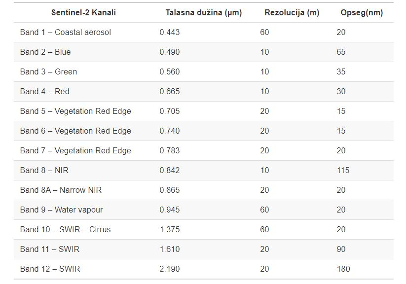

# Uvod 

U okviru ovih vežbi biće predstavljene mogućnosti definisanja i manipulacije nad definicijom referentnog koordinatnog sistema prostornih podataka u R-u. Zatim biće predstavljene mogućnosti učitavanja, obrade, analize i manipulacije nad rasterskim podacima.


# Koordinatni referentni sistem 

**Coordinate reference system (CRS)** - Koordinatni referentni sistem ili Prostorni referentni sistem - **Spatial reference system (SRS)** predestavlja sinonim kojim se definiše niz parametara kojim se definiše položaj određene tačke u prostoru u odnosu na položaj Zemlje.

Geografski koordinatni referentni sistem je geometrijski model u kome je definisano sledeće:

1. Model oblika zemlje (npr: elipsoid sa parametrima $a$ i $e$);
1. Početni meridijan (najčešće Grinički meridijan, pa se ovaj deo podrazumeva i često izostavlja iz definicije);
1. Datum.

Koordinatni referentni sistem u projekciji je geometrijski model u kome je definisano sledeće:

1. Projekcija;
1. Model oblika zemlje (npr: elipsoid sa parametrima $a$ i $e$);
1. Početni meridijan (npr: Grinički meridijan);
1. Datum.

<style>
div.blue { background-color:#fff7fa; border-radius: 5px; padding: 20px;}
</style>
<div class = "blue">
Prema Lott-u [2015](http://docs.opengeospatial.org/is/12-063r5/12-063r5.html) važno je razlikovati:
  
+ Koordinatni sistem (**coordinate system**) je set matematickih pravila koja definišu kako se koordinate dodeljuju tacki
+ Datum (**datum**) je set parametara koji definiše položaj centra, razmeru i orijentaciju koordinatnog sistema
+ Geodetski datum (**Geodetic datum**) opisuje odnos koordinatnog sistema u odnosu na Zemlju
+ Koordinatni Referentni Sistem (**Coordinate Reference System**) je koordinatni sistem ciji je položaj odreden datumom u odnosu na referentni objekat. U slucaju planete zemlje (WGS84) parametri geodetskog datuma se koriste.
+ Možemo razlikovati Geografske koordinatne sisteme, Sisteme u projekciji i Lokalne koordinatne sisteme.
</div>


Učitavanje potrebnih paketa:
***
```{r message=FALSE, warning=FALSE}
library(sp)
library(raster)
library(sf)
library(mapview)
library(stringr)
library(tidyverse)
library(dplyr)
library(magrittr)
library(RStoolbox)
library(gridExtra)
library(viridis)
library(stars)
```

## Učitavanje podataka
***

```{r message=FALSE, warning=FALSE}

gradovi <- st_read(system.file("vectors/cities.shp", package = "rgdal"))
gradovi

```

## Vizuelizacija podataka
***

<style>
.html-widget {
    margin: auto;
}
</style>

```{r fig.align="center", message=FALSE, warning=FALSE}
mapview(gradovi, zcol = "POPULATION")

```

Kreiaranje data frame-a gde su prostorni podaci - koordinate tačaka date kao dve kolone:

```{r message=FALSE, warning=FALSE}
gradovi_df <- cbind(st_drop_geometry(gradovi), 
                    st_coordinates(gradovi))

head(gradovi_df, 10)

```


## `sf` paket - definicija CRS-a
***

Definisanje CRS-a se postiže na sledeći način:

```{r message=FALSE, warning=FALSE}
crs_wgs84 <- st_crs(4326) # WGS84 elipsoidni koordinatni sistem ima EPSG kod 4326
class(crs_wgs84) # klasa
crs_wgs84 # kod crs objekta uočavaju se sve stvari: EPSG kod i WKT2 string
```

```{r message=FALSE, warning=FALSE}
cat(crs_wgs84$wkt) # direktan pristup wkt elementu crs objekta
crs_wgs84$epsg # direktan pristup epsg elementu crs objekta
crs_wgs84$proj4string # direktan pristup proj4string elementu crs objekta
```

Dodeljivanje CRS-a se postiže na sledeći način:

```{r message=FALSE, warning=FALSE}
gradovi2 <- st_as_sf(gradovi_df, coords = c("X", "Y")) # kreiranje objekta sf klase
gradovi2 # CRS: NA

st_crs(gradovi2) <- 4326 # Putem EPSG koda!
# Drugi način: st_crs(gradovi2) <- crs_wgs84

```


```{r message=FALSE, warning=FALSE}
# Pristup CRS objektu
st_crs(gradovi2)
# Pristup wkt elementu CRS objekta
cat(st_crs(gradovi2)$wkt)
```

## `sp` paket - definicija CRS-a
***

Definisanje CRS-a se postiže na sledeći način:

```{r message=FALSE, warning=FALSE}
crs_wgs84 <- CRS(SRS_string = "EPSG:4326") # WGS84 elipsoidni koordinatni sistem ima EPSG kod 4326
class(crs_wgs84) # klasa
crs_wgs84 # defnisan putem proj4string-a
```

```{r}
wkt_wgs84 <- wkt(crs_wgs84)
cat(wkt_wgs84)
```

Dodeljivanje CRS-a se postiže na sledeći način:

```{r message=FALSE, warning=FALSE}
gradovi2 <- gradovi_df # kreiranje objekta sp klase
coordinates(gradovi2) <-  ~ X + Y
proj4string(gradovi2) <- crs_wgs84

gradovi2
```


```{r message=FALSE, warning=FALSE}
str(gradovi2)
# Pristup CRS objektu u formi wkt elementa
cat(wkt(gradovi2))
```


## Konverzija `sf` <--> `sp`
***

```{r message=FALSE, warning=FALSE}
gradovi_sf <- st_as_sf(gradovi2) # iz sp klase u sf klasu
gradovi_sf
gradovi_sp <- as(gradovi_sf, "Spatial") # iz sf klase u sp klasu
gradovi_sp
```


# Prostorni podaci u formi `raster`-a
***

**Raster** ili **grid** je prostorna struktura podataka koja deli prostor u pravougaone ćelije (piksele) koje sadrže jednu ili više vrednosti nekog opažanog ili modeliranog fenomena, vrednosti ćelija su uglavnom numerički ili kategorijski podaci.      
Više na: Geovizualizacija i Web kartografija, M. Kilibarda i D. Protić - http://osgl.grf.bg.ac.rs/books/gvvk/.

Raster (grid) koji ima jednu atributnu vrednost podseća na matricu koja dodatno ima definisano i zaglavlje. Postavlja se pitanje kako se definiše georeferencija kod rasterskih podataka. Praktično ona je sadržana u zaglavlju. Zavisno od formata rasterskih podataka, u zaglavlju se najčešće nalaze podaci o koordinatnom referentnom sistemu (kod nekih formata su u zasebnom fajlu), broju vrsta i kolonan matrice podataka, koordinatama početne ćelije (piksela), veličini piksela (neki formati podržavaju samo kvadratne dok drugi podržavaju i pravougaone piksele), informacija kako je zapisana vrednost za piksele koji nemaju atributnu vrednost. 

U okviru R okruženja, za rad sa prostornim podacima u formi rastera, dostupni su paketi `raster` i `stars`.

## Paket `raster`

Paket raster sadrži više klasa za rasterske podatke od kojih su tri glavne `RasterLayer`, `RasterBrick` i `RasterStack`. Raster paket sadrži funkcionalnosti za kreiranje, čitanje, pisanje i manipulaciju nad rasterskim podacima, kao što je na primer rasterska algebra. Isto tako paket sadrži i funkcionalnosti za vizualizaciju rasterskih podataka.

Klase:

+ Klasa `RasterLayer` predstavlja rasterski podatak sa jednim atributom. Objekat tipa RasterLayer sadrži pored atributnih podataka i sve parametre koje se tipično čuvaju u zaglavlju (hederu) rasterskog fajla. To su: broj vrsta i kolona, prostorni obuhvat podataka i parametri koordinatnog referentnog sistema. Zavisno od veličine fajla svi podaci mogu biti u RAM memoriji ili im se pristupa sa diska računara.
+ `RasterBrick` je klasa koja podržava više atributa u okviru rasterskih podataka, tipično to važi kad se koristi satelitski snimak sa više kanala, na primer multispektralni snimak iz Sentinel 2 misije ili Landsat 8. Ono što je specifično za RasterBrick je da on može da se referiše samo na jedan fajl koji je sačuvan na disku, na primer GeoTIFF fajl u kome su sačuvani kanali nekog multispektralnog satelitskog snimka.
+ `RasterStack` je lista rasterskih lejera, vrlo slične strukture kao RasterBrick, ali ne postoji ograničinje da se referiše na jedan GIS fajl, već može da bude kompozicija više fajlova koji su sačuvani na disku ili koji su u RAM memoriji računara, ili kombinacija istih. Praktično se može reći da je to lista objekata tipa RasterLayer. Podrazumeva se da je prostorni obuhvat i rezolucija ista za svaki RasterLayer koji je deo RasterStack objekta.

## Paket `stars`

Paket stars [https://r-spatial.github.io/stars/] nudi klase i metode za učitavanje, obradu, vizualizaciju i čuvanje podataka u formi vektorskih i rasterskih `data cube` - kocki podataka. U potpunosti se oslanja na tidyverse familiju paketa i logiku rada sa prostornim podacima koja je implementirana u okviru paketa sf.

## Definisanje raster objekta i koordinatnog sistema

Kreiranje rastera sa slucajnim vrednostima celija - piksela
```{r message=FALSE, warning=FALSE}
extent(7440500, 7475000, 4948000, 4976500) # xmin, xmax, ymin, ymax
podrucje_beograda <- raster(extent(7440500, 7475000, 4948000, 4976500), res = 100)
```

Funkcija rnorm - vektor slucajnih brojeva sa normalnom raspodelom
```{r message=FALSE, warning=FALSE}
values(podrucje_beograda) <- rnorm(ncell(podrucje_beograda)) 
summary(values(podrucje_beograda))

```

```{r fig.align="center", message=FALSE, warning=FALSE}
podrucje_beograda # CRS:NA
plot(podrucje_beograda)

```


Definicija referentnog koordinatnog sistema

```{r message=FALSE, warning=FALSE}
podrucje_beograda1 <- podrucje_beograda
podrucje_beograda2 <- podrucje_beograda
podrucje_beograda3 <- podrucje_beograda
podrucje_beograda4 <- podrucje_beograda

```

Dodeljivanje CRS-a se vrsi putem funkcije <- crs(), na vise načina koji daju isti rezultat

```{r message=FALSE, warning=FALSE}

crs(podrucje_beograda1) <- 3909
crs(podrucje_beograda2) <- "EPSG:3909"
crs(podrucje_beograda3) <- st_crs(3909)$wkt # a WKT string
crs(podrucje_beograda4) <- CRS(SRS_string = "EPSG:3909") # an sp CRS object

```

Kontrola:

```{r message=FALSE, warning=FALSE}
cat(wkt(podrucje_beograda1))

all.equal(wkt(podrucje_beograda1),
          wkt(podrucje_beograda2),
          wkt(podrucje_beograda3),
          wkt(podrucje_beograda4))


```

Vizualizacija:

```{r fig.align="center", message=FALSE, warning=FALSE}
podrucje_beograda1


mapview::mapview(podrucje_beograda1, na.color = "transparent", trim = TRUE) # trim - should rasters be trimmed off NA values around the edges
```


## Multispektralni satelitski podaci

Dati su Multispektralni satelitski podaci - snimci, satelitske misije `Sentinel 2`, sa sledećim dostupnim kanalima:

<center>

</center>

<style>
div.blue { background-color:#fff7fa; border-radius: 5px; padding: 20px;}
</style>
<div class = "blue">
U okviru ovog dela vežbe potrebno je: 

+ Učitati 3 multispektralna satelitska snimka (3 epohe), sa više dostupnih kanala.
+ Kreirati raster stack kao kombinaciju sve tri epohe.
+ Vizualizovati podatke u formi kolor kompozita i falš kolor kompozita.
+ Sračunati vegetacioni indeks za sve tri epohe na nivou piksela.
+ Kreirati histogram NDVI indeksa.
</div>


### Učitavanje podataka

```{r message=FALSE, warning=FALSE}
files <- list.files("Data/Multispektralni_snimci/", 
                    full.names = TRUE,
                    pattern = ".tif")

files
```


Prvi način: svaki pojedinačan snimak kao poseban rasterStack putem `for` petlje
```{r message=FALSE, warning=FALSE}
rasList <- list()
for(i in 1:length(files)){
  if(file.size(files[i]) > 0){
    rasList[[i]] <- raster::stack(files[i]) 
  } else {
    rasList[[i]] <- NULL
  }
}
rasList
```


Drugi način: svaki pojedinačan snimak kao poseban rasterStack putem `lapply` funkcije

```{r message=FALSE, warning=FALSE}
rasStack <- lapply(files, stack)
rasStack
```

### Koordinatni sistem:

```{r message=FALSE, warning=FALSE}
cat(wkt(rasStack[[1]]))
```

```{r message=FALSE, warning=FALSE}
for(i in 1:length(rasStack)){
  crs(rasStack[[i]]) <- 32634
}

```

```{r message=FALSE, warning=FALSE}
cat(wkt(rasStack[[1]]))
```


### Vizualizacija multispektralnih snimaka
***

Funkcija za vizualizaciju podataka u formi kolor kompozita i falš kolor kompozita:


Nazivi snimka - pomoćno:
```{r message=FALSE, warning=FALSE}
files.names <- list.files("Data/Multispektralni_snimci/", full.names = F,
                          pattern = ".tif")
files.names %<>% stringr::str_remove(., pattern = ".tif")
files.names
```

```{r message=FALSE, warning=FALSE}
plotS2parcel <- function(listS2parc = listS2parc, files.names = files.names, id = 1){
  
  c.plot <- ggRGB(listS2parc[[id]], r = 3, g = 2, b = 1) +
    labs(x = "Easting [m]", y = "Northing [m]",
         title = "Sentinel 2 satellite image - Color composite",
         subtitle = paste("Image: ", files.names[id]),
         caption = "UBFCE (2020) \n
       Spatial resolution 10mx10m, Teritory of the Republic of Serbia") +
    theme(line = element_blank(),
          panel.background = element_blank())
  
  f.plot <- ggRGB(listS2parc[[id]], r = 7, g = 3, b = 2) +
    labs(x = "Easting [m]", y = "Northing [m]",
         title = "Sentinel 2 satellite image - Falsh color composite",
         subtitle = paste("Image: ", files.names[id]),
         caption = "UBFCE (2020) \n
       Spatial resolution 10mx10m, Teritory of the Republic of Serbia") +
    theme(line = element_blank(),
          panel.background = element_blank())
  

  
  gridCF <- grid.arrange(c.plot, f.plot, ncol = 1, nrow = 2)
  return(gridCF)
}
```

Vizualizacija:

```{r fig.align="center", message=FALSE, warning=FALSE, fig.width=8, fig.height=8}
id1 <- plotS2parcel(listS2parc = rasStack, files.names = files.names, id = 1)
id2 <- plotS2parcel(listS2parc = rasStack, files.names = files.names, id = 2)
id3 <- plotS2parcel(listS2parc = rasStack, files.names = files.names, id = 3)
```


### Računanje vegetacionog indeksa - NDVI
***

Pogledati: https://www.indexdatabase.de/

(NIR - Red) / (NIR + Red)
Kanali: NIR = B08, i = 7 i RED = BO2, i = 3;

Funkcija za računanje NDVI indeksa nad svim snimcima: 
```{r message=FALSE, warning=FALSE}
rasListNDVI <- list()
for(i in 1:length(rasStack)){
    rasListNDVI[[i]] <- (rasStack[[i]][[7]] - rasStack[[i]][[3]]) / (rasStack[[i]][[7]] + rasStack[[i]][[3]])
}

rasListNDVI

names(rasListNDVI) <- paste(files.names, "_NDVI", sep = "")
names(rasListNDVI)

```

```{r message=FALSE, warning=FALSE}
summary(rasListNDVI[[1]])
summary(rasListNDVI[[2]])
summary(rasListNDVI[[3]])

```

### Histogram i vizuelizacija
***

```{r}

plotS2parcel <- function(listS2parc = listS2parc, listS2parcNDVI = listS2parcNDVI, files.names = files.names, id = 1){
  c.plot <- ggRGB(listS2parc[[id]], r = 3, g = 2, b = 1) +
    labs(x = "Easting [m]", y = "Northing [m]",
         title = "Sentinel 2 satellite image - Color composite",
         subtitle = paste("Image: ", files.names[id]),
         caption = "UBFCE (2020) \n
       Spatial resolution 10mx10m, Teritory of the Republic of Serbia") +
    theme(line = element_blank(),
          panel.background = element_blank())
    
  f.plot <- ggRGB(listS2parc[[id]], r = 7, g = 3, b = 2) +
    labs(x = "Easting [m]", y = "Northing [m]",
         title = "Sentinel 2 satellite image - Falsh color composite",
         subtitle = paste("Image: ", files.names[id]),
         caption = "UBFCE (2020) \n
       Spatial resolution 10mx10m, Teritory of the Republic of Serbia") +
    theme(line = element_blank(),
          panel.background = element_blank())
  
  star_pred <- st_as_stars(listS2parcNDVI[[id]])
  
  ndvi.plot <- ggplot()+
    geom_stars(data = star_pred)+
    scale_fill_viridis(option = "D", na.value = NA, name = "NDVI: ")+
    labs(x = "Easting [m]", y = "Northing [m]",
         title = "Sentinel 2 satellite image - NDVI",
         subtitle = paste("Image: ", files.names[id]),
         caption = "UBFCE (2020) \n
       Spatial resolution 10mx10m, Teritory of the Republic of Serbia") +
    theme(line = element_blank(),
          panel.background = element_blank(), 
          legend.position = "bottom")
  
  df <- as.data.frame(listS2parcNDVI[[id]])
  hist.plot <- ggplot(data=df, aes(layer)) + 
    geom_histogram(binwidth = 0.005,
                   col="red", 
                   aes(y = ..density..,
                       fill = ..count..)) +
    scale_fill_gradient("Count", low = "blue", high = "red")+
    stat_function(fun = dnorm, 
                  color = "black",
                  size = 1.5,
                  args = list(mean = mean(df$layer), sd = sd(df$layer)))+
    labs(x = "NDVI values", y = "Count",
         title = "Sentinel 2 satellite image - NDVI histogram",
         subtitle = paste("Image: ", files.names[id]),
         caption = "UBFCE (2020) \n
       Spatial resolution 10mx10m, Teritory of the Republic of Serbia") +
    theme(line = element_blank(),
          panel.background = element_blank(), 
          legend.position = "bottom")+
    annotate("text",x = 0.5, y = 5.5, label = paste("Mean:",round(mean(df$layer),digits = 2)))+
    annotate("text",x = 0.5, y = 5, label = paste("SD:",round(sd(df$layer),digits = 2)))
  
  gridCF <- grid.arrange(c.plot, f.plot, ndvi.plot, hist.plot, ncol = 2)
  return(gridCF)
}


```

```{r fig.align="center", message=FALSE, warning=FALSE, fig.width=12, fig.height=10}
id1 <- plotS2parcel(listS2parc = rasStack, listS2parcNDVI = rasListNDVI, files.names = files.names, id = 1)
id2 <- plotS2parcel(listS2parc = rasStack, listS2parcNDVI = rasListNDVI, files.names = files.names, id = 2)
id3 <- plotS2parcel(listS2parc = rasStack, listS2parcNDVI = rasListNDVI, files.names = files.names, id = 3)
```


***

<style>
div.blue { background-color:#fff7fa; border-radius: 5px; padding: 20px;}
</style>
<div class = "blue">

> ZADATAK
>
> +Napraviti kratak izveštaj (RMarkodown) sa vizualizacijom i računanjem indeksa hlorofila.
> +Sačuvati podatke u formatu GeoTIFF za razmenu i čuvanje rasterskih prostornih podataka.

</div>


### Čuvanje podataka u GeoTIFF formatu

```{r eval = FALSE, warning = FALSE, message = FALSE}
writeRaster(rasListNDVI$`0_2015-08-24_S2_NDVI`, "Data/Multispektralni_snimci/0_2015-08-24_S2_NDVI.tif", overwrite=TRUE)

for(i in 1:length(rasListNDVI)){
  writeRaster(rasListNDVI[[i]], paste("Data/Multispektralni_snimci/", names(rasListNDVI)[[i]], ".tif", sep = ""), overwrite = TRUE)
  print(names(rasListNDVI)[[i]])
}
```


