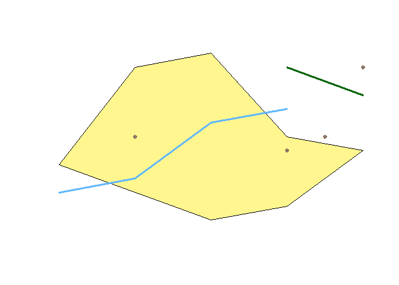
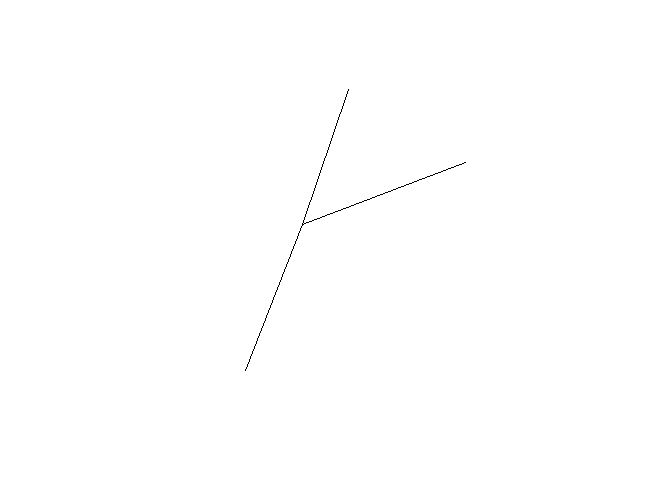
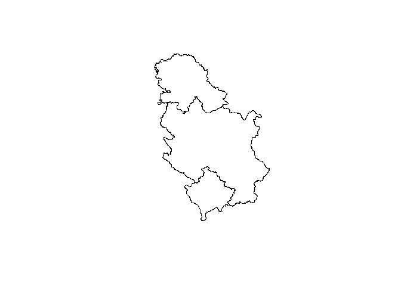
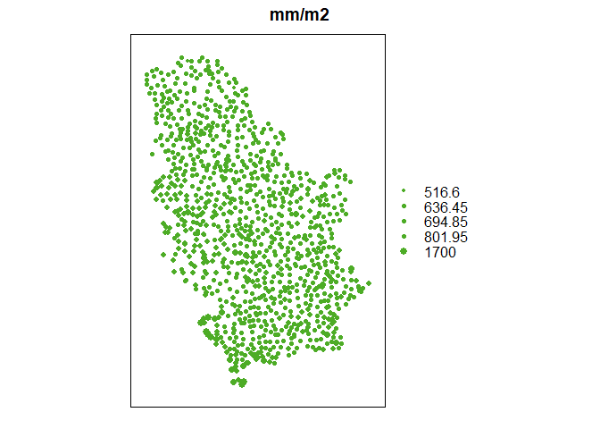
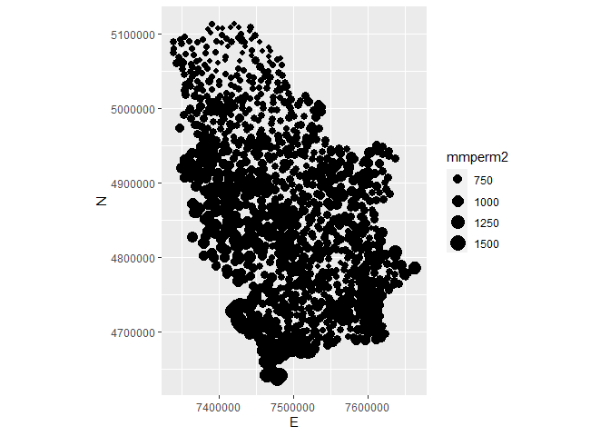

## Šta su to prostorni podaci

Prostorni podaci su namenjeni skladištenju, manipulaciji i analizi informacija o nekim prostornim fenomenima. Na primer, izmerena temperatura u jednoj tački može da predstavlja jedan prostorni podatak. Prostorni podatak je najčešće reprezentacija jednog prostornog fenomena u toj tački. U ovom slučaju to je temperatura, koja je prostorno-vremenski promenljiva. Prema tome, prostorni podaci opisuju prostorne fenomene i kao takvi, prilagođeni su prirodi i karakteristikama prostornih fenomena:

+ Prostorni fenomeni mogu biti diskretni i kontinualni,
+ Pod diskretnim prostornim fenomenima se smatraju fenomeni koji se mogu opisati primarnim geometrijskim primitivima,
+ Diskretni prostorni fenomeni se obicno opisuju vektorskim podacima (lokacija, kuca, reka…),
+ Kontinualni prostorni fenomeni su obicno podložni prostornim i vremenskim promenama,
+ Obicno se opisuju rasterskim podacima.


Kad kažemo vektorski podaci, obično mislimo na tačku liniju i poligon.

<!-- -->

> <h3>Zadatak</h3>
>
> Šta od informacija neki podatak (kao npr. tačka, linija ili poligon) mora da sadrži da bi se zvao prostornim?


## Prostorni podaci u R-u

U okviru R okruženja, izdvojila su se dva pristupa namenjenih radu sa prostornim podacima, a to su `sp (spatial)` i `sf (simple features)`.  Kad se kaže pristup, tu se misli na celokupno okruženje, koje pruža mogućnosti skladištenja, manupulacije, vizualizacije i drugih analiza. Jedno okruženje obično čini jedan osnovni paket koji rešava konceptualni problem apstrakcije prostornih podataka i niz drugih paketa namenjenih rešavanju konkretnih problema, a koji koriste tako organizovane podatke. Popularnost `R`-a u pogledu rada sa prostornim podacima ogleda se u mnoštvu paketa namenjenih učitavanju, vizualizaciji i analizi prostornih podataka [cran task view - spatial](https://cran.r-project.org/web/views/Spatial.html). Pored toga, tome doprinose i razvijeni interfejsi ka opšte prihvaćenim geoinformatičkim softverima (`GDAL, GEOS, PROJ4`).


Ovo predavanje ima za cilj da predstavi mogućnosti `R` programskog okruženja za manupulaciju prostornim podacima. Kroz ovo predavanje biće opisano šta su to prostorni podaci, koja je njihova struktura, koji paketi i klase su namenjene radu sa prostornim podacima i odabrane funkcionalnosti tih rešenja.


# `sp` paket

[`sp`](https://cran.r-project.org/package=sp) je prvi paket namenjen radu sa prostornim podacima. Njegovo razvijanje je počelo ranih 2000-tih godina sa namerom da standardizuje format skladištenja prostornih podataka, a sve u cilju veće "interoperobilnosti" između različitih paketa koji se bave prostornim analizama. Tako je u okviru `sp` paketa definisane klase i metode za rad sa vektorskim podacima (`SpatialPoints`, `Spatiallines` i `SpatialPoligons`), tako i klase i metode za rad sa rasterskim podacima `SpatialPixels` i `SpatialGrid`


## Struktura `sp` klasa

`sp` klase su razvijene u okviru `s4` sistema za objektno orijentisano programiranje u R-u. 

> R ima nekoliko razvijenih pristupa objektno orijentisanom programiranju: S3 (stari), S4 i RC (Reference Classes). U okviru S3 sistema, klasa je definisana atributom `class`, ali je odgovarajuci metod definisan u okviru tzv. generičkih funkcija (generic functions). Za datu klasu, generička funkcija traži odgovarajući metod. S4 sistem je dosta rigorozniji u definiciji strukture klase i nasledjivanju osobina. S4 objekti se sastoje iz elemenata, koji se nazivaju slotovi i njima se pristupa operatorom `@`.

Lista postojećih `sp` klasa može se dobiti sledećom komadnom:

\tiny

```r
library(sp)
getClass("Spatial")
```

```
## Class "Spatial" [package "sp"]
## 
## Slots:
##                               
## Name:         bbox proj4string
## Class:      matrix         CRS
## 
## Known Subclasses: 
## Class "SpatialPoints", directly
## Class "SpatialMultiPoints", directly
## Class "SpatialGrid", directly
## Class "SpatialLines", directly
## Class "SpatialPolygons", directly
## Class "SpatialPointsDataFrame", by class "SpatialPoints", distance 2
## Class "SpatialPixels", by class "SpatialPoints", distance 2
## Class "SpatialMultiPointsDataFrame", by class "SpatialMultiPoints", distance 2
## Class "SpatialGridDataFrame", by class "SpatialGrid", distance 2
## Class "SpatialLinesDataFrame", by class "SpatialLines", distance 2
## Class "SpatialPixelsDataFrame", by class "SpatialPoints", distance 3
## Class "SpatialPolygonsDataFrame", by class "SpatialPolygons", distance 2
```

Kao što se može videti, osnovna klasa za prostorne podatke u okviru `sp` paketa je klasa `spatial`. Ona je sačinjena iz dva elementa, koji se u ovom slučaju zovu "slotovi", `bbox` i `proj4string`. 

`bbox` - Bounding box (Spatial extent)

- `bounding box` predstavlja prostorni obuhvat nekog prostornog objekta
<div class="figure">

<p class="caption">Bounding box</p>
</div>

`proj4string` - Opis koordinatnog sistema (Coordinate Reference System - CRS class). Opis koordinatnog sistema je zadat u vidu `PROJ4` stringa, o kome će biti reči u nastavku.


## Koordinatni referetni sistem (Coordinate Reference System - CRS)

Geografski koordinatni referentni sistem je geometrijski model u kome je definisano sledeće:

1. Model oblika zemlje (npr: elipsoid sa parametrima $a$ i $e$);
1. Početni meridijan (najčešće Grinički meridijan, pa se ovaj deo podrazumeva i često izostavlja iz definicije);
1. Datum.

Koordinatni referentni sistem u projekciji je geometrijski model u kome je definisano sledeće:

1. Projekcija;
1. Model oblika zemlje (npr: elipsoid sa parametrima $a$ i $e$);
1. Početni meridijan (npr: Grinički meridijan);
1. Datum.

> Prema Lott-u [2015](http://docs.opengeospatial.org/is/12-063r5/12-063r5.html) važno je razlikovati:
>   
> + Koordinatni sistem (**coordinate system**) je set matematickih pravila koja definišu kako se koordinate dodeljuju tacki
> 
> + Datum (**datum**) je set parametara koji definiše položaj centra, razmeru i orijentaciju koordinatnog sistema
> 
> + Geodetski datum (**Geodetic datum**) opisuje odnos koordinatnog sistema u odnosu na Zemlju
> 
> + Koordinatni Referentni Sistem (**Coordinate Reference System**) je koordinatni sistem ciji je položaj odreden datumom u odnosu na referentni objekat. U slucaju planete zemlje (WGS84) parametri geodetskog datuma se koriste.
> 
> + Možemo razlikovati Geografske koordinatne sisteme, Sisteme u projekciji i Lokalne koordinatne sisteme.

#### Geodetski datum

Datum (Geodetski) je set konstanti koji definišu položaj refernetnog elipsoida u odnosu na Zemlju.
Može biti definisan na 2 načina:

1. Topocentrični datum i
1. Geocentrični datum.

Geocentričnidatum se definiše sa sedam parametara i to na sledeći način:

1. Tri parametra koja definišu položaj referentnog elipsoida u odnosu na centar Zemlje $∆X , ∆Y, ∆Z$;
1. Tri parametra koja definišu orjentaciju referentnog elipsoida $\alpha, \beta, \gamma$;
1. Parametar razmere $\mu$

WGS84 je konvencionalni terestički referentni sistem uz koji se vezuje globalni elipsoid WGS84 kojim se aproksimira geoid na celoj njegovoj površini. Dakle, parametri datuma se često definišu tako da predstaljaju geometrijski odnos referenc elipsoida i globalnog elipsoida (WGS84).


#### EPSG

EPSG (European Petroleum Survey Group – Oil & Gas Producers) registar je javni registar podataka vezanih koordinatnih referentnih sistema, geodetskih datuma i elipsoida kao i algoritama i parametara transformacija podataka iz jednog sistema u drugi. U okviru tog registra, svakom koordinatnom sistemu je dodeljen određeni kod, poznat pod nazivom EPSG kod kojim se on identifikuje, na primer EPSG:4326 - WGS 84. Kompletan registar je dostupan na adresi: http://www.epsg-registry.org/

Ovaj set podataka omogućuje jednostavne transfromacije između koordinatnih referentnih sistema, stalno se razvija, napreduje i
ažurira.

Više informacija: http://www.epsg.org/

U `R`-u, detalji određenog EPSG koda mogu se dobiti sledećom komandom:

```r
CRS("+init=epsg:4326")
```

```
## CRS arguments:
##  +init=epsg:4326 +proj=longlat +datum=WGS84 +no_defs +ellps=WGS84
## +towgs84=0,0,0
```


\scriptsize

```r
getClass("CRS")
```

```
## Class "CRS" [package "sp"]
## 
## Slots:
##                 
## Name:   projargs
## Class: character
```
\scriptsize
CRS mo?e biti zadat i preko epsg koda

```r
CRS("+init=epsg:4326")
```

```
## CRS arguments:
##  +init=epsg:4326 +proj=longlat +datum=WGS84 +no_defs +ellps=WGS84
## +towgs84=0,0,0
```


Sažet pregled na temu `CRS`-a u `R`-u je dat na sledećem [linku](https://www.nceas.ucsb.edu/~frazier/RSpatialGuides/OverviewCoordinateReferenceSystems.pdf)

### PROJ.4

- PROJ.4 biblioteka omogućava transformaciju prostprnih koordinata iz jednog sistema u drugi
- Da bi transformacija bila moguća, koordinatni sistemi moraju biti definisani.
- PROJ.4 koristi "tag=value" opis koordinatnog sistema


- [PROJ.4](https://proj4.org/) biblioteka je dostupna preko `rgdal R` paketa.
\scriptsize

```r
library(rgdal)
```


#### PROJ4 string primer

- PROJ4 string se sastoji od elemenata koji defini?u koordinatni sistem (projekciju, elipsoid, zonu), datum i jedinice.
- Svaki element je odvojen znakom "+" i razmakom pre njega

\small
`"+proj=tmerc +lat_0=0 +lon_0=21 +k=0.9999 +x_0=7500000 +y_0=0 +ellps=bessel +towgs84=574.027,170.175,401.545,4.88786,-0.66524,-13.24673,0.99999311
+units=m"`


```r
+proj=tmerc - Gaus Kriger (Transverzalna merkatorova) projekcija,                  
+lat_0=0 +lon_0=21 - koordinatni pocetak na elipsoidu,                            
+k=0.9999 - razmera du? srednjeg meridijana,                                        
+x_0=7500000 +y_0=0 - koordinatni pocetak u ravni karte                           
+ellps=bessel - elipsoid                                                            
+towgs84=574.027,170.175,401.545,4.88786,-0.66524,-13.24673,6.89 - 3 translacije, 3 rotacije, razmera u odnosu na WGS84 izra?ena u ppm (parts per milion)  
+=m - jedinice metri.
```

</br></br></br></br></br>


## `spatial`* klase (`SpatialPoints`, `SpatialLines`, `SpatialPolygons`)

<div class="figure">

<p class="caption">SpatialPoints</p>
</div>

### SpatialPoints

- `SpatialPoints`, `SpatialLines`, `SpatialPolygons`
- `SpatialPoints` se dobija proširenjem `Spatial` klase dodavanje slota `coords` u vidu matrice koordinata.
- `SpatialPointsDataFrame` se dobija proširenjem `SpatialPoints` klase dodavanje slota `data` u vidu data frame-a sa podacima.

\scriptsize

```r
#umka.df <- readxl::read_xlsx("umka.df.xlsx")

padavine <- read.table("C:/R_projects/Nauka_R/Slides/data/merenja1960-1990.txt", header=TRUE, sep=",")


names(padavine)<-c("merna_stanica", "Latitude", "Longitude", "H", "mmperm2")


# Izdvajanje koordinata
coords <- as.matrix(padavine[, c("Longitude", "Latitude")], ncol = 2)

# Opis koordinatnog sistema
coord_system <- CRS("+proj=longlat +ellps=bessel +towgs84=574.027,170.175,401.545,4.88786,-0.66524,-13.24673,0.99999311067")


# Kreiranje `SpatialPoints` klase
padavine_sp <- SpatialPoints(coords, proj4string = coord_system, bbox = NULL)


str(padavine_sp)
```

```
## Formal class 'SpatialPoints' [package "sp"] with 3 slots
##   ..@ coords     : num [1:1014, 1:2] 20.1 20.9 19.9 22.5 19.3 ...
##   .. ..- attr(*, "dimnames")=List of 2
##   .. .. ..$ : NULL
##   .. .. ..$ : chr [1:2] "Longitude" "Latitude"
##   ..@ bbox       : num [1:2, 1:2] 18.9 41.9 23 46.2
##   .. ..- attr(*, "dimnames")=List of 2
##   .. .. ..$ : chr [1:2] "Longitude" "Latitude"
##   .. .. ..$ : chr [1:2] "min" "max"
##   ..@ proj4string:Formal class 'CRS' [package "sp"] with 1 slot
##   .. .. ..@ projargs: chr "+proj=longlat +ellps=bessel +towgs84=574.027,170.175,401.545,4.88786,-0.66524,-13.24673,0.99999311067"
```

```r
head(padavine_sp@coords)
```

```
##      Longitude Latitude
## [1,]  20.13139 45.80222
## [2,]  20.87806 43.89444
## [3,]  19.88528 43.42222
## [4,]  22.45556 43.53306
## [5,]  19.32972 45.93083
## [6,]  21.22000 44.44833
```

```r
# bbox se dodaju automatski

padavine_sp[1,]
```

```
## class       : SpatialPoints 
## features    : 1 
## extent      : 20.13139, 20.13139, 45.80222, 45.80222  (xmin, xmax, ymin, ymax)
## crs         : +proj=longlat +ellps=bessel +towgs84=574.027,170.175,401.545,4.88786,-0.66524,-13.24673,0.99999311067
```

#### Primer kreiranja `SpatialPointsDataFrame` klase


```r
padavine_atributi <- padavine %>% dplyr::select(merna_stanica, H, mmperm2)

# Kreiranje `SpatialPointsDataFrame` klase
padavine_spdf <- SpatialPointsDataFrame(coords, proj4string = coord_system, bbox = NULL, data = padavine_atributi)
```


```r
str(padavine_spdf)

padavine_spdf[5, 2]

padavine_spdf[15, ]


#Pristupanje odredjenom atributu
padavine_spdf[[2]] #vraca vrednosti iz prve kolone "data" slota
```


### Standardne `sp` metode

\scriptsize

```r
#Pristupanje odrednjeim tackama
padavine_sp[1,]
```

```
## class       : SpatialPoints 
## features    : 1 
## extent      : 20.13139, 20.13139, 45.80222, 45.80222  (xmin, xmax, ymin, ymax)
## crs         : +proj=longlat +ellps=bessel +towgs84=574.027,170.175,401.545,4.88786,-0.66524,-13.24673,0.99999311067
```

```r
padavine_spdf[1,]
```

```
## class       : SpatialPointsDataFrame 
## features    : 1 
## extent      : 20.13139, 20.13139, 45.80222, 45.80222  (xmin, xmax, ymin, ymax)
## crs         : +proj=longlat +ellps=bessel +towgs84=574.027,170.175,401.545,4.88786,-0.66524,-13.24673,0.99999311067 
## variables   : 3
## names       : merna_stanica,  H, mmperm2 
## value       :           Ada, 80,   556.5
```

```r
#Pristupanje odredjenom atributu
padavine_spdf[,2]
```

```
## class       : SpatialPointsDataFrame 
## features    : 1014 
## extent      : 18.93333, 23.01056, 41.88778, 46.15333  (xmin, xmax, ymin, ymax)
## crs         : +proj=longlat +ellps=bessel +towgs84=574.027,170.175,401.545,4.88786,-0.66524,-13.24673,0.99999311067 
## variables   : 1
## names       :    H 
## min values  :   42 
## max values  : 2658
```

```r
padavine_spdf[1:2, "mmperm2"] # Vraca "SpatialPointsDataFrame" 
```

```
## class       : SpatialPointsDataFrame 
## features    : 2 
## extent      : 20.13139, 20.87806, 43.89444, 45.80222  (xmin, xmax, ymin, ymax)
## crs         : +proj=longlat +ellps=bessel +towgs84=574.027,170.175,401.545,4.88786,-0.66524,-13.24673,0.99999311067 
## variables   : 1
## names       : mmperm2 
## min values  :   556.5 
## max values  :   825.8
```

```r
# padavine_spdf[[1]] #vraca vrednosti iz prve kolone "data" slota
```

**Pristupanje određenom slotu vrši se korišćenjem operatora "@"**

```r
# Pristupanje određenom slotu vrši se korišćenjem operatora "@"

padavine_spdf@data

padavine_spdf@proj4string

padavine_spdf@coords
```


### Prostorne `sp` metode


```r
# dimensions(x) vraca informaciju o prostornoj dimenziji podataka

dimensions(padavine_spdf)
```

```
## [1] 2
```

```r
padavine_WGS <- spTransform(padavine_spdf, CRS("+init=epsg:4326"))

# spTransform(x, CRS) vrši transformaciju prostornih podataka iz jednog koordinatnog sistema u drugi
GK <- "+proj=tmerc +lat_0=0 +lon_0=21 +k=0.9999 +x_0=7500000 +y_0=0 +ellps=bessel +towgs84=574.027,170.175,401.545,4.88786,-0.66524,-13.24673,0.99999311 +units=m"

padavine_GK <- spTransform(padavine_WGS, CRS(GK))

# coordinates(x) vraca sadržaj "coords" slota

head(coordinates(padavine_spdf))
```

```
##      Longitude Latitude
## [1,]  20.13139 45.80222
## [2,]  20.87806 43.89444
## [3,]  19.88528 43.42222
## [4,]  22.45556 43.53306
## [5,]  19.32972 45.93083
## [6,]  21.22000 44.44833
```

```r
head(coordinates(padavine_GK))
```

```
##      Longitude Latitude
## [1,]   7432490  5073448
## [2,]   7490204  4861123
## [3,]   7409749  4809264
## [4,]   7617631  4822001
## [5,]   7370483  5088729
## [6,]   7517508  4922673
```

```r
# bbox(x) vraca sadržaj "boundary box" slota

bbox(padavine_spdf)
```

```
##                min      max
## Longitude 18.93333 23.01056
## Latitude  41.88778 46.15333
```

```r
bbox(padavine_GK)
```

```
##               min     max
## Longitude 7339508 7663396
## Latitude  4638273 5112613
```

```r
proj4string(padavine_GK)
```

```
## [1] "+proj=tmerc +lat_0=0 +lon_0=21 +k=0.9999 +x_0=7500000 +y_0=0 +ellps=bessel +towgs84=574.027,170.175,401.545,4.88786,-0.66524,-13.24673,0.99999311 +units=m"
```

```r
# gridded(x) vraca informaciju da li je "x" dobijen od "SpatialPixels" ili konvertuje "SpatialPoints" u "SpatialPixels"
# over(x) vraca atribute na osnovu prostornog preklapanja
# spsample(x) prostorno uzorkovanje
```
Još neke prostorne metode date su u sledećoj tabeli:

function | and what it does
------------ | ------------------------------------------------------
`bbox()` | returns the bounding box coordinates
`proj4string()` | sets or retrieves projection attributes as object of the `CRS` class. 
`CRS()` | creates an object of class of coordinate reference system arguments
`spplot()` | plots a separate map of all the attributes unless specified otherwise
`coordinates()` | set or retrieve the spatial coordinates. For spatial polygons it returns the centroids.
`over(a, b)` | used for example to retrieve the polygon or grid indices on a set of points
`spsample()` | sampling of spatial points within the spatial extent of objects


### `SpatialLines` klase


<div class="figure">

<p class="caption">SpatialPoints</p>
</div>
Kreiracemo linije od svake tacke na Umci do fiksnih tacaka


```r
nn_points <- nn2(data = coordinates(padavine_GK), k = 4)[[1]][,-1]

  pi_coords <- coordinates(padavine_GK[1,])
  l1_coords <- matrix(c(pi_coords, coordinates(padavine_GK[nn_points[1, 1], ])), ncol = 2, byrow = TRUE)
  l1_name <- paste(padavine_GK$merna_stanica[1], padavine_GK$merna_stanica[nn_points[1, 1]], sep = "_")
  l2_coords <- matrix(c(pi_coords, coordinates(padavine_GK[nn_points[1, 2], ])), ncol = 2, byrow = TRUE)
  l2_name <- paste(padavine_GK$merna_stanica[1], padavine_GK$merna_stanica[nn_points[1, 2]], sep = "_")
  l3_coords <- matrix(c(pi_coords, coordinates(padavine_GK[nn_points[1, 3], ])), ncol = 2, byrow = TRUE)
  l3_name <- paste(padavine_GK$merna_stanica[1], padavine_GK$merna_stanica[nn_points[1, 3]], sep = "_")


line_1 <- Line(l1_coords)
line_2 <- Line(l2_coords)
line_3 <- Line(l3_coords)

str(line_1)
```

```
## Formal class 'Line' [package "sp"] with 1 slot
##   ..@ coords: num [1:2, 1:2] 7432490 7435786 5073448 5083075
```

```r
# Da bi smo napravili `Lines` kreirane linije moramo smestiti u jednu listu i dodati im ID. Posto su ovo linije prve epohe, ID ce im biti prvi UTC_date.

lines_IDs <- c(1, 2, 3)

lines_1 <- Lines(list(line_1), ID = lines_IDs[1])
lines_2 <- Lines(list(line_2), ID = lines_IDs[2])
lines_3 <- Lines(list(line_3), ID = lines_IDs[3])

str(lines_1)
```

```
## Formal class 'Lines' [package "sp"] with 2 slots
##   ..@ Lines:List of 1
##   .. ..$ :Formal class 'Line' [package "sp"] with 1 slot
##   .. .. .. ..@ coords: num [1:2, 1:2] 7432490 7435786 5073448 5083075
##   ..@ ID   : chr "1"
```

```r
# Da bi smo napravili "SpatialLines" moramo koristiti funkciju `SpatialLines`

lines_sp <- SpatialLines(list(lines_1, lines_2, lines_3), proj4string = CRS(GK))

plot(lines_sp)
```

<!-- -->

```r
str(lines_sp)
```

```
## Formal class 'SpatialLines' [package "sp"] with 3 slots
##   ..@ lines      :List of 3
##   .. ..$ :Formal class 'Lines' [package "sp"] with 2 slots
##   .. .. .. ..@ Lines:List of 1
##   .. .. .. .. ..$ :Formal class 'Line' [package "sp"] with 1 slot
##   .. .. .. .. .. .. ..@ coords: num [1:2, 1:2] 7432490 7435786 5073448 5083075
##   .. .. .. ..@ ID   : chr "1"
##   .. ..$ :Formal class 'Lines' [package "sp"] with 2 slots
##   .. .. .. ..@ Lines:List of 1
##   .. .. .. .. ..$ :Formal class 'Line' [package "sp"] with 1 slot
##   .. .. .. .. .. .. ..@ coords: num [1:2, 1:2] 7432490 7428441 5073448 5063027
##   .. .. .. ..@ ID   : chr "2"
##   .. ..$ :Formal class 'Lines' [package "sp"] with 2 slots
##   .. .. .. ..@ Lines:List of 1
##   .. .. .. .. ..$ :Formal class 'Line' [package "sp"] with 1 slot
##   .. .. .. .. .. .. ..@ coords: num [1:2, 1:2] 7432490 7444125 5073448 5077870
##   .. .. .. ..@ ID   : chr "3"
##   ..@ bbox       : num [1:2, 1:2] 7428441 5063027 7444125 5083075
##   .. ..- attr(*, "dimnames")=List of 2
##   .. .. ..$ : chr [1:2] "x" "y"
##   .. .. ..$ : chr [1:2] "min" "max"
##   ..@ proj4string:Formal class 'CRS' [package "sp"] with 1 slot
##   .. .. ..@ projargs: chr "+proj=tmerc +lat_0=0 +lon_0=21 +k=0.9999 +x_0=7500000 +y_0=0 +ellps=bessel +towgs84=574.027,170.175,401.545,4.8"| __truncated__
```


#### `SpatialLinesDataFrame` klase


```r
lines_spdf <- SpatialLinesDataFrame(lines_sp, data = data.frame(ID = lines_IDs, od_do = c(l1_name, l2_name, l3_name), match.ID = "ID")

lines_spdf                                   
```


> <h3>Zadatak</h3>
>
> Kreirati `SpatialLinesDataFrame` koji ce sadržati po tri linije do najbližih stanica za svaku stanicu)

### `Polygon*` klasa


```r
srbija <- readOGR(dsn = "C:/R_projects/Nauka_R/Slides/data/Srbija_shp/RAP.shp")
```

```
## OGR data source with driver: ESRI Shapefile 
## Source: "C:\R_projects\Nauka_R\Slides\data\Srbija_shp\RAP.shp", layer: "RAP"
## with 3 features
## It has 5 fields
```

```r
str(srbija)
```

```
## Formal class 'SpatialPolygonsDataFrame' [package "sp"] with 5 slots
##   ..@ data       :'data.frame':	3 obs. of  5 variables:
##   .. ..$ OBJECTID  : int [1:3] 1 2 3
##   .. ..$ SifRAP    : int [1:3] 9 7 8
##   .. ..$ ImeRAP    : Factor w/ 3 levels "Centralna Srbija",..: 2 1 3
##   .. ..$ SHAPE_Leng: num [1:3] 719740 1950258 1158157
##   .. ..$ SHAPE_Area: num [1:3] 1.09e+10 5.60e+10 2.15e+10
##   ..@ polygons   :List of 3
##   .. ..$ :Formal class 'Polygons' [package "sp"] with 5 slots
##   .. .. .. ..@ Polygons :List of 1
##   .. .. .. .. ..$ :Formal class 'Polygon' [package "sp"] with 5 slots
##   .. .. .. .. .. .. ..@ labpt  : num [1:2] 490960 4714288
##   .. .. .. .. .. .. ..@ area   : num 1.09e+10
##   .. .. .. .. .. .. ..@ hole   : logi FALSE
##   .. .. .. .. .. .. ..@ ringDir: int 1
##   .. .. .. .. .. .. ..@ coords : num [1:8502, 1:2] 548474 548192 547917 547227 547081 ...
##   .. .. .. ..@ plotOrder: int 1
##   .. .. .. ..@ labpt    : num [1:2] 490960 4714288
##   .. .. .. ..@ ID       : chr "0"
##   .. .. .. ..@ area     : num 1.09e+10
##   .. ..$ :Formal class 'Polygons' [package "sp"] with 5 slots
##   .. .. .. ..@ Polygons :List of 2
##   .. .. .. .. ..$ :Formal class 'Polygon' [package "sp"] with 5 slots
##   .. .. .. .. .. .. ..@ labpt  : num [1:2] 506741 4845894
##   .. .. .. .. .. .. ..@ area   : num 5.59e+10
##   .. .. .. .. .. .. ..@ hole   : logi FALSE
##   .. .. .. .. .. .. ..@ ringDir: int 1
##   .. .. .. .. .. .. ..@ coords : num [1:29304, 1:2] 528288 528340 528468 528596 528695 ...
##   .. .. .. .. ..$ :Formal class 'Polygon' [package "sp"] with 5 slots
##   .. .. .. .. .. .. ..@ labpt  : num [1:2] 372087 4823555
##   .. .. .. .. .. .. ..@ area   : num 3913589
##   .. .. .. .. .. .. ..@ hole   : logi TRUE
##   .. .. .. .. .. .. ..@ ringDir: int -1
##   .. .. .. .. .. .. ..@ coords : num [1:189, 1:2] 372685 372687 372654 372611 372545 ...
##   .. .. .. ..@ plotOrder: int [1:2] 1 2
##   .. .. .. ..@ labpt    : num [1:2] 506741 4845894
##   .. .. .. ..@ ID       : chr "1"
##   .. .. .. ..@ area     : num 5.59e+10
##   .. ..$ :Formal class 'Polygons' [package "sp"] with 5 slots
##   .. .. .. ..@ Polygons :List of 1
##   .. .. .. .. ..$ :Formal class 'Polygon' [package "sp"] with 5 slots
##   .. .. .. .. .. .. ..@ labpt  : num [1:2] 428012 5027773
##   .. .. .. .. .. .. ..@ area   : num 2.15e+10
##   .. .. .. .. .. .. ..@ hole   : logi FALSE
##   .. .. .. .. .. .. ..@ ringDir: int 1
##   .. .. .. .. .. .. ..@ coords : num [1:12760, 1:2] 528288 528161 528033 527925 527817 ...
##   .. .. .. ..@ plotOrder: int 1
##   .. .. .. ..@ labpt    : num [1:2] 428012 5027773
##   .. .. .. ..@ ID       : chr "2"
##   .. .. .. ..@ area     : num 2.15e+10
##   ..@ plotOrder  : int [1:3] 2 3 1
##   ..@ bbox       : num [1:2, 1:2] 332049 4633470 663034 5116035
##   .. ..- attr(*, "dimnames")=List of 2
##   .. .. ..$ : chr [1:2] "x" "y"
##   .. .. ..$ : chr [1:2] "min" "max"
##   ..@ proj4string:Formal class 'CRS' [package "sp"] with 1 slot
##   .. .. ..@ projargs: chr "+proj=utm +zone=34 +datum=WGS84 +units=m +no_defs +ellps=WGS84 +towgs84=0,0,0"
```

```r
plot(srbija)
```

<!-- -->


- `Polygon` klasa proširuje `Line` klasu sa dodatnim slotovima kojima se proverava da li set linija cini zatvoreni poligon.

\scriptsize

```r
getClass("Polygon")
```

```
## Class "Polygon" [package "sp"]
## 
## Slots:
##                                               
## Name:    labpt    area    hole ringDir  coords
## Class: numeric numeric logical integer  matrix
## 
## Extends: "Line"
```
- Dodatni slotovi su `labpt`, `area`, `hole` i `ringDir`.
- `Polygons` klasa predstavlja listu `Polygon` objekata

#### `SpatialPolygons` klasa

- `SpatialPolygons` klasa predstavlja prostornu reprezentaciju od `Polygon` i `Polygons` klasa.
- To podrazumeva proširenje tih klasa slotovima `bbox` i `proj4string`

\scriptsize

```r
getClass("SpatialPolygons")
```

```
## Class "SpatialPolygons" [package "sp"]
## 
## Slots:
##                                                       
## Name:     polygons   plotOrder        bbox proj4string
## Class:        list     integer      matrix         CRS
## 
## Extends: "Spatial", "SpatialVector"
## 
## Known Subclasses: 
## Class "SpatialPolygonsDataFrame", directly, with explicit coerce
```

#### `SpatialPolygonsDataFrame*` klasa

\scriptsize

```r
getClass("SpatialPolygonsDataFrame")
```

```
## Class "SpatialPolygonsDataFrame" [package "sp"]
## 
## Slots:
##                                                                   
## Name:         data    polygons   plotOrder        bbox proj4string
## Class:  data.frame        list     integer      matrix         CRS
## 
## Extends: 
## Class "SpatialPolygons", directly
## Class "Spatial", by class "SpatialPolygons", distance 2
## Class "SpatialVector", by class "SpatialPolygons", distance 2, with explicit coerce
```

## `sp` klase za gridne podatke

- Gridovi su struktuirani objekti i ne zahtevaju toliko informacija za njihovo opisivanje
- NPR. dovoljno je zadati koordinate pocetka grida, rezoluciju celije i broj kolona i vrsta (cime je definisan prostorni obuhvat.) 

\scriptsize

```r
getClass("GridTopology")
```

```
## Class "GridTopology" [package "sp"]
## 
## Slots:
##                                                             
## Name:  cellcentre.offset          cellsize         cells.dim
## Class:           numeric           numeric           integer
```

### `SpatialGrid*` klase
- `GridTopology` klasa ima ulogu da definiše strukturu grida i igra osnovu za kreiranje klasa prostornih gridova.
- `SpatialGrid` klasa sadrzi `GridTopology` klasu i `Spatial` slotove `bbox` i `proj4string`
- `SpatialGridDataFrame` klasa predstavlja `SpatialGrid` klasu pro?irenu za `data` slot sa dodatnim atributima za svaku celiju.

### `SpatialPixels*` klase

- U slucajevima kada znatan deo grida oznacen sa NA vrednostima, velicina grida je bezrazlo?no velika. Veliki broj celija ne nosi nikakvu informaciju.
- Alternativa za taj problem je `SpatialPixels*` klasa
- `SpatialPixels*` predstavlja samo celije koje nose informaciju i tako što zapisuje koordinate centra celije i ukupan broj takvih celija.
- Takav format omogucava zapisivanje grida u vidu tacaka u spoljnim bazama.


<div class="figure">

<p class="caption">SpatialGrids i SpatialPixels</p>
</div>

#### `sp` klase

<div class="figure">

<p class="caption">sp klase</p>
</div>

## Vizualizacija `sp` klasa

### Vizualizacija `sp` klasa
- Postoje nekoliko metoda namenjenih vizualizaciji `sp` klasa: `plot(x)`, `spplot(x, attr)`, `bubble(x, attr)`
- Takodje moguce je koristiti i `ggplot`

### `sp` metode za vizualizaciju


```r
bubble(padavine_GK, "mmperm2", main="mm/m2" , maxsize = 1.0)
```

<!-- -->

### `ggplot` pristup
\tiny

```r
library(ggplot2)

padavine_GK_df <- padavine_GK %>% as.data.frame() %>% dplyr::select(Easting = Longitude, Northing = Latitude, H, mmperm2)

ggplot(as.data.frame(padavine_GK_df)) + geom_point(aes(x = Easting, y = Northing, size = mmperm2)) + coord_equal() + labs(x = "E", y="N")
```

<!-- -->


# `sf` paket

`sf` okruženje je prilično novo okruženje. Prvi put je objavljeno 2016-te godine. `sf` implementira standard koji se zove `Simple Features` koji definiše način skladištenja geometrije vektorskih prostornih podataka. 
 
<div class="figure">

<p class="caption">Well-Known-Text Geometry primitives  (wikipedia)</p>
</div>


<div class="figure">

<p class="caption">Well-Known-Text Multipart geometries (wikipedia)</p>
</div>


U okviru `sf` paketa prostorni podaci su skladišteni u formi `data.frame`-a sa jednom posebnom kolonom koja sadrži informacije o geometriji (koordinatama). Ta kolona je u stvari lista koja je iste dužine kao i bilo koja druga kolona u `data.frame`-u i zove se `list column`. Svaki element te liste (liste kolone) može biti opet lista bilo koje dužine, koliko god je potrebno da se skladišti geometrija jednog **feature**-a.

<div class="figure">

<p class="caption">Struktura sf objekta</p>
</div>

Da bi se kreirao objekat iz `sf` familije potrebni su sledeci koraci:

> Kreirati geometriju objekta (topologiju)

Geometrija objekta se skladišti kao numerički vektor ili matrica koordinata i skladišti se kao klasa `sfg` (`Simple Feature Geometry`). Slično kao kod `sp` paketa, postoje funkcije koje omogućavaju kreiranje `Simple Feature Geometry` -a, kao na primer `st_point(), st_linestring(), st_polygon()`i druge.

> Kombinovati pojedinačne objekte u specijalnu kolonu (list column)

Pojedinačne geometrije se kombinuju u specijalnu listu koja ce biti jedna kolona u `sf` klasi. Ta kolona se skladišti kao klasa `Simple Feature Collection (sfc)` komandom st_sfc(). Važno je znati da `sfc` klasa skladišti i informaciju o `bounding box`-u i o koordinatnom sistemu (takodje u `PROJ4` notaciji).


> Dodavanje atributa

Na kraju, dodaju se atributi i kreira se konačna klasa `sf` koja skladišti sadržaj pod klasa (`sfg` i `sfc`) kao i atribute. Ova klasa se formira komandom `st_sf()`. Ova fukncija tačnije proširuje dobro poznati `data.frame` u prostorni podatak.


Primer:

```r
l1_coords

sf_line_1 <- st_linestring(l1_coords) 
sf_line_2 <- st_linestring(l2_coords) 
sf_line_3 <- st_linestring(l3_coords) 

class(sf_line_1)
```


```r
lines_sfc <- st_sfc(sf_line_1, sf_line_2, sf_line_3, crs = GK)

sf_lines <- st_sf(od_do = c(l1_name, l2_name, l3_name) , lines_sfc)

sf_lines
# st_set_crs(umka_sf, GK)
```


```r
# MULTILINESTRING
sf_multiline <- st_multilinestring(list(sf_line_1, sf_line_2, sf_line_3))

class(sf_multiline)

sfc_multiline <- st_sfc(sf_multiline, crs = GK)

sf_multiline <- st_sf(sfc_multiline, stanica = "station_1")

sf_multiline

sf_linestring <- st_cast(sf_multiline, "LINESTRING")

sf_linestring

class(sf_linestring)

sf_linestring$od_do = unlist(lines_IDs)

class(sf_linestring) 

sf_linestring$length = st_length(sf_linestring)

sf_linestring
```


```r
# LINESTRING

coords_line_1
coords_line_2
coords_line_3

sf_linestring <- st_linestring(rbind(l1_coords, l2_coords, l3_coords))

GK <- "+proj=tmerc +lat_0=0 +lon_0=21 +k=0.9999 +x_0=7500000 +y_0=0 +ellps=bessel +towgs84=574.027,170.175,401.545,4.88786,-0.66524,-13.24673,0.99999311 +units=m"

sf_linestring_sfc <- st_sfc(sf_linestring,  crs = GK)

plot(sf_linestring_sfc)

sf_linestring_sf <- st_sf(sf_linestring_sfc, od_do = c(l1_name, l2_name, l3_name))

sf_linestring_sf
```


```r
methods(class="sf")
```

```
##   [1] $<-                   [                     [[<-                 
##   [4] aggregate             anti_join             arrange              
##   [7] as.data.frame         cbind                 coerce               
##  [10] dbDataType            dbWriteTable          distinct             
##  [13] dplyr_reconstruct     editFeatures          filter               
##  [16] full_join             gather                group_by             
##  [19] group_split           identify              initialize           
##  [22] inner_join            left_join             mapView              
##  [25] merge                 mutate                nest                 
##  [28] plot                  print                 rbind                
##  [31] rename                right_join            sample_frac          
##  [34] sample_n              select                selectFeatures       
##  [37] semi_join             separate              separate_rows        
##  [40] show                  slice                 slotsFromS3          
##  [43] spread                st_agr                st_agr<-             
##  [46] st_area               st_as_s2              st_as_sf             
##  [49] st_bbox               st_boundary           st_buffer            
##  [52] st_cast               st_centroid           st_collection_extract
##  [55] st_convex_hull        st_coordinates        st_crop              
##  [58] st_crs                st_crs<-              st_difference        
##  [61] st_filter             st_geometry           st_geometry<-        
##  [64] st_interpolate_aw     st_intersection       st_intersects        
##  [67] st_is                 st_is_valid           st_join              
##  [70] st_line_merge         st_m_range            st_make_valid        
##  [73] st_nearest_points     st_node               st_normalize         
##  [76] st_point_on_surface   st_polygonize         st_precision         
##  [79] st_reverse            st_sample             st_segmentize        
##  [82] st_set_precision      st_shift_longitude    st_simplify          
##  [85] st_snap               st_sym_difference     st_transform         
##  [88] st_triangulate        st_union              st_voronoi           
##  [91] st_wrap_dateline      st_write              st_z_range           
##  [94] st_zm                 summarise             transform            
##  [97] transmute             ungroup               unite                
## [100] unnest               
## see '?methods' for accessing help and source code
```

> **Neke prednosti `sf` okruženja**
> 
> + Omogućava brzo učitavanje i ispisivanje velikih fajlova sa prostornim podacima
> + Omogućava funkcije koje se oslanjaju na GEOS, GDAL i PROJ eksterne biblioteke, koje su povezane (linkovane) sa ovim paketom tako da ne moraju biti učitane.
> + `sf` objekti se mogu direktno plotovati u `ggplot`-u
> + `sf` objekti se mogu direktno čitati i pisati u/iz prostornih baza podataka kao što je PostGIS
> + `sf` je potpuno kompatibilan sa tidyverse familijom paketa

## Kreiranje prostornih objekata iz tabele

### U `sf` okruženju


```r
padavine <- read.table("C:/R_projects/Nauka_R/Slides/data/merenja1960-1990.txt", header=TRUE, sep=",")


names(padavine)<-c("merna_stanica", "Latitude", "Longitude", "H", "mmperm2")

str(padavine)

# Opis koordinatnog sistema
coord_system <- "+proj=longlat +ellps=bessel +towgs84=574.027,170.175,401.545,4.88786,-0.66524,-13.24673,0.99999311067"

padavine_sf <- st_as_sf(padavine, coords = c("Longitude", "Latitude"))
str(padavine_sf)


st_crs(st_as_sf)

st_crs(padavine_sf) <- coord_system # Моžemo koristit direktno EPSG broj

st_crs(padavine_sf)
```


### U `sp` okruženju


```r
padavine_sp <- padavine

coordinates(padavine_sp) <- ~Longitude + Latitude

# ili ovako
# coordinates(umka_sp) <- c("latitude", "longitude")

class(padavine_sp)


is.projected(padavine_sp) # da li je definisana projekcija  


proj4string(padavine_sp) <- CRS(coord_system)
is.projected(padavine_sp) 
```

## Prostorne operacije

<div class="figure">

<p class="caption">Prostorne operacije u sf paketu</p>
</div>

<div class="figure">

<p class="caption">Prostorne operacije u sf paketu</p>
</div>


### `sp` - `sf` poređenje

|how to.. | for `sp` objects | for `sf` objects |
|---|---|---|
|join attributes| `sp::merge()` | `dplyr::*_join()` (also `sf::merge()`) |
|reproject | `spTransform()` | `st_transform()`|
|retrieve (or assign) CRS | `proj4string()` | `st_crs()` |
|count points in polygons| `over()` | `st_within` and `aggregate()` |
|buffer|  `rgeos::gBuffer()` (separate package) | `st_buffer()` |
|select by location | [`g*` functions](https://www.rdocumentation.org/packages/rgeos/) from `rgeos` | [st_* geos functions](https://www.rdocumentation.org/packages/sf/topics/geos) in `sf` |
 

