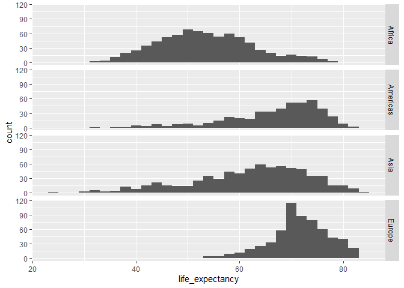

U okviru ovog predavanja biće predstavljeni različite vrste grafika namenjenih vizualizaciji različitih vrsta promenljivih kao i odnosa više različitih promenljivih u okviru `ggplot` okruženja. Za te potrebe koristićemo podatke koji su dostupni u okviru paketa `dcldata`, a koji je kreiran kao dopunski materijal za knjigu [Data visualization](https://dcl-data-vis.stanford.edu/). Za instalaciju paketa potrebno je sledeće:


```r
install.packages("dcldata")
```

Za potrebe vizualizacije podataka koristićemo opšte poznati set podataka `Gapminder` koji sadrži podatke populacije, bruto društvenog proizvoda po stanovniku, prosečni životni vek stanovništva po godinama i kontinentima.


```r
data(gm_combined)

?gm_combined
```

# Vizualizacija jedne promenljive

## Distrubucija jedne promenljive

Kada želimo saznati više o distribuciji jedne promenljive obično prvo pogledamo aritmetičku sredinu i uz to minimalnu i maksimalnu vrednost. Međutim, veoma često to nije dovoljno, pa želimo pogledati i median koji je po prirodi manje osetljiv na odskačuće rezultate. Poređenje srednje vrednosti i medijana možemo videti koliko nam je distribucija podataka razvučena ka minimumu ili maksimumu. 


```r
serbia <- gm_combined %>% dplyr::filter(name == "Serbia")

head(serbia)
```

```
## # A tibble: 6 x 7
##   iso_a3 name   region  year population gdp_per_capita life_expectancy
##   <chr>  <chr>  <chr>  <dbl>      <dbl>          <dbl>           <dbl>
## 1 srb    Serbia Europe  1950    6732256           4549            59.7
## 2 srb    Serbia Europe  1955    7234922           5200            62.0
## 3 srb    Serbia Europe  1960    7556725           6954            64.8
## 4 srb    Serbia Europe  1965    7835082           8638            67.6
## 5 srb    Serbia Europe  1970    8119860          10410            70.0
## 6 srb    Serbia Europe  1975    8497170          13212            71.1
```


```r
serbia$year
```

```
##  [1] 1950 1955 1960 1965 1970 1975 1980 1985 1990 1995 2000 2005 2010 2015
```

```r
range(serbia$year)
```

```
## [1] 1950 2015
```

```r
min(serbia$population)
```

```
## [1] 6732256
```

```r
max(serbia$population)
```

```
## [1] 9884147
```

```r
mean(serbia$population)
```

```
## [1] 8580224
```

```r
summary(serbia$population)
```

```
##    Min. 1st Qu.  Median    Mean 3rd Qu.    Max. 
## 6732256 7906276 8879786 8580224 9243800 9884147
```

Iste funkcionalnosti su dostupne i u okviru `dplyr` paketa


```r
serbia %>% dplyr::slice_sample(n = 20)
```

```
## # A tibble: 14 x 7
##    iso_a3 name   region  year population gdp_per_capita life_expectancy
##    <chr>  <chr>  <chr>  <dbl>      <dbl>          <dbl>           <dbl>
##  1 srb    Serbia Europe  2000    9487615           7985            72.2
##  2 srb    Serbia Europe  2015    8851280          13278            75.7
##  3 srb    Serbia Europe  1990    9517674          14912            72.6
##  4 srb    Serbia Europe  1975    8497170          13212            71.1
##  5 srb    Serbia Europe  1995    9884147           7393            70.7
##  6 srb    Serbia Europe  1955    7234922           5200            62.0
##  7 srb    Serbia Europe  2005    9214986          10901            73.2
##  8 srb    Serbia Europe  1960    7556725           6954            64.8
##  9 srb    Serbia Europe  1965    7835082           8638            67.6
## 10 srb    Serbia Europe  2010    9029716          12688            74.6
## 11 srb    Serbia Europe  1985    9253405          16679            72.1
## 12 srb    Serbia Europe  1980    8908293          16313            71.7
## 13 srb    Serbia Europe  1950    6732256           4549            59.7
## 14 srb    Serbia Europe  1970    8119860          10410            70.0
```

```r
serbia %>% dplyr::slice_max(order_by = population, n = 20)
```

```
## # A tibble: 14 x 7
##    iso_a3 name   region  year population gdp_per_capita life_expectancy
##    <chr>  <chr>  <chr>  <dbl>      <dbl>          <dbl>           <dbl>
##  1 srb    Serbia Europe  1995    9884147           7393            70.7
##  2 srb    Serbia Europe  1990    9517674          14912            72.6
##  3 srb    Serbia Europe  2000    9487615           7985            72.2
##  4 srb    Serbia Europe  1985    9253405          16679            72.1
##  5 srb    Serbia Europe  2005    9214986          10901            73.2
##  6 srb    Serbia Europe  2010    9029716          12688            74.6
##  7 srb    Serbia Europe  1980    8908293          16313            71.7
##  8 srb    Serbia Europe  2015    8851280          13278            75.7
##  9 srb    Serbia Europe  1975    8497170          13212            71.1
## 10 srb    Serbia Europe  1970    8119860          10410            70.0
## 11 srb    Serbia Europe  1965    7835082           8638            67.6
## 12 srb    Serbia Europe  1960    7556725           6954            64.8
## 13 srb    Serbia Europe  1955    7234922           5200            62.0
## 14 srb    Serbia Europe  1950    6732256           4549            59.7
```

```r
serbia %>% dplyr::slice_min(order_by = population, n = 20)
```

```
## # A tibble: 14 x 7
##    iso_a3 name   region  year population gdp_per_capita life_expectancy
##    <chr>  <chr>  <chr>  <dbl>      <dbl>          <dbl>           <dbl>
##  1 srb    Serbia Europe  1950    6732256           4549            59.7
##  2 srb    Serbia Europe  1955    7234922           5200            62.0
##  3 srb    Serbia Europe  1960    7556725           6954            64.8
##  4 srb    Serbia Europe  1965    7835082           8638            67.6
##  5 srb    Serbia Europe  1970    8119860          10410            70.0
##  6 srb    Serbia Europe  1975    8497170          13212            71.1
##  7 srb    Serbia Europe  2015    8851280          13278            75.7
##  8 srb    Serbia Europe  1980    8908293          16313            71.7
##  9 srb    Serbia Europe  2010    9029716          12688            74.6
## 10 srb    Serbia Europe  2005    9214986          10901            73.2
## 11 srb    Serbia Europe  1985    9253405          16679            72.1
## 12 srb    Serbia Europe  2000    9487615           7985            72.2
## 13 srb    Serbia Europe  1990    9517674          14912            72.6
## 14 srb    Serbia Europe  1995    9884147           7393            70.7
```

```r
serbia %>% dplyr::slice_head(n = 20)
```

```
## # A tibble: 14 x 7
##    iso_a3 name   region  year population gdp_per_capita life_expectancy
##    <chr>  <chr>  <chr>  <dbl>      <dbl>          <dbl>           <dbl>
##  1 srb    Serbia Europe  1950    6732256           4549            59.7
##  2 srb    Serbia Europe  1955    7234922           5200            62.0
##  3 srb    Serbia Europe  1960    7556725           6954            64.8
##  4 srb    Serbia Europe  1965    7835082           8638            67.6
##  5 srb    Serbia Europe  1970    8119860          10410            70.0
##  6 srb    Serbia Europe  1975    8497170          13212            71.1
##  7 srb    Serbia Europe  1980    8908293          16313            71.7
##  8 srb    Serbia Europe  1985    9253405          16679            72.1
##  9 srb    Serbia Europe  1990    9517674          14912            72.6
## 10 srb    Serbia Europe  1995    9884147           7393            70.7
## 11 srb    Serbia Europe  2000    9487615           7985            72.2
## 12 srb    Serbia Europe  2005    9214986          10901            73.2
## 13 srb    Serbia Europe  2010    9029716          12688            74.6
## 14 srb    Serbia Europe  2015    8851280          13278            75.7
```

```r
serbia %>% dplyr::slice_tail(n = 20)
```

```
## # A tibble: 14 x 7
##    iso_a3 name   region  year population gdp_per_capita life_expectancy
##    <chr>  <chr>  <chr>  <dbl>      <dbl>          <dbl>           <dbl>
##  1 srb    Serbia Europe  1950    6732256           4549            59.7
##  2 srb    Serbia Europe  1955    7234922           5200            62.0
##  3 srb    Serbia Europe  1960    7556725           6954            64.8
##  4 srb    Serbia Europe  1965    7835082           8638            67.6
##  5 srb    Serbia Europe  1970    8119860          10410            70.0
##  6 srb    Serbia Europe  1975    8497170          13212            71.1
##  7 srb    Serbia Europe  1980    8908293          16313            71.7
##  8 srb    Serbia Europe  1985    9253405          16679            72.1
##  9 srb    Serbia Europe  1990    9517674          14912            72.6
## 10 srb    Serbia Europe  1995    9884147           7393            70.7
## 11 srb    Serbia Europe  2000    9487615           7985            72.2
## 12 srb    Serbia Europe  2005    9214986          10901            73.2
## 13 srb    Serbia Europe  2010    9029716          12688            74.6
## 14 srb    Serbia Europe  2015    8851280          13278            75.7
```


```r
gm_combined %>%
  dplyr::filter(region == "Europe") %>%
  ggplot(aes(x = life_expectancy)) +
  geom_histogram() 
```

```
## `stat_bin()` using `bins = 30`. Pick better value with `binwidth`.
```

<!-- -->


```r
gm_combined %>%
  dplyr::filter(region == "Europe") %>%
  ggplot(aes(x = life_expectancy)) +
  geom_histogram(binwidth=5) +
  geom_vline(aes(xintercept = median(life_expectancy)), color = "red")
```

<!-- -->


```r
gm_combined %>% 
  ggplot(aes(x = life_expectancy)) +
  geom_freqpoly(binwidth = 2) +
  geom_vline(aes(xintercept = median(life_expectancy)), color = "red")
```

<!-- -->


```r
gm_combined %>% 
  ggplot(aes(life_expectancy)) +
  geom_density() +
  geom_vline(aes(xintercept = median(life_expectancy)), color = "red")
```

<!-- -->

### Distribucija više promenljivih


```r
gm_combined %>% 
  ggplot(aes(x = life_expectancy)) + geom_histogram(aes(fill = region), bins = 20, alpha=0.5) 
```

<!-- -->


```r
gm_combined %>% 
  ggplot(aes(x = life_expectancy)) + geom_density(aes(fill = region), alpha=0.5) 
```

<!-- -->


```r
gm_combined %>% 
  ggplot(aes(life_expectancy)) +
  geom_histogram(binwidth = 2) +
  facet_grid(cols = vars(region))
```

<!-- -->


```r
gm_combined %>% 
  ggplot(aes(life_expectancy)) +
  geom_histogram(binwidth = 2) +
  facet_grid(rows = vars(region))
```

<!-- -->


```r
gm_combined %>% 
  ggplot(aes(life_expectancy, color = region)) +
  geom_freqpoly(binwidth = 5)
```

<!-- -->


```r
gm_combined %>% 
  ggplot(aes(life_expectancy, color = region, fill = region )) +
  geom_density(alpha = 0.5)
```

<!-- -->


### Box-plot


```r
gm_combined %>% 
  ggplot(aes(x = region, life_expectancy)) +
  geom_boxplot()
```

<!-- -->


```r
gm_combined %>% 
  mutate(region_1 = fct_reorder(region, life_expectancy)) %>% 
  ggplot(aes(region_1, life_expectancy)) +
  geom_boxplot()
```

<!-- -->


```r
gm_combined %>% 
  mutate(region_1 = fct_reorder(region, life_expectancy)) %>% 
  ggplot(aes(region_1, life_expectancy)) +
  geom_boxplot() + 
  coord_flip()
```

<!-- -->


```r
gm_combined %>% 
  mutate(region_1 = fct_reorder(region, life_expectancy)) %>% 
  ggplot(aes(region_1, life_expectancy)) +
  geom_boxplot() +
  geom_hline(aes(yintercept = median(life_expectancy)), color = "red") +
  theme(axis.text.x = element_text(angle = -45, hjust = 0)) 
```

<!-- -->


## Vizualizacija odnosa dve promenljive

### Dve kontinualne promenljive

Vizualizacija dve kontinualne promenljive omogućava uvid u odnos dve promenljive. U okviru ovog poglavlja posmatraćemo odnos izmedju promenljivih `life_expectancy` i `gdp_per_capita`.

Nekoliko pitanja se mogu postaviti kada govorimo o odnosu dve kontinualne promenljive `life_expectancy` i `gdp_per_capita`:

+ Postoji li odnos izmedju dve promenljive?
+ Postoji li zavisnost između dve promenljive?
+ Koji je tip zavisnosti?
+ Da li `life_expectancy` linearno raste sa rastom `gdp_per_capita`?

U okviru `ggplot` okruženja postoji nekoliko objekata i geometrijskih lejera koji su namenjeni vizalizaciji odnosa dve kontinualne promenljive: 

+ Scales
+ Coordinate systems
+ Geoms:
  - geom_point()
  - geom_hex()
  - geom_bin2d()
  - geom_smooth()
  - geom_line()


```r
asia_2015 <-
  gm_combined %>% 
  filter(region == "Asia", year == 2015)

asia_2015 %>% 
  mutate(name = fct_reorder(name, population)) %>% 
  ggplot(aes(population, name)) +
  geom_point()
```

<!-- -->


```r
asia_2015 %>% 
  mutate(name = fct_reorder(name, population)) %>% 
  ggplot(aes(population, name)) +
  geom_point() +
  scale_x_log10()
```

<!-- -->


```r
gm_combined %>% 
  ggplot(aes(gdp_per_capita, life_expectancy)) +
  geom_point()
```

<!-- -->


```r
gm_combined %>% 
  ggplot(aes(gdp_per_capita, life_expectancy)) +
  geom_point() +
  scale_x_log10()
```

<!-- -->


#### Preklapanje podataka


```r
gm_combined %>% 
  ggplot(aes(gdp_per_capita, life_expectancy)) +
  geom_bin2d() +
  scale_x_log10()
```

<!-- -->


```r
gm_combined %>% 
  ggplot(aes(gdp_per_capita, life_expectancy)) +
  geom_hex() +
  scale_x_log10()
```

<!-- -->


```r
gm_combined %>% 
  ggplot(aes(gdp_per_capita, life_expectancy)) +
  geom_hex() +
  scale_x_log10() +
  scale_fill_viridis_c()
```

<!-- -->


```r
gm_combined_2010_2015 <-
  gm_combined %>% 
  filter(year %in% c(2010, 2015))

gm_combined_2010_2015 %>% 
  ggplot(aes(gdp_per_capita, life_expectancy)) +
  geom_point() +
  scale_x_log10()
```

<!-- -->

```r
gm_combined_2010_2015 %>% 
  ggplot(aes(gdp_per_capita, life_expectancy)) +
  geom_hex() +
  scale_x_log10() +
  scale_fill_viridis_c()
```

<!-- -->


```r
gm_combined_2010_2015 %>% 
  ggplot(aes(gdp_per_capita, life_expectancy)) +
  geom_point(shape = 21, size = 3) +
  scale_x_log10()
```

<!-- -->

#### Smoothing


```r
gm_combined %>% 
  ggplot(aes(gdp_per_capita, life_expectancy)) +
  geom_hex() +
  geom_smooth() +
  scale_x_log10() +
  scale_fill_viridis_c() 
```

```
## `geom_smooth()` using method = 'gam' and formula 'y ~ s(x, bs = "cs")'
```

<!-- -->


```r
gm_combined %>% 
  ggplot(aes(gdp_per_capita, life_expectancy)) +
  geom_hex() +
  geom_smooth(method = "loess") +
  scale_x_log10() +
  scale_fill_viridis_c()
```

```
## `geom_smooth()` using formula 'y ~ x'
```

<!-- -->


```r
gm_combined %>% 
  ggplot(aes(gdp_per_capita, life_expectancy)) +
  geom_hex() +
  geom_smooth(method = "gam") +
  scale_x_log10() +
  scale_fill_viridis_c()
```

```
## `geom_smooth()` using formula 'y ~ s(x, bs = "cs")'
```

<!-- -->


```r
gm_combined %>% 
  ggplot(aes(gdp_per_capita, life_expectancy, color = region)) +
  geom_point() +
  scale_x_log10()
```

<!-- -->

Često je potrebno prikazati jednu promenljivu koja je prikupljana u dva različita momenta u vremenu.


```r
gm_combined_paired <-
  gm_combined_2010_2015 %>%  
  select(iso_a3, name, region, year, life_expectancy) %>% 
  pivot_wider(
    names_from = year,
    names_prefix = "year_",
    values_from = life_expectancy
  )

gm_combined_paired %>% 
  ggplot(aes(year_2010, year_2015)) +
  geom_point(alpha = 0.5) 
```

<!-- -->


```r
gm_combined_paired %>% 
  ggplot(aes(year_2010, year_2015)) +
  geom_point(alpha = 0.5) +
  coord_fixed()
```

<!-- -->


```r
gm_combined_paired %>% 
  filter(region == "Asia") %>% 
  mutate(name = fct_reorder(name, year_2015)) %>% 
  ggplot(aes(y = name)) +
  geom_point(aes(x = year_2010, color = "2010")) +
  geom_point(aes(x = year_2015, color = "2015"))
```

<!-- -->


```r
gm_combined_paired %>% 
  filter(region == "Asia") %>% 
  mutate(name = fct_reorder(name, year_2015)) %>% 
  ggplot(aes(y = name)) +
  geom_segment(aes(x = year_2010, xend = year_2015, y = name, yend = name)) +
  geom_point(aes(x = year_2010, color = "2010")) +
  geom_point(aes(x = year_2015, color = "2015"))
```

<!-- -->


#### Prikazivanje vise promenljivih


```r
gm_combined_2015 <-
  gm_combined %>% 
  filter(year == 2015)

gm_combined_2015 %>% 
  arrange(desc(population)) %>% 
  ggplot(
    aes(gdp_per_capita, life_expectancy, fill = region, size = population)
  ) +
  geom_point(shape = 21, color = "black") +
  scale_size(range = c(0.5, 20)) +
  scale_x_log10() 
```

<!-- -->


