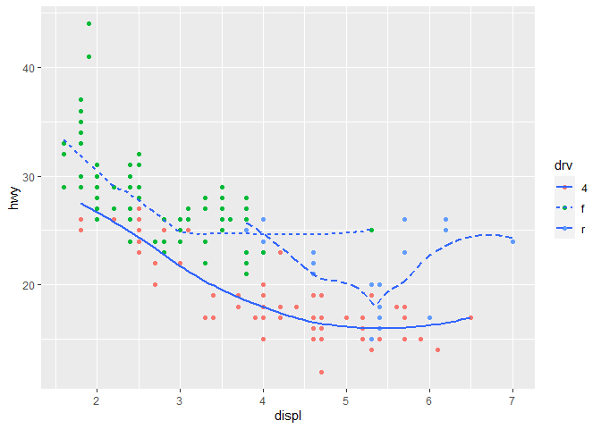
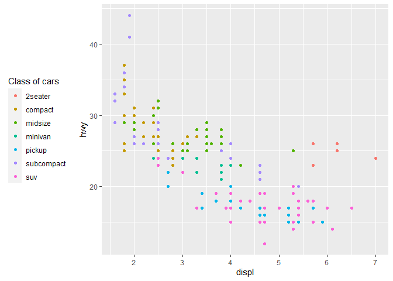

# Vizualizacija podataka u R-u

Vizualizacija podataka podrazumeva kreiranje različitih vrsta grafika i odnosno prikaza podataka u cilju otkrivanja informacija koje na prvi pogled nisu tako uočljive. `R` ima tri odvojena okruženja za kreiranje grafika, `base`, `Lattice` i `ggplot`. U poslednje vreme `ggplot` je daleko najpopularniji paket i upravo on doprinosi velikoj popularizaciji R-a. Sa druge strane `base` plot nikada neće izaći iz upotrebe medju R korisnicima. Njega odlikuje jednostavnost poziva funkcija. 


## `ggplot2`

`ggplot2` je daleko najpopularnije okruženje za kreiranje grafika. `ggplot2` predstavlja implementaciju poznatog pristupa poznatog po nazivu "The Grammar of Graphics" koji je predstavljen u istoimenoj knjizi autora Leland Wilkinson-a. Ovaj pristup je zasnovan na lejerskoj kompoziciji grafika.

> Zadatak 3:
> + Pokušajte da reprodukujete sledeće grafike:

<!-- -->


```r
ggplot(mpg, aes(x = displ, y = hwy)) +
  geom_point() +
  geom_smooth(se = FALSE) # se - confidence interval 
```

```
## `geom_smooth()` using method = 'loess' and formula 'y ~ x'
```

<!-- -->


```r
ggplot(mpg, aes(x = displ, y = hwy)) +
  geom_smooth(mapping = aes(group = drv), se = FALSE) + # f = front-wheel drive, r = rear wheel drive, 4 = 4wd
  geom_point() 
```

```
## `geom_smooth()` using method = 'loess' and formula 'y ~ x'
```

<!-- -->

```r
# grupisanje po vrednosti kategoričke promenljive - atribut drv
```


```r
ggplot(mpg, aes(x = displ, y = hwy)) +
  geom_smooth(mapping = aes(group = drv, colour = drv), se = FALSE) +   
  geom_point(mapping = aes(colour = drv))
```

```
## `geom_smooth()` using method = 'loess' and formula 'y ~ x'
```

<!-- -->

```r
# ILI 

#ggplot(mpg, aes(x = displ, y = hwy, colour = drv)) +
#  geom_point() +
#  geom_smooth(se = FALSE)
```


```r
ggplot(mpg, aes(x = displ, y = hwy)) +
  geom_point(aes(colour = drv)) +
  geom_smooth(se = FALSE)
```

```
## `geom_smooth()` using method = 'loess' and formula 'y ~ x'
```

<!-- -->


```r
ggplot(mpg, aes(x = displ, y = hwy)) +
  geom_point(aes(colour = drv)) +
  geom_smooth(aes(linetype = drv), se = FALSE)
```

```
## `geom_smooth()` using method = 'loess' and formula 'y ~ x'
```

<!-- -->


```r
ggplot(mpg, aes(x = displ, y = hwy)) +
  geom_point(size = 4, color = "white") +
  geom_point(aes(colour = drv))
```

<!-- -->


## Grafik kao alat komunikacije

Nauka o podacima u R-u, Čas vežbi, 02-12-2020 


U okviru ovog dela fokus je na mogućnostima ggplot2 paketa u cilju kreiranja kvalitetnih grafika i dodavanja neophodnih elemenata. Elementi grafika koji su neophodni kako bi kreirali dobar grafik, koji krajnjem korisniku nudi pravi uvid u podatke i nije dvosmislen, odnosi se na oznake koje svaki grafik treba da ima, anotacije, razmeru osa, legendu, temu i čuvanje grafika u visokoj rezolciji. 

### Oznake grafika

Pre svega dobar grafik mora imati naslov koji verno opisuje podatke (title), a opciono i podnaslov (subtitle), komentar (caption) i nazive po osama (xlab, ylab).


```r
ggplot(mpg, aes(displ, hwy)) +
  geom_point(aes(color = class)) +
  geom_smooth(se = FALSE) +
  labs(title = "Fuel efficiency generally decreases with engine size")
```

```
## `geom_smooth()` using method = 'loess' and formula 'y ~ x'
```

<!-- -->


```r
ggplot(mpg, aes(displ, hwy)) +
  geom_point(aes(color = class)) +
  geom_smooth(se = FALSE) +
  labs(
    title = "Fuel efficiency generally decreases with engine size",
    subtitle = "Two seaters (sports cars) are an exception because of their light weight",
    caption = "Data from fueleconomy.gov"
  )
```

```
## `geom_smooth()` using method = 'loess' and formula 'y ~ x'
```

<!-- -->


```r
ggplot(mpg, aes(displ, hwy)) +
  geom_point(aes(color = class)) +
  geom_smooth(se = FALSE) +
  labs(
    title = "Fuel efficiency generally decreases with engine size",
    subtitle = "Two seaters (sports cars) are an exception because of their light weight",
    caption = "Data from fueleconomy.gov", 
    x = "Engine displacement [litres]",
    y = "Highway miles per gallon"
  )
```

```
## `geom_smooth()` using method = 'loess' and formula 'y ~ x'
```

<!-- -->


### Anotacije

Kao što je bitno da imamo generalno naslov i podnaslov, kao i nazive osa čime definišemo glavne komponente grafika, isto tako je ponekad korisno da postavimo anotacije - označimo merene vrednosti ili grupe merenih vrednosti na grafiku.


```r
# pull out the most efficient car in each class with dplyr, and then label it on the plot

best_in_class <- mpg %>%
  group_by(class) %>%
  filter(row_number(desc(hwy)) == 1)


ggplot(mpg, aes(displ, hwy)) +
  geom_point(aes(colour = class)) +
  geom_text(data = best_in_class, aes(x = displ, y = hwy, label = model))
```

<!-- -->


```r
ggplot(mpg, aes(displ, hwy)) +
  geom_point(aes(colour = class)) +
  geom_label(aes(label = model), data = best_in_class, nudge_y = 2, alpha = 0.5)
```

<!-- -->


Da ne bi imali preklapanja u anotacijama, možemo korstiti paket ggrepel. Paket automatski pomera anotacije kako se ne bi preklapale.


```r
ggplot(mpg, aes(displ, hwy)) +
  geom_point(aes(colour = class)) +
  geom_point(data = best_in_class, size = 4, shape = 1) +
  ggrepel::geom_label_repel(data = best_in_class, aes(label = model))
```

<!-- -->

Ako želimo da postavimo anotacije po grupama - klasama, to možemo uraditi na sledeći način.


```r
class_avg <- mpg %>%
  group_by(class) %>%
  summarise(
    displ = median(displ),
    hwy = median(hwy)
  )
```

```
## `summarise()` ungrouping output (override with `.groups` argument)
```

```r
class_avg
```

```
## # A tibble: 7 x 3
##   class      displ   hwy
##   <chr>      <dbl> <dbl>
## 1 2seater     6.2   25  
## 2 compact     2.2   27  
## 3 midsize     2.8   27  
## 4 minivan     3.3   23  
## 5 pickup      4.7   17  
## 6 subcompact  2.2   26  
## 7 suv         4.65  17.5
```


```r
ggplot(mpg, aes(displ, hwy, colour = class)) +
  ggrepel::geom_label_repel(aes(label = class),
    data = class_avg,
    size = 6,
    label.size = 0,
    segment.color = NA
  ) +
  geom_point() +
  theme(legend.position = "none")
```

<!-- -->

### Razmera

Razmerom se definiše odnos osa na grafiku, razmera pojedinačnih osa, kao i razmak između vrednosti nanteih na osama grafika. Po default-u ggplot definiše sam razmeru osa, koju naravno može i korisnik definisati.


```r
ggplot(mpg, aes(displ, hwy)) +
  geom_point(aes(colour = class)) +
  scale_x_continuous() +
  scale_y_continuous() +
  scale_colour_discrete()
```

<!-- -->


```r
ggplot(mpg, aes(displ, hwy)) +
  geom_point() +
  scale_y_continuous(breaks = seq(15, 40, by = 5))
```

<!-- -->

```r
ggplot(mpg, mapping = aes(displ, hwy)) +
  geom_point(aes(color = class)) +
  geom_smooth() +
  coord_cartesian(xlim = c(5, 7), ylim = c(10, 30))
```

```
## `geom_smooth()` using method = 'loess' and formula 'y ~ x'
```

<!-- -->

```r
# U čemu je razlika?

mpg %>%
  filter(displ >= 5, displ <= 7, hwy >= 10, hwy <= 30) %>%
  ggplot(aes(displ, hwy)) +
  geom_point(aes(color = class)) +
  geom_smooth()
```

```
## `geom_smooth()` using method = 'loess' and formula 'y ~ x'
```

<!-- -->


### Legenda

https://www.datanovia.com/en/blog/ggplot-legend-title-position-and-labels/


```r
base <- ggplot(mpg, aes(displ, hwy)) +
  geom_point(aes(colour = class))+
  labs(colour = "Class of cars")

base + theme(legend.position = "left")
```

<!-- -->

```r
base + theme(legend.position = "top")
```

<!-- -->

```r
base + theme(legend.position = "bottom")
```

<!-- -->

```r
base + theme(legend.position = "right")
```

<!-- -->

+theme(legend.position = "none") - na ovaj način ne prikazujemo legendu podataka

Isto tako kao što definišemo razmeru osa, odnos boja kojima prikazujemo podatke je bitan i često imamo predefinisane klase boja kojima želimo da prikažemo podake. Postoje i paketi kojima možemo da kreiramo paletu boja po želji, kako za kontinualne tako i za diskretne podatke.


```r
ggplot(mpg, aes(displ, hwy)) +
  geom_point(aes(color = drv))
```

<!-- -->

```r
ggplot(mpg, aes(displ, hwy)) +
  geom_point(aes(color = drv)) +
  scale_colour_brewer(palette = "Set1")
```

<!-- -->

paket "viridis" nudi veoma kvalitetne palete boja, pre svega za kontinualne podatke.


```r
df <- tibble(
  x = rnorm(10000),
  y = rnorm(10000)
)
ggplot(df, aes(x, y)) +
  geom_hex() +
  coord_fixed()
```

<!-- -->

```r
ggplot(df, aes(x, y)) +
  geom_hex() +
  viridis::scale_fill_viridis(option = "D") +
  coord_fixed()
```

<!-- -->

```r
ggplot(df, aes(x, y)) +
  geom_hex() +
  viridis::scale_fill_viridis(option = "B") +
  coord_fixed()
```

<!-- -->

### Tema

Bitan element kreiranja grafika je tema, putem koje se definišu parametri i elemnti grafika koji ne sadrže podatke.

Pogledati: https://github.com/jrnold/ggthemes


```r
ggplot(mpg, aes(displ, hwy)) +
  geom_point(aes(color = class)) +
  geom_smooth(se = FALSE) +
  theme_bw()
```

```
## `geom_smooth()` using method = 'loess' and formula 'y ~ x'
```

<!-- -->

### Čuvanje grafika

Grafik čuvamo komandom ggsave, u okviru koje se definišu parametri plot - promenljiva koja sadrži grafik, filename - putanja ka izlaznom fajlu, width - širina grafika, height - visina grafika, units - jedinice u kojima je izražena širina i visina, device - format podataka, dpi - "dots per inch" rezolucija, kvalitet grafika.


```r
graf1 <- ggplot(mpg, aes(displ, hwy)) +
  geom_point(aes(color = class)) +
  geom_smooth(se = FALSE) +
  theme_bw()

ggsave(plot = graf1, 
       filename = "D:/R_projects/Nauka_R/Slides/R/graf1.jpg", 
       width = 30, 
       height = 30, 
       units = "cm", 
       device = "jpeg", 
       dpi = 300)
```
